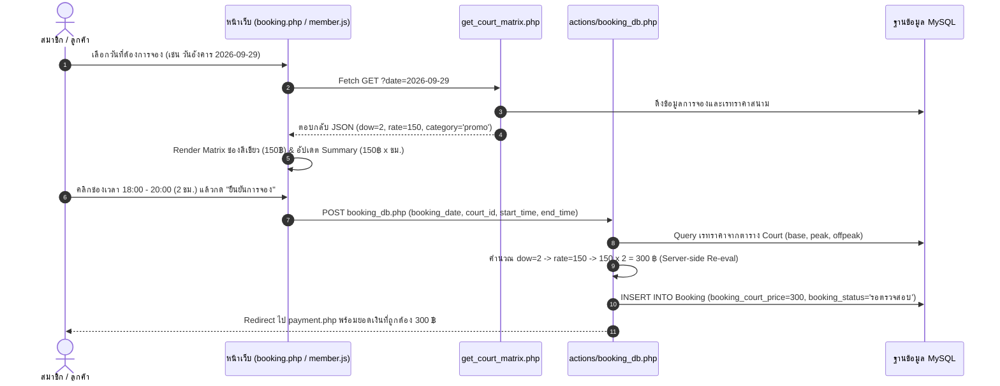

# บันทึกการพัฒนาระบบ: ระบบคำนวณราคาค่าสนามตามวันในสัปดาห์ (Day-of-Week Dynamic Pricing)
**วันที่:** 2026-09-26  
**ระบบ:** T.S. Pattani Badminton Court Management System  
**ผู้จัดทำ:** Antigravity AI Assistant

---

## 1. ทำอะไรบ้าง (What Was Done)

พัฒนาระบบคำนวณราคาค่าบริการสนามแบดมินตันแบบไดนามิกตามวันในสัปดาห์ (Day-of-Week Dynamic Pricing) ให้สอดคล้องกับความต้องการของผู้ใช้งานอย่างสมบูรณ์แบบ โดยเชื่อมโยงทั้งระบบตาราง Time-Slot Matrix, การคำนวณแบบ Realtime หน้าบ้าน (Frontend JavaScript), การคำนวณและตรวจสอบความถูกต้องฝั่งเซิร์ฟเวอร์ (Server-side PHP Validation), หน้าจอจัดการสนามของแอดมิน (Admin Courts Management), และระบบเปิดสนาม Walk-in ผ่าน POS หน้าร้าน

### รายละเอียดเงื่อนไขราคาตามวันในสัปดาห์:
1. **เสาร์ - อาทิตย์ (Sat & Sun):** อัตรา **200 บาท / ชั่วโมง** (เรทวันหยุด / Peak Rate - ใช้ฟิลด์ `court_peak_price`)
2. **จันทร์, พุธ, ศุกร์ (Mon, Wed, Fri):** อัตรา **180 บาท / ชั่วโมง** (เรทราคาปกติ / Standard Rate - ใช้ฟิลด์ `court_price_per_hour`)
3. **อังคาร, พฤหัสบดี (Tue & Thu):** อัตรา **150 บาท / ชั่วโมง** (เรทโปรโมชั่นพิเศษ / Promo Rate - ใช้ฟิลด์ `court_offpeak_price`)

---

### ไฟล์ที่ทำการสร้างและแก้ไข:

1. **[actions/get_court_matrix.php](file:///c:/xampp/htdocs/ts-pattani/actions/get_court_matrix.php)**
   - เพิ่มการคำนวณวันในสัปดาห์ `$dow = intval(date('w', strtotime($date)))`
   - กำหนด Category (`weekend`, `normal`, `promo`) และป้ายกำกับ (`rate_label`, `rate_badge`)
   - คำนวณราคาของแต่ละ Slot และราคาเรทปัจจุบันของแต่ละสนามตามวันที่เลือก
   - ส่งคืนข้อมูล `day_name`, `day_of_week`, `rate_category`, `rate_label`, `rate_badge` ใน JSON response

2. **[actions/booking_db.php](file:///c:/xampp/htdocs/ts-pattani/actions/booking_db.php)**
   - ปรับการคำนวณราคาค่าสนามฝั่งเซิร์ฟเวอร์ (Server-side recalculation) เพื่อป้องกันการแก้ไขราคาจาก Client
   - ตรวจสอบ `$dow = intval(date('w', strtotime($booking_date)))`:
     - วันที่ 0 (อาทิตย์) และ 6 (เสาร์): คิดอัตรา `court_peak_price` (200 ฿)
     - วันที่ 2 (อังคาร) และ 4 (พฤหัสบดี): คิดอัตรา `court_offpeak_price` (150 ฿)
     - วันที่ 1 (จันทร์), 3 (พุธ), 5 (ศุกร์): คิดอัตรา `court_price_per_hour` (180 ฿)
   - คำนวณยอดรวม `$real_court_price = $hourly_rate * $hours` และบันทึกลงตาราง `Booking`

3. **[assets/js/member.js](file:///c:/xampp/htdocs/ts-pattani/assets/js/member.js)**
   - ปรับปรุงฟังก์ชัน `calculateSummary()`:
     - ดึงวันที่จาก `#booking_date` และแปลงเป็น Day of Week (`dateObj.getDay()`)
     - กำหนด `hourlyRate` ตามวัน (0,6=200฿ | 2,4=150฿ | 1,3,5=180฿)
     - แสดงข้อความแจกแจงเรทราคาใต้ค่าสนามในตารางสรุป เช่น `(วันปกติ จันทร์-พุธ-ศุกร์: 2 ชม. x 180 ฿)` หรือ `(โปรโมชั่น อังคาร-พฤหัส: 2 ชม. x 150 ฿)`
   - ปรับปรุงฟังก์ชัน `renderCourtMatrix(data)`:
     - แสดง Header Info Card สรุปวันและเรทราคาพร้อม Badge สีสันชัดเจน
     - ใส่คลาสสีและ Tooltip สำหรับแต่ละประเภทวัน: `.cell-normal` (ฟ้า), `.cell-weekend` (ส้มทอง), `.cell-promo` (เขียว)
     - อัปเดตราคาในช่อง Header ของแต่ละสนามในตาราง Matrix ให้ตรงกับเรทของวันนั้น

4. **[booking.php](file:///c:/xampp/htdocs/ts-pattani/booking.php)**
   - อัปเดตคำอธิบายสัญลักษณ์สี (Color Legend) 3 เรท: ปกติ จันทร์-พุธ-ศุกร์ (180 ฿/ชม.), วันหยุด เสาร์-อาทิตย์ (200 ฿/ชม.), วันโปรโมชั่น อังคาร-พฤหัส (150 ฿/ชม.)
   - ปรับแต่งการ์ดเลือกสนามให้แสดงราคาแยกชัดเจนทั้ง 3 แบบ (จ.-พ.-ศ., ส.-อา., อ.-พฤ.) พร้อมไอคอนสวยงาม
   - ผูก Event `onchange` ของ `#booking_date` ให้เรียก `calculateSummary()` ทันทีที่มีการเปลี่ยนวัน

5. **[admin/courts.php](file:///c:/xampp/htdocs/ts-pattani/admin/courts.php)**
   - ปรับเปลี่ยน Label ในฟอร์มเพิ่มสนามและ Modal แก้ไขสนาม ให้ระบุชื่อวันอย่างชัดเจน:
     - "ราคาปกติ/ชม. (฿) (จ.-พ.-ศ.)"
     - "ราคาวันหยุด ส.-อา./ชม. (฿) (Peak)"
     - "ราคาวันโปรโมชั่น อ.-พฤ./ชม. (฿) (Off-peak)"
   - ปรับหัวตารางและ Badge แสดงราคาในตารางจัดการสนามของแอดมิน

6. **[admin/pos.php](file:///c:/xampp/htdocs/ts-pattani/admin/pos.php)**
   - อัปเดตการ์ดสนามสำหรับเปิด Walk-in ให้แสดงเรทราคาทั้ง 3 รูปแบบ
   - เพิ่ม Logic คำนวณราคาค่าสนามตามวันในสัปดาห์ใน Modal เปิดสนาม Walk-in หน้าเคาน์เตอร์
   - แสดง Badge สถานะเรทราคาและยอดรวมที่คำนวณอัตโนมัติตามวันที่เลือก

7. **[admin/actions/pos_checkout_db.php](file:///c:/xampp/htdocs/ts-pattani/admin/actions/pos_checkout_db.php)**
   - เพิ่ม Fallback ตรวจสอบและคำนวณค่าสนามตามวันในสัปดาห์แบบ Server-side กรณีเปิดสนาม Walk-in

---

## 2. ระบบเป็นอย่างไร (How the System Works)

### 2.1 ตรรกะการตรวจสอบวันในสัปดาห์ (Day of Week Logic Matrix)
ระบบใช้ฟังก์ชัน `date('w')` ใน PHP และ `Date.getDay()` ใน JavaScript ซึ่งให้ผลลัพธ์เป็นตัวเลข 0 ถึง 6:

| ตัวเลข (w/getDay) | วันในสัปดาห์ (Day) | หมวดหมู่ (Category) | เรทราคาตัวอย่าง (Rate) | คอลัมน์ฐานข้อมูล (DB Field) | สไตล์สี (Theme Color) |
|:---:|:---:|:---:|:---:|:---:|:---:|
| **0** | วันอาทิตย์ (Sunday) | `weekend` | 200 บาท / ชม. | `court_peak_price` | ส้มทอง (`#fef3c7`, `#b45309`) |
| **1** | วันจันทร์ (Monday) | `normal` | 180 บาท / ชม. | `court_price_per_hour` | ฟ้าอ่อน (`#e0f2fe`, `#0369a1`) |
| **2** | วันอังคาร (Tuesday) | `promo` | 150 บาท / ชม. | `court_offpeak_price` | เขียวอ่อน (`#dcfce7`, `#15803d`) |
| **3** | วันพุธ (Wednesday) | `normal` | 180 บาท / ชม. | `court_price_per_hour` | ฟ้าอ่อน (`#e0f2fe`, `#0369a1`) |
| **4** | วันพฤหัสบดี (Thursday) | `promo` | 150 บาท / ชม. | `court_offpeak_price` | เขียวอ่อน (`#dcfce7`, `#15803d`) |
| **5** | วันศุกร์ (Friday) | `normal` | 180 บาท / ชม. | `court_price_per_hour` | ฟ้าอ่อน (`#e0f2fe`, `#0369a1`) |
| **6** | วันเสาร์ (Saturday) | `weekend` | 200 บาท / ชม. | `court_peak_price` | ส้มทอง (`#fef3c7`, `#b45309`) |

### 2.2 โฟลว์การทำงาน (Workflow Sequence)

---

## 3. การใช้งานอย่างไร (How to Use / Test)

### ขั้นตอนการทดสอบฝั่งสมาชิก (Member Booking Flow):
1. เข้าสู่ระบบสมาชิก แล้วไปที่หน้า [booking.php](http://localhost/ts-pattani/booking.php)
2. **ทดสอบวันที่เป็นวันหยุด (เสาร์ - อาทิตย์):**
   - เลือกวันที่เป็นวันเสาร์หรือวันอาทิตย์ (เช่น `2026-09-26` หรือ `2026-09-27`)
   - ตาราง Matrix จะแสดงแถบสถานะสีส้มทอง `เสาร์-อาทิตย์ (200฿)` และราคาในช่องว่างจะแสดง `200฿`
   - เมื่อเลือกช่วงเวลา 2 ชั่วโมง (เช่น 18:00 - 20:00) ยอดสรุปค่าสนามจะแสดง `400 ฿` พร้อมคำอธิบาย `(เสาร์-อาทิตย์: 2 ชม. x 200 ฿)`
3. **ทดสอบวันที่เป็นวันปกติ (จันทร์, พุธ, ศุกร์):**
   - เลือกวันที่เป็นวันจันทร์, พุธ หรือศุกร์ (เช่น `2026-09-28`)
   - ตาราง Matrix จะแสดงแถบสถานะสีฟ้า `จันทร์-พุธ-ศุกร์ (180฿)` และราคาในช่องว่างจะแสดง `180฿`
   - เมื่อเลือกช่วงเวลา 2 ชั่วโมง ยอดสรุปค่าสนามจะแสดง `360 ฿` พร้อมคำอธิบาย `(วันปกติ จันทร์-พุธ-ศุกร์: 2 ชม. x 180 ฿)`
4. **ทดสอบวันที่เป็นวันโปรโมชั่น (อังคาร, พฤหัสบดี):**
   - เลือกวันที่เป็นวันอังคารหรือพฤหัสบดี (เช่น `2026-09-29`)
   - ตาราง Matrix จะแสดงแถบสถานะสีเขียว `อังคาร-พฤหัส (150฿)` และราคาในช่องว่างจะแสดง `150฿`
   - เมื่อเลือกช่วงเวลา 2 ชั่วโมง ยอดสรุปค่าสนามจะแสดง `300 ฿` พร้อมคำอธิบาย `(โปรโมชั่น อังคาร-พฤหัส: 2 ชม. x 150 ฿)`
5. กดปุ่ม **"ยืนยันการจองสนาม"** เพื่อตรวจสอบว่าระบบส่งต่อไปหน้า `payment.php` ด้วยยอดเงินที่คำนวณถูกต้องตรงกัน

### ขั้นตอนการทดสอบฝั่งแอดมิน (Admin POS Walk-in):
1. เข้าสู่ระบบแอดมิน แล้วไปที่หน้า [admin/pos.php](http://localhost/ts-pattani/admin/pos.php)
2. คลิกเลือกการ์ดสนามเพื่อเปิด Walk-in
3. ใน Modal ทดลองเปลี่ยน "วันที่ใช้งาน" ระหว่าง วันเสาร์ (200฿), วันจันทร์ (180฿), และวันอังคาร (150฿)
4. สังเกตว่าอัตราค่าบริการ, ป้าย Badge และยอดรวมจะเปลี่ยนไปตามประเภทวันโดยอัตโนมัติ

---

## 4. ปัญหาที่เจอหรือแก้อะไรบ้าง (Issues Encountered & Resolved)

1. **ปัญหา Date Rollback ใน JavaScript:**
   - **สาเหตุ:** การใช้ `new Date(dateString)` ใน JavaScript บางเบราว์เซอร์จะตีความค่าเป็น UTC เวลา 00:00:00 น. ซึ่งเมื่อแปลงเป็น Local Time ของประเทศไทย (UTC+7) อาจทำให้วันถอยหลังไป 1 วัน
   - **การแก้ไข:** ใช้ `new Date(dateString + 'T00:00:00')` เพื่อระบุเวลาแบบ Local ISO String ป้องกันปัญหาโซนเวลาเพี้ยนอย่างเด็ดขาด

2. **ปัญหาการป้องกัน Client-side Price Tampering:**
   - **สาเหตุ:** หากผู้ใช้แก้ไขราคาก่อนส่ง Request ผ่าน Form POST หรือ Inspect Element อาจทำให้เกิดช่องโหว่ด้านความปลอดภัย
   - **การแก้ไข:** ใน `actions/booking_db.php` ไม่เชื่อถือราคาที่ส่งมาจาก Client แต่ทำการคำนวณใหม่ทั้งหมดจากข้อมูลสนามจริงในฐานข้อมูลและวันที่ระบุ

3. **ปัญหาความไม่สอดคล้องระหว่าง Matrix และ Summary:**
   - **สาเหตุ:** เดิมเวลาผู้ใช้กดเปลี่ยนวันใน Matrix หรือ Date Picker ตารางจะโหลดใหม่แต่ยอดสรุปค่าสนามด้านล่างยังไม่อัปเดตทันที
   - **การแก้ไข:** เพิ่มการเรียก `calculateSummary()` ในทุก Event Handler (`setMatrixDate`, `onMatrixDatePickerChange`, และ `booking_date.onchange`) ทำให้หน้าจอซิงโครไนซ์กัน 100%
