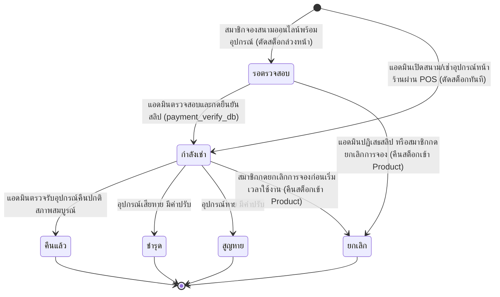
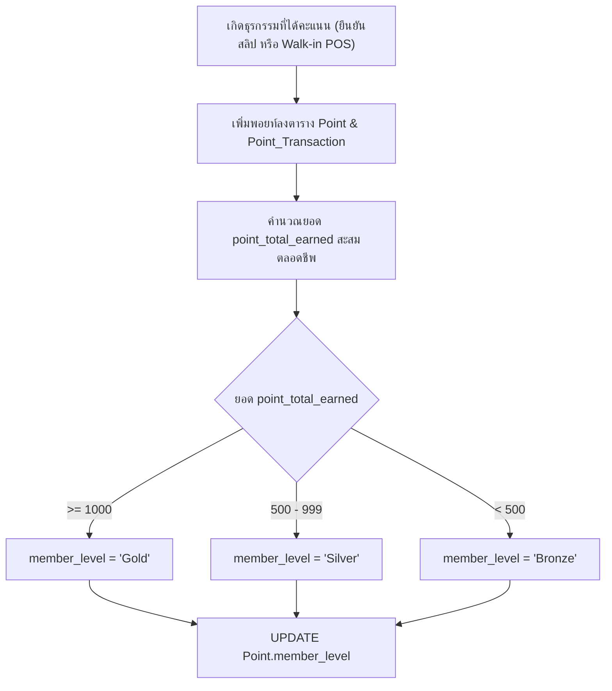

# บันทึกการดำเนินงาน: Quick-Wins & Bug Fixes (2026-09-26)

เอกสารนี้บันทึกรายละเอียดการปรับปรุงและแก้ไขปัญหาจุดย่อย (Quick-Wins & Bug Fixes) ประจำวันที่ 26 กันยายน 2026 เพื่อเพิ่มความสมบูรณ์และเสถียรภาพของระบบสนามแบดมินตัน T.S. Pattani ตามขอบเขตการทำงาน 1.3

---

## 1. รายการสิ่งที่ดำเนินการ (What Was Done)

### 1.1 การปรับปรุงโครงสร้างฐานข้อมูล (Database Schema)
* **เพิ่มสถานะ `'ยกเลิก'` ใน ENUM ของคอลัมน์ `rental_status` ตาราง `Rental`:**
  - เดิม: `ENUM('รอตรวจสอบ', 'กำลังเช่า', 'คืนแล้ว', 'ชำรุด', 'สูญหาย')`
  - ใหม่: `ENUM('รอตรวจสอบ', 'กำลังเช่า', 'คืนแล้ว', 'ชำรุด', 'สูญหาย', 'ยกเลิก')`
  - อัปเดตไฟล์ติดตั้ง/อัปเกรดฐานข้อมูล:
    - [config/setup.php](file:///c:/xampp/htdocs/ts-pattani/config/setup.php)
    - [config/update_database.php](file:///c:/xampp/htdocs/ts-pattani/config/update_database.php)
  - รันคำสั่ง SQL `ALTER TABLE Rental MODIFY COLUMN ...` ลงฐานข้อมูล `ts_pattani_db` สำเร็จแล้ว

### 1.2 ระบบคืนสต็อกและอัปเดตสถานะการเช่าเมื่อปฏิเสธสลิปชำระเงิน
* **ไฟล์ที่แก้ไข:** [admin/actions/payment_verify_db.php](file:///c:/xampp/htdocs/ts-pattani/admin/actions/payment_verify_db.php)
  - เมื่อแอดมินกด "ปฏิเสธ" สลิปการโอนเงิน (สลิปปลอม/ยอดไม่ตรง):
    1. ระบบจะค้นหาอุปกรณ์/สินค้าในตาราง `Rental` ของรายการจองนั้นที่สถานะยังเป็น `'รอตรวจสอบ'` หรือ `'กำลังเช่า'`
    2. คืนจำนวนสต็อกกลับเข้าสู่ตาราง `Product` อัตโนมัติ (`product_stock = product_stock + qty`)
    3. ปรับสถานะในตาราง `Rental` ให้เป็น `'ยกเลิก'`
  - เมื่อแอดมินกด "ยืนยันแล้ว":
    1. ปรับสถานะในตาราง `Rental` จาก `'รอตรวจสอบ'` เป็น `'กำลังเช่า'` อัตโนมัติ เพื่อให้พร้อมสำหรับการตรวจรับคืนในหน้าตรวจรับอุปกรณ์

### 1.3 ปรับปรุงสถานะอุปกรณ์เมื่อลูกค้ายกเลิกการจอง
* **ไฟล์ที่แก้ไข:** [actions/cancel_booking_db.php](file:///c:/xampp/htdocs/ts-pattani/actions/cancel_booking_db.php)
  - ปรับสถานะในตาราง `Rental` จากเดิมที่ใส่เป็น `'คืนแล้ว'` ให้เป็น `'ยกเลิก'` เพื่อแยกความแตกต่างระหว่างการใช้งานจริงแล้วนำมาคืน กับการยกเลิกรายการตั้งแต่แรก

### 1.4 ระบบปรับระดับสมาชิกอัตโนมัติ (Automated Member Tier Progression)
* **ไฟล์ที่แก้ไข:** 
  - [admin/actions/payment_verify_db.php](file:///c:/xampp/htdocs/ts-pattani/admin/actions/payment_verify_db.php)
  - [admin/actions/pos_checkout_db.php](file:///c:/xampp/htdocs/ts-pattani/admin/actions/pos_checkout_db.php)
* **เกณฑ์การคำนวณระดับสมาชิก (อิงตามยอดสะสมตลอดชีพ `point_total_earned`):**
  - **Bronze:** คะแนนสะสมน้อยกว่า 500 พอยท์
  - **Silver:** คะแนนสะสมตั้งแต่ 500 ถึง 999 พอยท์
  - **Gold:** คะแนนสะสมตั้งแต่ 1,000 พอยท์ขึ้นไป
* ระบบจะคำนวณและอัปเดต `Point.member_level` ให้สมาชิกทันทีที่มีการอนุมัติการชำระเงิน หรือเปิดสนามผ่าน POS หน้าร้าน

### 1.5 ระบบแชทเรียลไทม์ฝั่งสมาชิก (Real-time AJAX Chat Polling)
* **ไฟล์ที่สร้างใหม่:** [actions/get_chat_messages.php](file:///c:/xampp/htdocs/ts-pattani/actions/get_chat_messages.php)
  - คืนค่ารายการแชทใหม่ในรูปแบบ JSON สำหรับ `member_id` ที่ล็อกอิน โดยรับพารามิเตอร์ `last_id` เพื่อดึงเฉพาะข้อความใหม่
* **ไฟล์ที่แก้ไข:**
  - [actions/send_chat_db.php](file:///c:/xampp/htdocs/ts-pattani/actions/send_chat_db.php): รองรับการส่งข้อความผ่าน AJAX พร้อมส่ง JSON Response กลับทันที และยังรองรับ Normal POST Form Submit สำหรับ Fallback
  - [chat.php](file:///c:/xampp/htdocs/ts-pattani/chat.php):
    - ส่งข้อความแบบ Asynchronous AJAX โดยไม่ต้องรีโหลดหน้าเว็บ (No Page Reload)
    - ตั้งเวลา Polling ดึงข้อความตอบกลับจากแอดมินอัตโนมัติทุกๆ 3 วินาที
    - ระบบ Auto-scroll เลื่อนลงล่างสุดอัตโนมัติเมื่อมีข้อความใหม่
    - แสดงแถบสถานะ "ระบบออนไลน์ (Auto-sync)"

### 1.6 ตารางประวัติคะแนนสะสมในหน้าโปรไฟล์สมาชิก (Point Transaction History UI)
* **ไฟล์ที่แก้ไข:** [profile.php](file:///c:/xampp/htdocs/ts-pattani/profile.php)
  - เพิ่ม Query ดึงประวัติรายการพอยท์สะสม (`Point_Transaction`) 10 รายการล่าสุด
  - ออกแบบ UI แสดงผลตารางสวยงาม พร้อมระบุประเภท (ได้รับ / ใช้ / ปรับปรุง), วัน-เวลา, บันทึกรายละเอียด, การอ้างอิงการจอง และสี Badge แสดงความเปลี่ยนแปลง (+ / - พอยท์)

---

## 2. ระบบทำงานอย่างไร (How the System Works)

### 2.1 วงจรชีวิตของสถานะการเช่าอุปกรณ์ (Rental Lifecycle Flow)

### 2.2 วงจรการอัปเกรดระดับสมาชิก (Tier Progression Flow)

---

## 3. วิธีการทดสอบและการใช้งาน (How to Use & Test)

1. **ทดสอบระบบแชทเรียลไทม์:**
   - สมาชิกเข้าหน้า [chat.php](http://localhost/ts-pattani/chat.php)
   - แอดมินเข้าหน้า [admin/chats.php](http://localhost/ts-pattani/admin/chats.php)
   - สมาชิกพิมพ์ข้อความและกดส่ง สังเกตว่าหน้าเว็บไม่ต้อง Refresh และข้อความจะปรากฏทันที
   - แอดมินตอบกลับ ข้อความจะเด้งขึ้นหน้าจอสมาชิกภายใน 3 วินาทีทันที

2. **ทดสอบการปฏิเสธสลิปและคืนสต็อก:**
   - เช็คจำนวนสต็อกอุปกรณ์ในหน้าสินค้าก่อนทดสอบ
   - สมาชิกทำรายการจองสนามออนไลน์พร้อมเช่าอุปกรณ์ สต็อกจะถูกตัดไป
   - แอดมินเปิดหน้า [admin/payments.php](http://localhost/ts-pattani/admin/payments.php) กด "ปฏิเสธสลิป"
   - ตรวจสอบจำนวนสต็อกอุปกรณ์ในตาราง `Product` จะถูกคืนกลับมาครบถ้วน และสถานะใน `Rental` จะเปลี่ยนเป็น `'ยกเลิก'`

3. **ทดสอบระดับสมาชิกและประวัติพอยท์:**
   - เข้าหน้า [profile.php](http://localhost/ts-pattani/profile.php)
   - ตรวจสอบ Badge ระดับสมาชิก (Bronze, Silver, Gold)
   - ตรวจสอบตารางประวัติคะแนนสะสม (Point History) ด้านล่าง จะแสดงรายการได้รับ/ใช้พอยท์ล่าสุด พร้อมตัวเลขพอยท์สีเขียว/แดงอย่างชัดเจน

---

## 4. ปัญหาที่พบและการแก้ไข (Issues Encountered & Resolved)

1. **Data Type Mismatch ใน `Rental.rental_status`:**
   - *ปัญหา:* ตารางเดิมไม่มี `'ยกเลิก'` ใน ENUM ทำให้เมื่อยกเลิกการจองระบบต้องเลือกระหว่าง `'คืนแล้ว'` (ซึ่งไม่ตรงกับความเป็นจริง) หรือปล่อยเป็น `'รอตรวจสอบ'` ค้างไว้
   - *วิธีแก้:* รัน `ALTER TABLE Rental MODIFY COLUMN rental_status ENUM(..., 'ยกเลิก')` และแก้ไขโค้ดทุกจุดที่เกี่ยวข้องให้ใช้ `'ยกเลิก'` อย่างถูกต้อง
2. **Missing Stock Restoration on Payment Rejection:**
   - *ปัญหา:* หากลูกค้าแนบสลิปปลอมแล้วแอดมินปฏิเสธ สต็อกสินค้าที่ถูกหักไปตอนจองจะไม่ถูกคืน ทำให้สต็อกคลาดเคลื่อน (Ghost Deductions)
   - *วิธีแก้:* เขียน Loop ตรวจสอบรายการใน `Rental` แล้วบวกคืนสต็อกใน `Product` ทันทีที่ปฏิเสธสลิป
3. **Chat Page Reload Flashing:**
   - *ปัญหา:* หน้าแชทเดิมใช้ Form POST ธรรมดา เมื่อกดส่งต้องโหลดทั้งหน้าใหม่ และไม่เห็นข้อความแอดมินหากไม่กด F5
   - *วิธีแก้:* ปรับปรุงด้วย Vanilla JS `fetch()` Polling ทุก 3 วินาที พร้อม Scroll lock ลงล่างสุด
