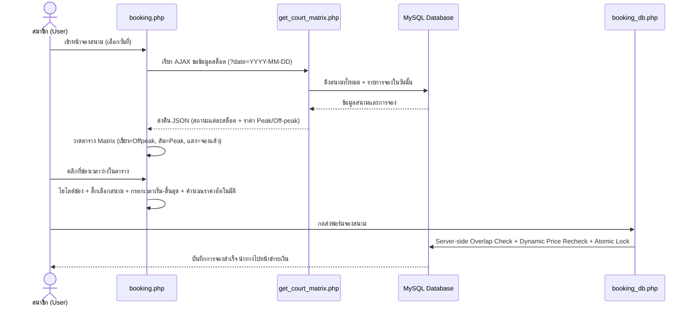

# บันทึกการดำเนินงาน: Time-Slot Matrix, Dynamic Peak/Off-Peak Pricing & Admin Analytics (2026-09-26)

เอกสารนี้บันทึกรายละเอียดการพัฒนาระบบตารางแสดงความพร้อมของสนามแบบ Time-Slot Matrix, ระบบคำนวณราคาแบบไดนามิก Peak / Off-Peak และการเพิ่มรายงานวิเคราะห์แดชบอร์ดแอดมิน (ช่วงอายุ และรายได้รายเดือน 12 เดือน) ประจำวันที่ 26 กันยายน 2026 ตามขอบเขตการทำงาน 1.3.2 และ 1.3.5

---

## 1. ทำอะไรบ้าง (What Was Done)

### 1.1 ตารางแสดงความพร้อมของสนามแบบ Time-Slot Matrix
* **ไฟล์ที่สร้างใหม่:** [actions/get_court_matrix.php](file:///c:/xampp/htdocs/ts-pattani/actions/get_court_matrix.php)
  - พัฒนา JSON API สำหรับดึงข้อมูลความพร้อมของทุกสนาม (Court 1 - 10) ในวันที่กำหนด
  - แบ่งช่วงเวลาเป็น 13 สล็อต (09:00 - 22:00 น. ช่วงละ 1 ชม.)
  - ตรวจสอบสถานะการจองแบบ Overlap (`booking_start_time < slot_end AND booking_end_time > slot_start`) และระบุสถานะ:
    - `'available'`: ว่าง พร้อมจอง
    - `'pending'`: รอตรวจสอบสลิป
    - `'booked'`: จองแล้ว
    - `'closed'`: นอกเวลาทำการของสนาม
  - ระบุเรทราคา Peak / Off-peak ประจำสล็อตแบบไดนามิก
* **ไฟล์ที่แก้ไข:** [booking.php](file:///c:/xampp/htdocs/ts-pattani/booking.php)
  - เพิ่มคอมโพเนนต์ Time-Slot Matrix ด้านบนสุดของหน้าจองสนาม
  - เพิ่มตัวเลือกวันที่แบบปุ่มลัด ("วันนี้", "พรุ่งนี้") และ Datepicker สำหรับเลือกดูวันล่วงหน้า
  - เพิ่มแถบ Color Legend อธิบายความหมายของแต่ละสี
  - รองรับการคลิกที่ช่องเวลาเพื่อเลือกสนามและเวลาลงฟอร์มจองทันที (One-click Slot Selection)
* **ไฟล์ที่แก้ไข:** [assets/js/member.js](file:///c:/xampp/htdocs/ts-pattani/assets/js/member.js)
  - เพิ่มฟังก์ชัน `loadCourtMatrix()`, `renderCourtMatrix()`, `selectSlotFromMatrix()`, `setMatrixDate()`, และ `onMatrixDatePickerChange()`

### 1.2 ระบบคำนวณราคาตามช่วงเวลาแบบไดนามิก (Peak / Off-Peak Pricing)
* **เกณฑ์การคิดราคา:**
  - **Peak (ช่วงยอดนิยม):** 17:00 - 22:00 น. (อัตราค่าบริการ `court_peak_price` เช่น 200 ฿/ชม.)
  - **Off-Peak (ช่วงทั่วไป):** ก่อน 17:00 น. เช่น 09:00 - 17:00 น. (อัตราค่าบริการ `court_offpeak_price` เช่น 150 ฿/ชม.)
* **ไฟล์ที่แก้ไขฝั่งเซิร์ฟเวอร์:** [actions/booking_db.php](file:///c:/xampp/htdocs/ts-pattani/actions/booking_db.php)
  - ปรับการคำนวณราคาค่าสนามฝั่ง Backend แบบวนลูปตรวจสอบทีละ 1 ชั่วโมงตามช่วงเวลาที่ลูกค้าเลือกจริง ป้องกันการแก้ไขตัวเลขจากฝั่ง Client
* **ไฟล์ที่แก้ไขฝั่งไคลเอนต์:** [assets/js/member.js](file:///c:/xampp/htdocs/ts-pattani/assets/js/member.js)
  - ปรับปรุงฟังก์ชัน `calculateSummary()` ให้คำนวณแยกจำนวนชั่วโมง Off-peak และ Peak พร้อมแสดงแจกแจงรายละเอียดในกล่องสรุปยอดจอง

### 1.3 กราฟช่วงอายุและรายงานรายได้รายเดือนบน Dashboard แอดมิน
* **ไฟล์ที่แก้ไข:** [admin/index.php](file:///c:/xampp/htdocs/ts-pattani/admin/index.php)
  - เพิ่มการ Query จัดกลุ่มช่วงอายุของผู้ใช้งาน (Demographic Age Groups):
    - ต่ำกว่า 18 ปี
    - 18 - 25 ปี
    - 26 - 35 ปี
    - 36 - 50 ปี
    - มากกว่า 50 ปี
  - เพิ่มการ Query สรุปรายรับย้อนหลัง 12 เดือน แยกหมวดหมู่ (ค่าสนาม, ค่าเช่าอุปกรณ์, ค่าสินค้า)
  - เพิ่มตารางจัดอันดับช่วงเวลายอดนิยมในการจอง (Peak Usage Hours: Top 5 Hours)
* **ไฟล์ที่แก้ไข:** [assets/js/admin.js](file:///c:/xampp/htdocs/ts-pattani/assets/js/admin.js)
  - เพิ่ม Chart.js Doughnut Chart แสดงสัดส่วนช่วงอายุ (`#ageGroupChart`)
  - เพิ่ม Chart.js Stacked Bar Chart แสดงรายรับรายเดือน 12 เดือนแบบแยกหมวดหมู่ (`#monthlyRevenueChart`)

---

## 2. ระบบทำงานอย่างไร (How the System Works)

### 2.1 โฟลว์การทำงานของ Time-Slot Matrix & การเลือกจอง

### 2.2 การคำนวณราคาแบบไดนามิกข้ามช่วงเวลา (Split-Hour Pricing)
สมมติลูกค้าเลือกจอง **15:00 - 18:00 น.** (รวม 3 ชั่วโมง):
* **15:00 - 16:00 น. (Off-peak):** 150 บาท
* **16:00 - 17:00 น. (Off-peak):** 150 บาท
* **17:00 - 18:00 น. (Peak):** 200 บาท
* **รวมค่าสนามทั้งสิ้น:** 150 + 150 + 200 = **500 บาท**
ทั้งฝั่งหน้าบ้าน (`member.js`) และหลังบ้าน (`booking_db.php`) คำนวณด้วยอัลกอริทึมเดียวกัน ทำให้ตัวเลขตรงกันและปลอดภัย

---

## 3. วิธีการทดสอบและการใช้งาน (How to Use & Test)

1. **ทดสอบ Time-Slot Matrix ในหน้าจองสนาม:**
   - เข้าหน้า [booking.php](http://localhost/ts-pattani/booking.php)
   - สังเกตตาราง **Court Availability Matrix** ด้านบน:
     - ช่องเวลา 09:00 - 17:00 น. จะเป็นสีเขียวอ่อน (Off-peak)
     - ช่องเวลา 17:00 - 22:00 น. จะเป็นสีเหลืองส้ม (Peak)
     - ช่องที่มีคนจองแล้วจะเป็นสีแดง (จองแล้ว)
   - ลองคลิกปุ่ม "พรุ่งนี้" หรือเลือกวันที่ใน Datepicker: ตารางจะโหลดข้อมูลของวันนั้นแบบเรียลไทม์
   - ลองคลิกที่ช่องเวลาว่างช่องใดก็ได้:
     - ช่องนั้นจะขึ้นขอบสีน้ำเงินไฮไลต์
     - ฟอร์มด้านล่างจะถูกเลือกสนามและเวลาให้ทันที
     - กล่องสรุปรายการจองจะคำนวณยอดเงินและแสดงแจกแจง Off-peak/Peak ทันที
2. **ทดสอบการคำนวณราคา Peak / Off-peak:**
   - เลือกเวลา 13:00 - 15:00 น. (Off-peak ล้วน): ยอดค่าสนามจะเป็น 150 x 2 = 300 ฿
   - เลือกเวลา 18:00 - 20:00 น. (Peak ล้วน): ยอดค่าสนามจะเป็น 200 x 2 = 400 ฿
   - เลือกเวลา 16:00 - 18:00 น. (ข้ามช่วง): ยอดค่าสนามจะเป็น 150 + 200 = 350 ฿
   - กดส่งฟอร์มและตรวจสอบในหน้าชำระเงิน ยอดเงินจะตรงกันอย่างสมบูรณ์
3. **ทดสอบ Dashboard แอดมิน (กราฟช่วงอายุ & รายรับ 12 เดือน):**
   - เข้าสู่ระบบแอดมินที่ [admin/index.php](http://localhost/ts-pattani/admin/index.php)
   - ตรวจสอบกราฟ **"รายงานสรุปรายได้รายเดือน (ย้อนหลัง 12 เดือน)"**: เป็นกราฟแท่งแบบ Stacked ซ้อนแยกค่าสนาม, ค่าเช่า, ค่าสินค้า
   - ตรวจสอบการ์ด **"ชั่วโมงยอดนิยม (Peak Hours)"**: แสดงตารางจัดอันดับชั่วโมงที่มีการจองบ่อยที่สุด
   - เลื่อนลงมาที่หมวด Demographic Analytics: ตรวจสอบกราฟโดนัท **"สัดส่วนการจองแบ่งตามช่วงอายุ"** (ต่ำกว่า 18, 18-25, 26-35, 36-50, มากกว่า 50)

---

## 4. ปัญหาที่พบและการแก้ไข (Issues Encountered & Resolved)

1. **ปัญหาการคำนวณราคาคงที่แบบเดิม (Flat-rate calculation):**
   - *สาเหตุ:* โค้ดเดิมใช้ `court_price_per_hour * hours` โดยไม่ได้คำนึงว่าลูกค้าจองในช่วงเวลาคนเล่นเยอะ (Peak) หรือช่วงบ่าย (Off-peak)
   - *การแก้ไข:* ปรับ Logic ทั้งใน JavaScript และ PHP ให้ Loop ตรวจสอบทีละชั่วโมง หากช่วงเวลา `$h >= 17 && $h < 22` ให้ใช้ราคา Peak
2. **การคลิกเลือกสล็อตในตาราง Matrix ให้เชื่อมโยงกับฟอร์ม:**
   - *สาเหตุ:* ตาราง Matrix และฟอร์มจองสนามแยกส่วนกัน หากคลิกแล้วต้องเลื่อนหาและกรอกเองจะใช้งานยาก
   - *การแก้ไข:* เขียนฟังก์ชัน `selectSlotFromMatrix()` ให้เมื่อคลิกช่องใด จะทำการ Set Radio button ของสนาม และ Dropdown ของเวลาเริ่มต้น-สิ้นสุด ให้อัตโนมัติ พร้อมสั่ง `calculateSummary()` ทันที
3. **การจัดการสมาชิกที่ไม่ได้ระบุอายุในกราฟ Demographic:**
   - *สาเหตุ:* สมาชิกบางท่านอาจไม่ได้ระบุอายุ หรืออายุเป็น 0 ซึ่งหากใช้เงื่อนไขช่วงอายุตรงๆ ข้อมูลอาจตกหล่น
   - *การแก้ไข:* เพิ่มเงื่อนไข `WHEN m.member_age IS NULL OR m.member_age = 0 THEN 'ไม่ระบุอายุ'` ใน SQL CASE Statement
