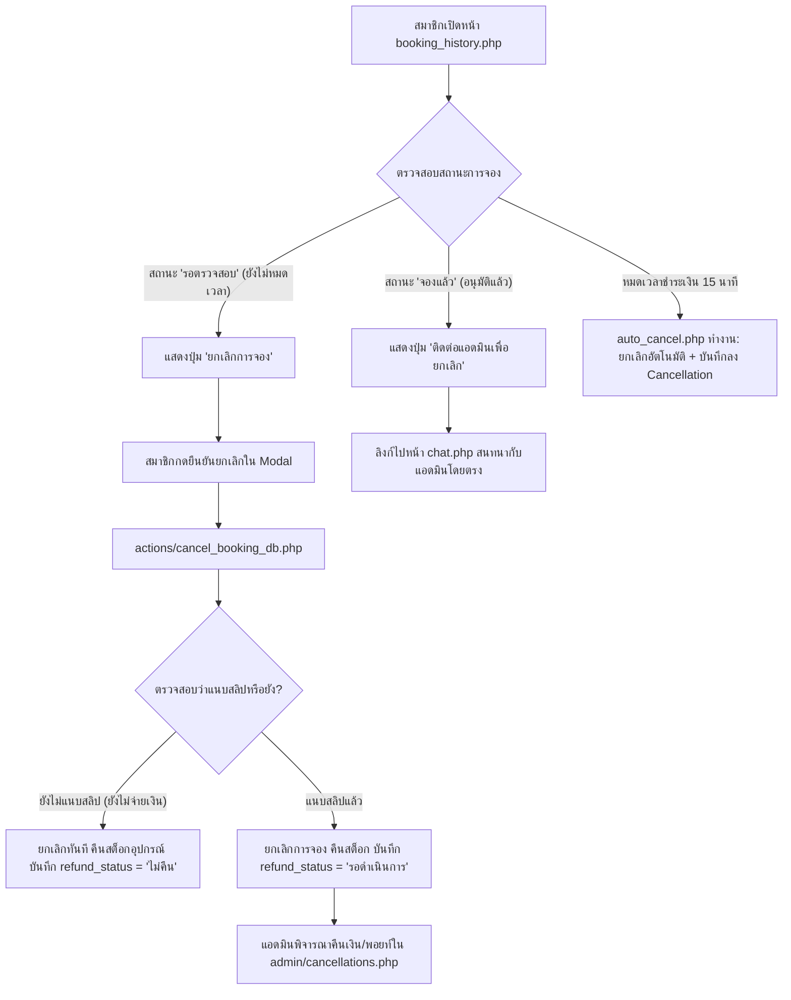

# บันทึกการดำเนินงาน: ปรับปรุงระบบยกเลิกการจองให้ตรงตามขอบเขต 1.3.11 (2026-09-28)
**วันที่:** 2026-09-28  
**ระบบ:** T.S. Pattani Badminton Court Management System  
**ผู้จัดทำ:** Antigravity AI Assistant

---

## 1. ทำอะไรบ้าง (What Was Done)

ปรับปรุงระบบและเงื่อนไขการยกเลิกการจองสนามฝั่งสมาชิกให้สอดคล้องกับข้อกำหนดใน **เล่มรายงานโครงงาน หัวข้อ 1.3.11 (ระบบการจัดการสิทธิ์และเงื่อนไขการยกเลิก)** อย่างถูกต้อง 100%:

### ข้อกำหนดตามรายงาน 1.3.11:
1. *สมาชิกสามารถกดยกเลิกการจองได้เองเฉพาะช่วงสถานะ "รอตรวจสอบ"*
2. *หากสถานะเปลี่ยนเป็น "จองแล้ว" จะไม่สามารถยกเลิกผ่านระบบได้ (ต้องติดต่อ Admin)*
3. *ผู้ดูแลระบบ (Admin) มีสิทธิ์พิจารณายกเลิกและคืนเงิน/คืนพอยท์ให้ลูกค้าตามความเหมาะสม*
4. *ระบบบันทึกประวัติการยกเลิกเพื่อใช้ตรวจสอบความโปร่งใสในรายงานตอนสิ้นวัน*

### ไฟล์ที่ทำการสร้างและแก้ไข:
1. **[booking_history.php](file:///c:/xampp/htdocs/ts-pattani/booking_history.php):**
   - ปรับเงื่อนไขตัวแปร `$can_member_cancel`: กำหนดให้แสดงปุ่ม **"ยกเลิกการจอง"** ได้เฉพาะเมื่อรายการมีสถานะ `'รอตรวจสอบ'` และยังไม่หมดเวลาล็อก 15 นาที
   - เพิ่มตัวแปร `$need_contact_admin`: เมื่อรายการมีสถานะ `'จองแล้ว'` และยังไม่เลยเวลาเริ่มใช้งาน ระบบจะแสดงปุ่ม **"ติดต่อแอดมินเพื่อยกเลิก"** พร้อมลิงก์ไปยังระบบแชท [chat.php](file:///c:/xampp/htdocs/ts-pattani/chat.php) โดยตรง เพื่อให้สมาชิกติดต่อเจ้าหน้าที่ตามเงื่อนไข
   - สำหรับรายการที่หมดเวลาล็อกชำระเงิน (15 นาที) ปรับให้แสดงป้ายสถานะ **"หมดเวลา"** อย่างชัดเจน
2. **[actions/cancel_booking_db.php](file:///c:/xampp/htdocs/ts-pattani/actions/cancel_booking_db.php):**
   - เพิ่มเงื่อนไขตรวจสอบฝั่ง Server: หากรายการจองเป็นสถานะ `'จองแล้ว'` จะไม่อนุญาตให้ยกเลิกผ่านระบบ และแจ้งข้อความเตือนให้ติดต่อแอดมินผ่านแชท
   - ปรับปรุงการบันทึกสถานะการคืนเงิน (`refund_status`):
     - กรณีที่ยังไม่ได้แนบสลิป (ยังไม่ได้โอนเงินจริง): กำหนดให้ `refund_status = 'ไม่คืน'` และแจ้งเตือน "ยกเลิกรายการจองเรียบร้อยแล้ว ปลดล็อกสนามและคืนอุปกรณ์เรียบร้อย"
     - กรณีที่แนบสลิปแล้ว: กำหนดให้ `refund_status = 'รอดำเนินการ'` เพื่อส่งต่อให้แอดมินพิจารณาคืนเงินใน [admin/cancellations.php](file:///c:/xampp/htdocs/ts-pattani/admin/cancellations.php)
3. **[admin/includes/auto_cancel.php](file:///c:/xampp/htdocs/ts-pattani/admin/includes/auto_cancel.php):**
   - เพิ่มคำสั่งบันทึกลงตาราง `Cancellation` อัตโนมัติ (`cancel_by = 'Admin'`, `refund_status = 'ไม่คืน'`, เหตุผล: 'ระบบยกเลิกอัตโนมัติเนื่องจากหมดเวลาชำระเงิน (15 นาที)') เพื่อความโปร่งใสและตรวจสอบได้ในรายงานตอนสิ้นวัน

---

## 2. ระบบเป็นอย่างไร (How the System Works)

### โฟลว์การควบคุมสิทธิ์การยกเลิก (Cancellation Permission Workflow):

---

## 3. การใช้งานอย่างไร (How to Use / Test)

1. **ทดสอบการยกเลิกของสถานะ "รอตรวจสอบ":**
   - ทำการจองสนามใหม่ในหน้า [booking.php](file:///c:/xampp/htdocs/ts-pattani/booking.php) (สถานะจะเป็น "รอตรวจสอบ")
   - เข้าไปที่หน้า [booking_history.php](file:///c:/xampp/htdocs/ts-pattani/booking_history.php)
   - สังเกตว่าจะพบปุ่มสีแดง **"ยกเลิกการจอง"**
   - คลิกปุ่ม -> ระบุเหตุผล -> กดยืนยัน
   - ผลลัพธ์: รายการจะถูกยกเลิกทันที และสต็อกอุปกรณ์เช่า (ถ้ามี) จะถูกคืนกลับเข้าคลัง
2. **ทดสอบสถานะ "จองแล้ว":**
   - ในรายการจองที่แอดมินกดอนุมัติสลิปแล้ว (สถานะเป็น "จองแล้ว")
   - จะไม่พบปุ่ม "ขอยกเลิก" แต่จะแสดงปุ่ม **"ติดต่อแอดมินเพื่อยกเลิก"**
   - เมื่อคลิกปุ่ม ระบบจะพาสมาชิกไปยังหน้า [chat.php](file:///c:/xampp/htdocs/ts-pattani/chat.php) เพื่อสนทนากับแอดมินโดยตรง
3. **ตรวจสอบรายงานในฝั่งผู้ดูแลระบบ:**
   - เข้าสู่ระบบแอดมิน แล้วไปที่หน้า [admin/cancellations.php](file:///c:/xampp/htdocs/ts-pattani/admin/cancellations.php)
   - จะพบประวัติการยกเลิกที่บันทึกไว้อย่างโปร่งใส ครบทั้งรายการที่สมาชิกยกเลิกและรายการที่ระบบยกเลิกอัตโนมัติ

---

## 4. ปัญหาที่เจอหรือแก้อะไรบ้าง (Issues Encountered & Resolved)

* **ปัญหาเดิม:** โค้ดเดิมอนุญาตให้สมาชิกกดยกเลิกรายการที่ "จองแล้ว" ได้ด้วยตนเอง ซึ่งไม่ตรงกับข้อความที่ระบุในเล่มรายงานโครงงาน 1.3.11 ที่กำหนดว่า "สถานะจองแล้วต้องติดต่อแอดมิน"
* **วิธีการแก้ไข:**
  1. ปรับเงื่อนไข UI ใน `booking_history.php` ให้ปุ่มยกเลิกแสดงเฉพาะสถานะ `รอตรวจสอบ` และเปลี่ยนปุ่มของสถานะ `จองแล้ว` เป็นปุ่มติดต่อแอดมินผ่านแชท
  2. เพิ่ม Backend Validation ใน `actions/cancel_booking_db.php` ดักจับไม่ให้ยกเลิกรายการสถานะ `จองแล้ว`
  3. เพิ่มการบันทึกประวัติการยกเลิกลงตาราง `Cancellation` สำหรับกรณี Auto-cancel 15 นาที เพื่อให้ประวัติในระบบครบถ้วน 100%
