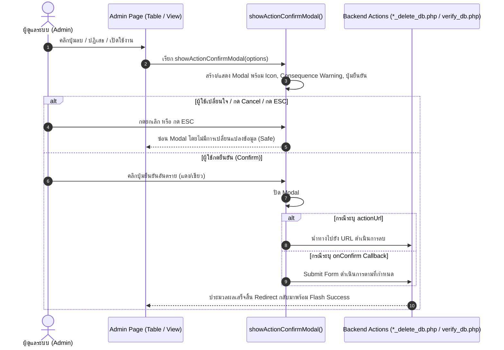

# เอกสารบันทึกการทำงาน: ยกระดับ Action Confirmation Modal ฝั่งผู้ดูแลระบบ (Admin)
**วันที่:** 2026-10-05  
**ผู้รับผิดชอบ:** AI Assistant (Antigravity) & ทีมพัฒนา T.S. Pattani Badminton  
**เอกสารอ้างอิง:** [docs/PROJECT_HCI_RULES.md](file:///c:/xampp/htdocs/ts-pattani/docs/PROJECT_HCI_RULES.md) (Supplementary Rules ข้อ 5 และ Section 15)  
**ไฟล์ที่เกี่ยวข้อง:**
- [assets/css/admin.css](file:///c:/xampp/htdocs/ts-pattani/assets/css/admin.css)
- [assets/js/admin.js](file:///c:/xampp/htdocs/ts-pattani/assets/js/admin.js)
- [admin/includes/footer.php](file:///c:/xampp/htdocs/ts-pattani/admin/includes/footer.php)
- [admin/admins.php](file:///c:/xampp/htdocs/ts-pattani/admin/admins.php)
- [admin/courts.php](file:///c:/xampp/htdocs/ts-pattani/admin/courts.php)
- [admin/news.php](file:///c:/xampp/htdocs/ts-pattani/admin/news.php)
- [admin/products.php](file:///c:/xampp/htdocs/ts-pattani/admin/products.php)
- [admin/rewards.php](file:///c:/xampp/htdocs/ts-pattani/admin/rewards.php)
- [admin/payments.php](file:///c:/xampp/htdocs/ts-pattani/admin/payments.php)

---

## 1. ทำอะไรบ้าง (What Was Done)
1. **พัฒนา Global Action Confirmation Modal Component (HCI Rule 5 & Section 15):**
   - ออกแบบ Modal สากลใน [assets/js/admin.js](file:///c:/xampp/htdocs/ts-pattani/assets/js/admin.js) ผ่านฟังก์ชัน `getOrCreateConfirmModal()`, `showActionConfirmModal(options)` และ `closeActionConfirmModal()`
   - รองรับการทำงานทั้งแบบระบุ URL ปลายทาง (`actionUrl`) สำหรับปุ่มลิงก์ และแบบ Callback Function (`onConfirm`) สำหรับส่งฟอร์ม (Form Submission)
   - รองรับ Accessibility: ปิด Modal ได้ด้วยการกดปุ่ม `ESC` หรือคลิกพื้นที่ภายนอก (Backdrop Overlay)
2. **ออกแบบและตกแต่งสไตล์ Confirmation Modal ใน [assets/css/admin.css](file:///c:/xampp/htdocs/ts-pattani/assets/css/admin.css):**
   - เพิ่มคลาส `.confirm-modal-content`, `.confirm-modal-icon-wrapper` (danger/success/warning), `.confirm-modal-title`, `.confirm-modal-consequence` (กล่องแจ้งเตือนผลกระทบสีแดง/เขียว), และ `.btn-confirm-action`
3. **กำจัดการใช้ `confirm()` ทั้งหมด 7 จุดในระบบ Admin และแทนที่ด้วย Modal ใหม่:**
   - **จุดที่ 1 ([admin/admins.php](file:///c:/xampp/htdocs/ts-pattani/admin/admins.php)):** การลบผู้ดูแลระบบ พร้อมระบุผลกระทบว่าบัญชีจะไม่สามารถเข้าใช้งานระบบได้อีก
   - **จุดที่ 2 ([admin/courts.php](file:///c:/xampp/htdocs/ts-pattani/admin/courts.php)):** การลบสนาม พร้อมคำเตือนเรื่องประวัติการจองในระบบ
   - **จุดที่ 3 ([admin/courts.php](file:///c:/xampp/htdocs/ts-pattani/admin/courts.php)):** การยืนยันเปิดใช้งานสนามหลังซ่อมเสร็จ เปลี่ยนเป็น Modal ยืนยันสีเขียว (`type: 'success'`)
   - **จุดที่ 4 ([admin/news.php](file:///c:/xampp/htdocs/ts-pattani/admin/news.php)):** การลบข่าวสาร/โปรโมชั่น แจ้งเตือนการลบรูปภาพและเนื้อหาออกจากหน้าเว็บอย่างถาวร
   - **จุดที่ 5 ([admin/products.php](file:///c:/xampp/htdocs/ts-pattani/admin/products.php)):** การลบสินค้าและอุปกรณ์เช่า พร้อมเตือนผลกระทบต่อประวัติการทำรายการ
   - **จุดที่ 6 ([admin/rewards.php](file:///c:/xampp/htdocs/ts-pattani/admin/rewards.php)):** การลบของรางวัล แจ้งเตือนว่าสมาชิกจะไม่สามารถแลกรับได้อีก
   - **จุดที่ 7 ([admin/payments.php](file:///c:/xampp/htdocs/ts-pattani/admin/payments.php)):** การปฏิเสธสลิปการโอนเงิน เตือนชัดเจนว่าการจองจะถูกยกเลิกและคืนสล็อตเวลาทันที
4. **อัปเดตแคชสคริปต์ (`admin.js?v=1.22`) ทั่วทั้งระบบ Admin**

---

## 2. ระบบเป็นอย่างไร (How the System Works)

* **มาตรฐานความปลอดภัยและ HCI Section 15:**
  - **No Generic "Are you sure?":** อธิบายผลกระทบของข้อมูลที่ชัดเจนทุกครั้ง
  - **Explicit Confirm Labels:** ปุ่มยืนยันระบุการกระทำชัดเจน เช่น *"ยืนยันการลบ"*, *"ยืนยันปฏิเสธสลิป"*, *"ยืนยันเปิดใช้งาน"*
  - **Visual Hierarchy:** ปุ่มอันตรายใช้สีแดง (`btn-danger`) พร้อมไอคอนเตือน ส่วนการเปิดใช้งานใช้สีเขียว (`btn-success`)

---

## 3. การใช้งานอย่างไร (How to Use / Test)

### ขั้นตอนการทดสอบฝั่ง Admin (Admin Verification Steps):
1. **เข้าสู่ระบบ Admin:** เข้าสู่ระบบหลังบ้านด้วยสิทธิ์ Admin
2. **ทดสอบหน้าผู้ดูแลระบบ (`admin/admins.php`):**
   - คลิกไอคอนถังขยะสีแดงที่บัญชี Admin อื่น
   - สังเกต Modal เด้งขึ้นมาตรงกลางจอ มีไอคอนเตือนสีแดง ข้อความระบุชื่อผู้ดูแลระบบ และกล่องคำเตือนผลกระทบ
   - ทดสอบกดปุ่ม **"ยกเลิก"** หรือกดปุ่ม **ESC** หรือคลิกพื้นหลังสีดำ -> Modal ต้องปิดตัวลงโดยไม่เกิดการลบ
3. **ทดสอบหน้าสนามแบดมินตัน (`admin/courts.php`):**
   - ทดสอบคลิกปุ่มถังขยะที่สนามเพื่อดูลักษณะกล่องยืนยันลบสนาม
   - สำหรับสนามที่อยู่ในสถานะ "ปิดปรับปรุง" ทดลองคลิกปุ่ม **"ซ่อมเสร็จแล้ว"** -> ระบบจะแสดง Modal สีเขียวถามยืนยันการเปิดใช้งาน
4. **ทดสอบหน้าสินค้าและของรางวัล (`admin/products.php`, `admin/rewards.php`, `admin/news.php`):**
   - คลิกปุ่มลบในแต่ละหน้า สังเกตการแสดงผลชื่อสินค้า/ข่าวสาร/ของรางวัลใน Modal อย่างถูกต้อง
5. **ทดสอบหน้าตรวจสอบการชำระเงิน (`admin/payments.php`):**
   - เปิดหน้ารายการชำระเงิน คลิกดูสลิปที่รอตรวจสอบ
   - คลิกปุ่มสีแดง **"ปฏิเสธสลิป"**
   - สังเกต Modal ยืนยันแจ้งเตือนว่า *"เมื่อปฏิเสธสลิป รายการจองนี้จะถูกยกเลิก และคืน Slot เวลาของสนามกลับสู่ระบบทันที"*
   - เมื่อกดยืนยัน ระบบจะส่งฟอร์มเพื่อปฏิเสธสลิปและปรับปรุงสถานะอย่างถูกต้อง

---

## 4. ปัญหาที่เจอหรือแก้อะไรบ้าง (Issues Encountered & Resolved)

| ปัญหาเดิม / สาเหตุ (Root Cause) | แนวทางแก้ไข (Solution) | หมายเหตุ / ข้อควรระวัง |
| :--- | :--- | :--- |
| **การใช้ browser `confirm()`:** ข้อความเรียบง่าย ไม่มี Consequence เตือน และขัดต่อมาตรฐาน HCI | พัฒนา Global Action Confirmation Modal ใน `admin.js` และ `admin.css` | ใช้งานได้ทันทีทุกหน้าในโฟลเดอร์ admin |
| **ความแตกต่างของการจัดการ Action:** บางปุ่มเป็นแท็ก `<a>` (URL redirect) แต่บางปุ่มเป็น `<button type="submit">` (Form submission เช่นใน `payments.php`) | ฟังก์ชัน `showActionConfirmModal` รองรับทั้ง `actionUrl` (เปลี่ยน `href`) และ `onConfirm` (Callback Function) | ยืดหยุ่นและรองรับทุกบริบทของฟอร์ม |
| **การปิด Modal:** หากผู้ใช้เปลี่ยนใจหรือต้องการยกเลิก | รองรับทั้งปุ่มยกเลิก, การคลิกพื้นหลังสีดำ (Backdrop), และการกดปุ่ม Escape | ตรงตามมาตรฐาน Accessibility |
| **Cache ของบราวเซอร์:** บราวเซอร์อาจจำไฟล์ `admin.js` เก่า | ปรับ Query string ทุกจุดเป็น `admin.js?v=1.22` | ผู้ใช้เห็นผลลัพธ์ใหม่ทันทีโดยไม่ต้องกด Hard Reload |
