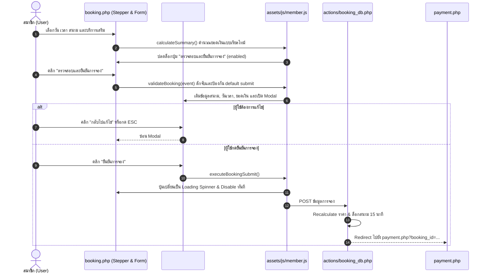

# เอกสารบันทึกการทำงาน: เพิ่ม 4-Phase Stepper และยกระดับ Booking Flow ตามมาตรฐาน HCI
**วันที่:** 2026-10-05  
**ผู้รับผิดชอบ:** AI Assistant (Antigravity) & ทีมพัฒนา T.S. Pattani Badminton  
**เอกสารอ้างอิง:** [docs/PROJECT_HCI_RULES.md](file:///c:/xampp/htdocs/ts-pattani/docs/PROJECT_HCI_RULES.md) (Supplementary Rules ข้อ 2, 3, 5 และ Section 10)  
**ไฟล์ที่เกี่ยวข้อง:**
- [booking.php](file:///c:/xampp/htdocs/ts-pattani/booking.php)
- [assets/css/style.css](file:///c:/xampp/htdocs/ts-pattani/assets/css/style.css)
- [assets/js/member.js](file:///c:/xampp/htdocs/ts-pattani/assets/js/member.js)

---

## 1. ทำอะไรบ้าง (What Was Done)
1. **พัฒนา Visual 4-Phase Stepper Component ใน `booking.php` (HCI Rule 2 & Section 10):**
   - เพิ่มแถบนำทางแสดงลำดับ 4 ขั้นตอน:
     - `Phase 1: วัน เวลา & สนาม` (เลือกวัน เวลา และดู Matrix ความพร้อม)
     - `Phase 2: บริการเสริม` (เครื่องดื่ม ลูกแบด ไม้แบด รองเท้า)
     - `Phase 3: สรุปยอดเงิน` (ตรวจสอบยอดรวมอัตโนมัติตามวันในสัปดาห์)
     - `Phase 4: ชำระเงิน` (หน้าถัดไป: สแกน QR และแนบสลิปภายใน 15 นาที)
   - มีเส้นเชื่อมต่อ (Progress bar) และไอคอนวงกลมพร้อมสถานะ `active` และ `upcoming` ช่วยลด Cognitive Load ของผู้ใช้งาน
2. **ปรับแต่งหัวข้อการ์ดฟอร์มให้สอดคล้องกับลำดับ Phase:**
   - *ขั้นตอนที่ 1.1: ระบุวันและเวลา (ขั้นต่ำ 1 ชม.)*
   - *ขั้นตอนที่ 1.2: เลือกสนามแบดมินตัน*
   - *ขั้นตอนที่ 2: บริการเสริมและอุปกรณ์เช่า (ทางเลือกเสริม)*
   - *ขั้นตอนที่ 3: สรุปรายการจองและยืนยัน*
3. **พัฒนา Member Booking Confirmation Modal แทนที่ Browser `confirm()` (HCI Rule 5 & Section 15):**
   - ยกเลิกการใช้ `confirm()` ในฟังก์ชัน `validateBooking()`
   - สร้างกล่อง Modal สวยงาม สรุปข้อมูลสำคัญก่อนส่งจอง: ชื่อสนาม, วันที่จอง, ช่วงเวลาและชั่วโมง, ยอดเงินรวมสุทธิ
   - แจ้งเตือนเรื่องการล็อกสนาม: *"กรุณาชำระเงินภายใน 15 นาที เมื่อกดยืนยัน ระบบจะล็อกสนามไว้ให้ท่าน และนำทางไปหน้าชำระเงินเพื่อแนบสลิป"*
   - มีปุ่ม *"กลับไปแก้ไข"* และปุ่ม *"ยืนยันการจอง"*
4. **Loading State & Anti-Double Submit (HCI Rule 3 & 4):**
   - เมื่อผู้ใช้กดยืนยันใน Modal ทั้งปุ่มใน Modal และปุ่มบนฟอร์มจะเปลี่ยนเป็น `<i class="fas fa-spinner fa-spin"></i> กำลังบันทึกการจอง...` และปิดการใช้งาน (`disabled = true`) ทันที ป้องกันการกดซ้ำซ้อนขณะรอระบบ Backend บันทึกลงฐานข้อมูล

---

## 2. ระบบเป็นอย่างไร (How the System Works)

---

## 3. การใช้งานอย่างไร (How to Use / Test)

1. **เข้าสู่หน้าจองสนาม ([booking.php](file:///c:/xampp/htdocs/ts-pattani/booking.php)):**
   - สังเกตแถบ **4-Phase Stepper** ด้านบนสุด แสดงขั้นตอนชัดเจน
2. **เลือกวันและเวลา:**
   - สามารถคลิกช่องว่างบน **Time-Slot Matrix** หรือเลือกผ่าน Dropdown ด้านล่าง
   - เลือกสนามที่ต้องการจอง
3. **เลือกบริการเสริม (ถ้ามี):**
   - ระบุจำนวนน้ำดื่ม ลูกแบด หรืออุปกรณ์เช่า
4. **ตรวจสอบและกดยืนยัน:**
   - ในกล่องสรุปรายการจอง ตรวจสอบยอดรวมที่คำนวณถูกต้อง
   - คลิกปุ่มสีน้ำเงิน **"ตรวจสอบและยืนยันการจอง"**
5. **ทดสอบ Confirmation Modal:**
   - สังเกตหน้าต่างเด้งขึ้นมา แสดงสรุปชื่อสนาม วันที่ ช่วงเวลา ยอดชำระสุทธิ และกล่องเตือนสีเหลืองเรื่องการล็อกสนาม 15 นาที
   - ทดสอบกดปุ่ม **"กลับไปแก้ไข"** หรือปุ่ม **ESC** บนคีย์บอร์ด -> Modal ปิดตัวลง
   - เปิดใหม่อีกครั้งแล้วคลิก **"ยืนยันการจอง"** -> สังเกตปุ่มกลายเป็น Spinner *"กำลังบันทึกการจอง..."* ทันที
   - ระบบจะส่งข้อมูลไปบันทึก และนำทางไปหน้าชำระเงิน [payment.php](file:///c:/xampp/htdocs/ts-pattani/payment.php) โดยราบรื่น

---

## 4. ปัญหาที่เจอหรือแก้อะไรบ้าง (Issues Encountered & Resolved)

| ปัญหาเดิม / สาเหตุ (Root Cause) | แนวทางแก้ไข (Solution) | หมายเหตุ / ข้อควรระวัง |
| :--- | :--- | :--- |
| **Cognitive Load สูง:** ผู้ใช้ไม่เห็นภาพรวมของโฟลว์การจองในแต่ละสเต็ป | เพิ่ม 4-Phase Stepper ด้านบนและจัดกลุ่มหัวข้อฟอร์มตาม Phase 1, 2, 3 | แสดงผลได้ดีทั้งบนจอ Desktop และ Mobile |
| **การใช้ browser `confirm()`:** เตือนยอดเงินแบบ Alert ธรรมดา ไม่แสดงรายละเอียดสนามและไม่เตือนเรื่องเวลาล็อก 15 นาที | พัฒนา Booking Confirmation Modal สวยงามแสดงข้อมูลครบถ้วน | รองรับ ESC และคลิก Backdrop เพื่อปิด |
| **เสี่ยงเกิด Race Condition / Double Submit:** ผู้ใช้อาจกดย้ำปุ่มจองขณะที่คำขอกำลังส่งไปยัง Server | ใส่ Loading Spinner และตั้ง `disabled = true` บนปุ่มทั้งสองจุดทันทีที่กดส่ง | ปกป้องความถูกต้องของระบบการจองและฐานข้อมูล |
