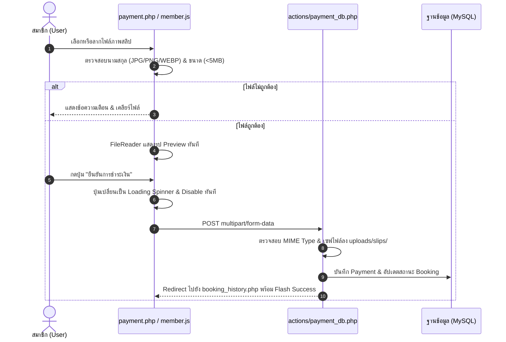

# เอกสารบันทึกการทำงาน: ปรับปรุงระบบแนบสลิปชำระเงินตามมาตรฐาน HCI (Payment Slip UX Improvements)
**วันที่:** 2026-10-05  
**ผู้รับผิดชอบ:** AI Assistant (Antigravity) & ทีมพัฒนา T.S. Pattani Badminton  
**เอกสารอ้างอิง:** [docs/PROJECT_HCI_RULES.md](file:///c:/xampp/htdocs/ts-pattani/docs/PROJECT_HCI_RULES.md) (Supplementary Rules ข้อ 3, 4, 6 และ Section 12)  
**ไฟล์ที่เกี่ยวข้อง:**
- [payment.php](file:///c:/xampp/htdocs/ts-pattani/payment.php)
- [assets/css/style.css](file:///c:/xampp/htdocs/ts-pattani/assets/css/style.css)
- [assets/js/member.js](file:///c:/xampp/htdocs/ts-pattani/assets/js/member.js)

---

## 1. ทำอะไรบ้าง (What Was Done)
1. **เพิ่มส่วนแสดง Flash Message ในหน้า `payment.php`:**
   - รองรับการแสดงผลกล่องแจ้งเตือน `$_SESSION['error']` และ `$_SESSION['success']` จากระบบ Backend เพื่อให้ผู้ใช้รับรู้สาเหตุทันทีหากอัปโหลดสลิปไม่ผ่าน
2. **แก้ไข Typo ของ QR Code Icon:**
   - แก้ไขโค้ดแท็กไอคอน `<i class="fas id="qrcode"></i>` ให้เป็น `<i class="fas fa-qrcode"></i>` เพื่อให้แสดงรูปไอคอน QR Code ได้ถูกต้อง
3. **เพิ่มปุ่มคัดลอกเลขบัญชีธนาคาร (Quick Copy Account Number):**
   - เพิ่มปุ่มคลิกเดียวเพื่อคัดลอกเลขบัญชี `123-4-56789-0` ด้วย Clipboard API พร้อม Tooltip แสดงข้อความยืนยัน *"คัดลอกแล้ว!"* ช่วยลด Cognitive Load ของผู้ใช้
4. **ยกระดับระบบแนบสลิปด้วย Dropzone & Live Image Preview (Section 12):**
   - ออกแบบกล่องอัปโหลด Dropzone สวยงาม รองรับทั้งการคลิกเลือกไฟล์และการลากไฟล์มาวาง (Drag & Drop)
   - แสดงตัวอย่างรูปภาพสลิปทันทีด้วย JavaScript `FileReader` พร้อมชื่อไฟล์และขนาดไฟล์
   - มีปุ่ม *"เปลี่ยนรูปภาพ"* ให้ผู้ใช้สามารถเลือกใหม่ได้ทันท่วงที
5. **Client-side Pre-validation:**
   - ตรวจสอบประเภทไฟล์ (ต้องเป็น JPG, JPEG, PNG, WEBP เท่านั้น)
   - ตรวจสอบขนาดไฟล์ (ต้องไม่เกิน 5MB) ก่อนอนุญาตให้ส่งฟอร์ม เพื่อป้องกัน Error จาก Server
6. **Loading State & Anti-double Submit Feedback (Supplementary Rule 3 & 4):**
   - เมื่อกดปุ่ม "ยืนยันการชำระเงิน" ปุ่มจะเปลี่ยนสถานะเป็น Loading Spinner (`กำลังอัปโหลดสลิป กรุณารอสักครู่...`) และถูกปิดใช้งาน (`disabled = true`) ทันที ป้องกันการกดย้ำซ้ำซ้อน

---

## 2. ระบบเป็นอย่างไร (How the System Works)

---

## 3. การใช้งานอย่างไร (How to Use / Test)

### ขั้นตอนการทดสอบฝั่งผู้ใช้งาน (Member Test Steps):
1. **เข้าสู่ระบบ:** ล็อกอินด้วยบัญชีสมาชิก เข้าสู่ระบบจองสนามและทำรายการจอง
2. **เข้าหน้าชำระเงิน:** ระบบจะนำทางมายัง `payment.php?booking_id=...`
3. **ทดสอบปุ่มคัดลอกเลขบัญชี:**
   - กดปุ่ม **"คัดลอก"** ข้างเลขบัญชี `123-4-56789-0`
   - ตรวจสอบว่ามี Tooltip สีเขียวขึ้นว่า *"คัดลอกแล้ว!"* และทดลองวาง (Ctrl+V) ในโปรแกรมอื่น
4. **ทดสอบ Pre-validation:**
   - ทดลองเลือกไฟล์ประเภทอื่น (เช่น .pdf, .txt) หรือไฟล์ขนาดเกิน 5MB
   - ระบบต้องแจ้งเตือนข้อผิดพลาด และไม่แสดงรูปพรีวิว
5. **ทดสอบ Image Preview:**
   - เลือกไฟล์รูปภาพสลิปที่ถูกต้อง (JPG/PNG/WEBP)
   - หน้าจอต้องซ่อนกล่อง Dropzone เดิม และแสดงรูปสลิปพร้อมขนาดไฟล์และปุ่มเปลี่ยนรูป
6. **ทดสอบ Loading State:**
   - กดปุ่ม **"ยืนยันการชำระเงิน"**
   - สังเกตปุ่มต้องเปลี่ยนเป็น `<i class="fas fa-spinner fa-spin"></i> กำลังอัปโหลดสลิป กรุณารอสักครู่...` และไม่สามารถกดซ้ำได้
   - ระบบจะพาไปยังหน้า `booking_history.php` พร้อม Flash Message สีเขียว

---

## 4. ปัญหาที่เจอหรือแก้อะไรบ้าง (Issues Encountered & Resolved)

| รายการปัญหาเดิม | สาเหตุ (Root Cause) | แนวทางแก้ไข (Solution) |
| :--- | :--- | :--- |
| **ไม่แสดงข้อความเตือนเมื่ออัปโหลดสลิปไม่ผ่าน** | หน้า `payment.php` ขาดการเรนเดอร์ Flash Session `$_SESSION['error']` | เพิ่มการแสดง Alert box ตามมาตรฐานระบบ |
| **เสี่ยงแนบสลิปผิดรูปหรือสลิปไม่ชัดเจน** | ใช้เพียง `<input type="file">` ธรรมดา ผู้ใช้ไม่เห็นตัวอย่างก่อนส่ง | ติดตั้ง Interactive Dropzone + Live Preview ผ่าน `FileReader API` |
| **เสี่ยงเกิด Double Submit** | ไม่มี Loading State บนปุ่มกดยืนยัน ทำให้ผู้ใช้กดซ้ำขณะรออัปโหลด | จัดการ Form Submit Event ใน `member.js` ให้ปุ่มกลายเป็น Spinner และ `disabled = true` ทันที |
| **ไอคอน QR Code ไม่แสดง** | Typo ใน class tag `<i class="fas id="qrcode"></i>` | แก้ไขเป็น `<i class="fas fa-qrcode"></i>` |
| **ความสะดวกในการโอนเงิน** | ผู้ใช้ต้องสลับแอปไปมาเพื่อจดจำหรือคัดลอกเลขบัญชีเอง | เพิ่มปุ่ม Quick Copy พร้อม Visual Feedback |
