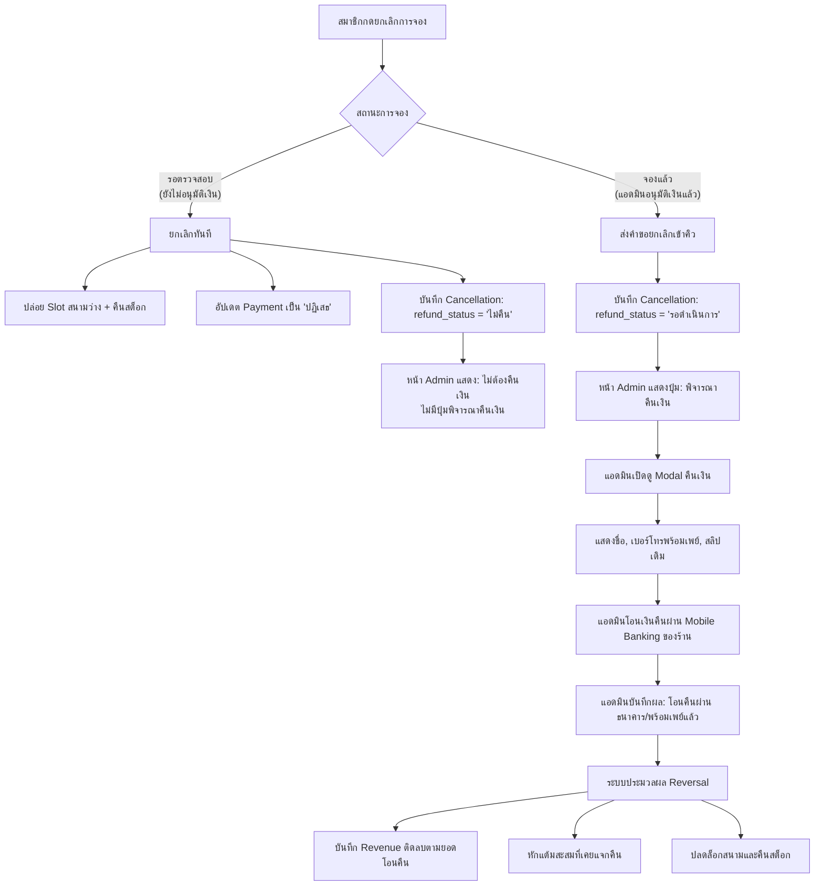

# บันทึกการปรับปรุงระบบ: การยกเลิกการจองและการพิจารณาคืนเงิน (Cancellation & Refund Logic Redesign)
**วันที่:** 6 ตุลาคม 2026 (2026-10-06)  
**โครงการ:** ระบบบริหารจัดการสนามแบดมินตัน T.S. Pattani  
**เป้าหมาย:** แก้ไขช่องโหว่ Business Logic และความเสี่ยงทางบัญชี (Accounting Risk):
1. ป้องกันไม่ให้รายการจองที่ยังไม่ได้รับการอนุมัติการชำระเงินถูกนำไปพิจารณาคืนเงิน (Unverified Cancellation Protection)
2. ปรับเปลี่ยนกระบวนการคืนเงินออนไลน์ให้เป็น "โอนเงินคืนผ่านบัญชีธนาคาร / พร้อมเพย์" (Bank / PromptPay Transfer) แทนการคืนเป็นเงินสด
3. ป้องกันการฉ้อโกง (Anti-Fraud) จากการส่งสลิปปลอมแล้วรีบกดยกเลิก
4. รักษาวินัยทางบัญชี โดยบันทึกการปรับลดยอดรายรับ (`Revenue`) ติดลบเฉพาะรายการที่เคยมีรายได้บันทึกเข้าสู่ระบบจริงเท่านั้น

---

## 1. รายการสิ่งที่ดำเนินการ (What Was Done)

### 1.1 ปรับปรุง Logic การยกเลิกของสมาชิก (`actions/cancel_booking_db.php`)
- **กรณีสถานะ "รอตรวจสอบ" (ยังไม่ได้รับการอนุมัติสลิป/เงินยังไม่เข้าร้าน):**
  - ปลดล็อกสนามให้ว่าง และคืนสต็อกอุปกรณ์กีฬาทันที
  - อัปเดตสถานะในตาราง `Payment` ของรายการนี้เป็น `'ปฏิเสธ'` ทันที เพื่อตัดสลิปออกจากคิวตรวจของแอดมิน
  - บันทึกลงตาราง `Cancellation` ด้วยสถานะ `refund_status = 'ไม่คืน'` และระบุเหตุผลว่าเป็นการยกเลิกก่อนการยืนยันชำระเงิน
  - **ผลลัพธ์:** ตัดสิทธิ์การขอคืนเงินทันที ไม่มีการส่งคำขอไปค้างในคิวรอพิจารณาคืนเงินของแอดมิน
- **กรณีสถานะ "จองแล้ว" (ได้รับการยืนยันและสลิปผ่านการอนุมัติแล้ว):**
  - ตรวจสอบ `Payment.payment_status === 'ยืนยันแล้ว'` เพิ่มเติมเพื่อความปลอดภัย
  - บันทึกคำขอลงตาราง `Cancellation` ด้วยสถานะ `refund_status = 'รอดำเนินการ'` เพื่อส่งให้แอดมินพิจารณาคืนเงินตามเงื่อนไขเวลา

### 1.2 ปรับปรุงหน้าประวัติการจองและ Modal ยกเลิกของสมาชิก (`booking_history.php`)
- ส่งพารามิเตอร์ `status` เข้าสู่ฟังก์ชัน `openCancelModal()`
- หากเป็นรายการ `รอตรวจสอบ`:
  - แสดงกล่องข้อความเตือนสีแดง: *"รายการนี้ยังไม่ได้รับการอนุมัติการชำระเงิน เมื่อกดยกเลิก ระบบจะปล่อย Slot สนามและคืนสต็อกทันที (ไม่มีการคืนเงินเนื่องจากยังไม่มีการชำระเงินที่สมบูรณ์)"*
  - ซ่อนกล่องเงื่อนไขค่าปรับ
  - เปลี่ยนปุ่มเป็น *"ยืนยันยกเลิกการจอง"*
- หากเป็นรายการ `จองแล้ว`:
  - แสดงกล่องนโยบายการขอคืนเงินตามเวลา (100% / 70% / 50%) พร้อมระบุ *"ผู้ดูแลระบบจะพิจารณาและโอนเงินคืนผ่านบัญชีธนาคาร/พร้อมเพย์ของท่าน"*
  - เปลี่ยนปุ่มเป็น *"ส่งคำขอยกเลิกการจอง"*

### 1.3 ปรับปรุงหน้าจัดการการยกเลิกของแอดมิน (`admin/cancellations.php`)
- เพิ่ม `LEFT JOIN Payment p ON b.booking_id = p.booking_id` เพื่อดึงข้อมูล `p.payment_status`, `p.payment_slip_image`, และ `m.member_phone`
- แสดงข้อมูลผู้จองพร้อมเบอร์โทรศัพท์ (พร้อมเพย์) และลิงก์ดูสลิปโอนเงินเดิม
- **เงื่อนไขปุ่มพิจารณาคืนเงิน:** จะแสดงปุ่ม **"พิจารณา"** ให้แอดมินคลิกได้ **เฉพาะเมื่อ** `c.refund_status == 'รอดำเนินการ' AND p.payment_status == 'ยืนยันแล้ว'` เท่านั้น
- หากเป็นกรณีที่ยกเลิกขณะรอตรวจสลิป จะแสดงป้าย `ยกเลิกก่อนชำระเงิน` และไม่มีปุ่มให้กดคืนเงินเด็ดขาด
- **ปรับปรุง Modal พิจารณาคืนเงิน (`#refundModal`):**
  - เปลี่ยนหัวข้อเป็น *"พิจารณาการคืนเงิน (โอนเงินคืนลูกค้า)"*
  - เพิ่มกล่องแสดงข้อมูลผู้รับเงินคืน: ชื่อสมาชิก, เบอร์พร้อมเพย์, ลิงก์ดูสลิปเดิม
  - แก้ไขตัวเลือกจากเดิม "คืนเงินสด" เป็น:
    `<option value="คืนแล้ว">โอนเงินคืนเรียบร้อยแล้ว (ผ่านบัญชีธนาคาร / พร้อมเพย์)</option>`
  - แก้ไข SweetAlert2 แจ้งเตือนยืนยัน: *"ยืนยันว่าได้โอนเงินคืนลูกค้าผ่านบัญชีธนาคาร/พร้อมเพย์ จำนวน X ฿ เรียบร้อยแล้ว"*

### 1.4 ปรับปรุง Action บันทึกผลการพิจารณาของแอดมิน (`admin/actions/cancellation_action_db.php`)
- **Server-side Security Check:** ตรวจสอบอย่างเข้มงวดก่อนดำเนินการ หากแอดมินส่งคำสั่ง `refund_status = 'คืนแล้ว'` แต่พบว่าการจองนั้นไม่เคยได้รับการอนุมัติเงินจริง (`payment_status !== 'ยืนยันแล้ว'`) ระบบจะปฏิเสธคำขอและ Rollback ทันที
- **Revenue Traceability:** บันทึกยอดเงินติดลบใน `Revenue` โดยผูกกับ `payment_id` เดิม เพื่อให้สามารถตรวจสอบย้อนกลับทางบัญชีได้อย่างถูกต้อง

### 1.5 ปรับปรุงหน้าตรวจสอบการชำระเงินของแอดมิน (`admin/payments.php`)
- กรองไม่ให้รายการสลิปของคำขอจองที่ถูกสมาชิกลบ/ยกเลิกไปแล้ว ปรากฏอยู่ในแท็บ `รอตรวจสอบ` (`AND b.booking_status != 'ยกเลิก'`) ป้องกันแอดมินสับสนและเผลอกดอนุมัติซ้ำ

### 1.6 ปรับปรุงสคริปต์ JavaScript กลาง (`assets/js/admin.js`)
- อัปเดตฟังก์ชัน `openRefundModal()` ให้รับพารามิเตอร์ `memberName`, `memberPhone`, `slipImage` และแสดงข้อมูลใน Modal พร้อมลิงก์ดูสลิปต้นทาง

---

## 2. กลไกการทำงานของระบบ (How the System Works)

---

## 3. การทดสอบและการใช้งาน (How to Use & Test)

### 3.1 ทดสอบกรณีสมาชิกยกเลิกระหว่าง "รอตรวจสอบ" (Unverified Cancellation)
1. เข้าสู่ระบบสมาชิก -> จองสนามใหม่ -> อัปโหลดสลิป
2. ไปที่หน้า `booking_history.php` สังเกตสถานะเป็น `รอตรวจสอบสลิป`
3. คลิกปุ่ม "ยกเลิกการจอง"
4. ใน Modal จะแสดงข้อความเตือนชัดเจนว่า *"รายการนี้ยังไม่ได้รับการอนุมัติการชำระเงิน เมื่อกดยกเลิกจะไม่มีการคืนเงิน"* และซ่อนกล่องค่าปรับ
5. กดยืนยันยกเลิก
6. **ผลลัพธ์ที่คาดหวัง:**
   - การจองเปลี่ยนเป็น `ยกเลิกแล้ว` ทันที สนามว่างทันที
   - เข้าสู่ระบบแอดมิน หน้า `admin/payments.php` -> สลิปนี้หายไปจากแท็บ `รอตรวจสอบ`
   - หน้า `admin/cancellations.php` -> แสดงป้าย `ยกเลิกก่อนชำระเงิน` และ `ไม่ต้องคืนเงิน` โดยไม่มีปุ่มให้กดพิจารณาคืนเงิน

### 3.2 ทดสอบกรณีสมาชิกขอยกเลิกขณะ "จองแล้ว" (Confirmed Cancellation & Online Refund)
1. สมาชิกจองสนามและแนบสลิป -> แอดมินตรวจสอบสลิปและกดยืนยัน (สถานะเป็น `จองแล้ว`)
2. สมาชิกเข้าหน้า `booking_history.php` แล้วกดปุ่ม "ขอยกเลิก"
3. ใน Modal จะแสดงเงื่อนไขการคืนเงิน (100%/70%/50%) และปุ่ม *"ส่งคำขอยกเลิกการจอง"*
4. สมาชิกส่งคำขอ -> สถานะเปลี่ยนเป็น `⏳ ขอยกเลิก (รอแอดมินพิจารณา)`
5. แอดมินเข้าหน้า `admin/cancellations.php` -> มีปุ่ม **"พิจารณา"**
6. คลิก "พิจารณา" -> Modal แสดงชื่อสมาชิก, เบอร์โทรศัพท์พร้อมเพย์, และปุ่มเปิดดูสลิปเดิม
7. แอดมินโอนเงินคืนผ่านแอปธนาคารตามยอดที่แนะนำ -> เลือก *"โอนเงินคืนเรียบร้อยแล้ว (ผ่านบัญชีธนาคาร / พร้อมเพย์)"* -> กดยืนยัน
8. **ผลลัพธ์ที่คาดหวัง:**
   - สถานะเปลี่ยนเป็น `โอนคืนแล้ว`
   - ตาราง `Revenue` บันทึกยอดติดลบตามยอดที่โอนคืนจริง
   - พอยท์สะสมของสมาชิกลดลงตามจำนวนที่เคยได้รับ
   - Slot สนามถูกปล่อยคืนสู่ระบบ

---

## 4. ปัญหาที่พบและการแก้ไข (Issues Encountered & Resolved)

| ปัญหาเดิม | สาเหตุที่ตรวจพบ (Root Cause) | แนวทางการแก้ไข (Solution) |
|---|---|---|
| **แอดมินกดคืนเงินให้รายการที่ยังไม่ตรวจสลิปได้** | ใน `actions/cancel_booking_db.php` มีโค้ด `$refund_status = $has_slip ? 'รอดำเนินการ' : 'ไม่คืน'` ทำให้เมื่อมีสลิปแนบมา ระบบส่งเข้าคิวรอคืนเงินทันที ทั้งๆ ที่สลิปยังไม่เคยได้รับการตรวจสอบ | ปรับให้รายการที่สถานะเป็น `รอตรวจสอบ` มีสถานะ `refund_status = 'ไม่คืน'` เท่านั้น และยกเลิกสลิปใน `Payment` เป็น `ปฏิเสธ` ทันที |
| **ไม่มีการคัดกรองปุ่มพิจารณาคืนเงินในหน้า Admin** | หน้า `admin/cancellations.php` เช็คเฉพาะ `refund_status == 'รอดำเนินการ'` โดยไม่ได้ตรวจสอบว่า `Payment.payment_status` ยืนยันแล้วหรือไม่ | เพิ่มเงื่อนไขตรวจสอบว่าต้องเป็นรายการที่ชำระเงินผ่านแล้วเท่านั้น (`payment_status === 'ยืนยันแล้ว'`) ถึงจะแสดงปุ่มพิจารณาคืนเงิน |
| **ข้อความคืนเงินระบุเป็น "เงินสด"** | ระบบออกแบบมาด้วยคำว่า "คืนเงินสด" ซึ่งขัดแย้งกับการจองออนไลน์ที่ลูกค้าชำระผ่าน PromptPay และไม่ได้อยู่ที่สนาม | เปลี่ยนเป็น "โอนเงินคืนผ่านบัญชีธนาคาร / พร้อมเพย์" พร้อมแสดงเบอร์พร้อมเพย์และสลิปเดิมใน Modal |
| **ความเสี่ยงยอดรายรับติดลบโดยไม่มีรายได้จริง** | `cancellation_action_db.php` ยอมบันทึก `Revenue` ติดลบทุกกรณีที่กดคืนเงิน แม้บิลนั้นจะไม่เคยมีรายรับบันทึกไว้ในระบบ | เพิ่ม Server-side check ปฏิเสธการคืนเงินทันทีหากพบว่าบิลไม่เคยได้รับการยืนยันชำระเงิน และผูก `payment_id` กับ `Revenue` |
