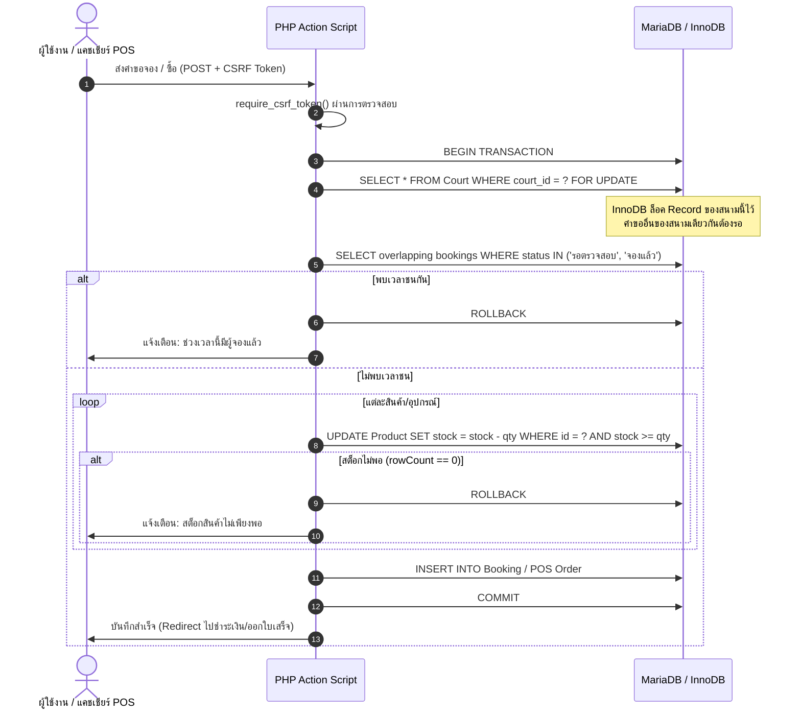
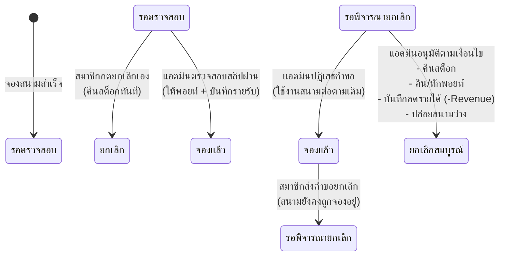

# รายงานการพัฒนาและ Hardening ระบบความมั่นคงปลอดภัยและความถูกต้องของข้อมูล (Phase 1)
**วันที่:** 6 ตุลาคม 2026 (2026-10-06)  
**โครงการ:** ระบบบริหารจัดการสนามแบดมินตัน T.S. Pattani  
**เป้าหมาย:** แก้ไขปัญหาจุดเสี่ยงระดับ Critical (Phase 1) ให้ระบบมีเสถียรภาพ 100%, ป้องกัน Double Booking, ป้องกัน Race Condition ของสต็อกสินค้า, บังคับใช้ CSRF Token ทั่วทั้งระบบ, ปรับปรุง Trust Boundary ของระบบ POS, และปรับขั้นตอนการยกเลิกการจองให้ตรงกับมาตรฐานสากลและ Business Logic ที่ถูกต้อง

---

## 1. รายการสิ่งที่ดำเนินการ (What Was Done)

### 1.1 ระบบรักษาความปลอดภัย CSRF Protection กลาง
- **สร้างไฟล์:** `includes/csrf.php`
  - ฟังก์ชัน `get_csrf_token()`: สร้าง CSRF Token ประจำ Session แบบสุ่มและคงทน
  - ฟังก์ชัน `csrf_field()`: สร้าง input hidden `csrf_token` ป้องกัน XSS
  - ฟังก์ชัน `validate_csrf_token($token)`: ตรวจสอบความถูกต้องโดยใช้ `hash_equals()`
  - ฟังก์ชัน `require_csrf_token()`: ป้องกันการทำ CSRF Attack ทันที โดยปฏิเสธคำขอและคืนค่า HTTP 403 Forbidden หาก Token ไม่ถูกต้องหรือไม่มี
- **ผูกเข้ากับระบบส่วนกลาง:** `config/config.php`
  - เรียกใช้ `require_once __DIR__ . '/../includes/csrf.php';` ทำให้ทุกสคริปต์ในระบบมีระบบ CSRF ทำงานทันที
- **ติดตั้ง CSRF Token ในฟอร์มและ Action Scripts ทุกจุดสำคัญ:**
  - `booking.php` & `actions/booking_db.php` (ระบบจองสนาม)
  - `payment.php` & `actions/payment_db.php` (การแนบสลิปโอนเงิน)
  - `admin/pos.php` & `admin/actions/pos_checkout_db.php` (ระบบขายหน้าร้าน/Walk-in)
  - `booking_history.php` & `actions/cancel_booking_db.php` (การขอยกเลิกและยกเลิกการจอง)
  - `admin/cancellations.php` & `admin/actions/cancellation_action_db.php` (การอนุมัติ/ปฏิเสธคำขอยกเลิก)
  - `admin/payments.php` & `admin/actions/payment_verify_db.php` (การตรวจรับสลิป)
  - `admin/equipment_returns.php` & `admin/actions/equipment_return_db.php` (การตรวจรับคืนอุปกรณ์)
  - `rewards.php` & `actions/redeem_reward_db.php` (การแลกของรางวัล)
  - `profile.php` & `actions/profile_edit_db.php` (การแก้ไขโปรไฟล์และเปลี่ยนรหัสผ่าน)

---

### 1.2 ป้องกัน Concurrency, Race Conditions & Double Booking ในระบบจองสนาม
- **ไฟล์แก้ไข:** `actions/booking_db.php`
  - **Pessimistic Row-level Locking:** เพิ่ม `SELECT court_id, court_name, court_status FROM Court WHERE court_id = :court_id FOR UPDATE;` เพื่อล็อคคิวการเข้าถึงคอร์ทนั้นๆ ภายใน Database Transaction ก่อนทำการตรวจซ้อนทับ
  - **Overlap Validation:** ตรวจสอบช่วงเวลาที่ซ้อนทับกัน (Time Overlap) ทั้งสถานะ `รอตรวจสอบ` และ `จองแล้ว` ในระหว่างที่ยังถือ Row Lock
  - **Atomic Stock Decrement:** ปรับการตัดสต็อกสินค้าและอุปกรณ์เช่าเป็นเงื่อนไข Atomic `UPDATE Product SET product_stock = product_stock - :qty WHERE product_id = :id AND product_stock >= :qty` และตรวจ `rowCount() === 0` เพื่อป้องกันสต็อกติดลบและการแย่งสินค้าในเวลาเดียวกัน
  - **Server-side Time Validations:** ตรวจสอบว่าวันที่และเวลาไม่ใช่เวลาในอดีต, ตรวจสอบเวลาทำการสนาม (08:00 - 22:00 น.), ตรวจสอบระยะเวลาขั้นต่ำ 1 ชั่วโมง, และตรวจสอบสถานะสมาชิกต้องไม่ใช่ `ระงับการใช้งาน`

---

### 1.3 ปรับปรุงระบบ POS หน้าร้านให้ปลอดภัยจาก Race Condition และ Client-side Tampering
- **ไฟล์แก้ไข:** `admin/pos.php` และ `admin/actions/pos_checkout_db.php`
  - **Trust Boundary Enforcement:** คำนวณราคาคอร์ทตามเงื่อนไขวันธรรมดา/วันหยุด (Day-of-Week Pricing) ที่ฝั่งเซิร์ฟเวอร์โดยตรง ไม่เชื่อถือราคารวมที่ส่งมาจาก Javascript ฝั่ง Client
  - **Walk-in Overlap Check:** ตรวจสอบตารางการจอง (`Booking`) เพื่อป้องกันไม่ให้แคชเชียร์เปิดสนาม Walk-in ชนกับสมาชิกที่จองออนไลน์เข้ามาในช่วงเวลาเดียวกัน พร้อมใช้ `SELECT ... FOR UPDATE` บนตาราง Court
  - **Atomic Stock Decrement:** ปรับการตัดสต็อกในตะกร้าสินค้า POS ให้เป็นแบบ Atomic เช็ค `product_stock >= :qty`
  - **Server-side Point Calculation:** คำนวณคะแนนสะสมฝั่งเซิร์ฟเวอร์ตามเกณฑ์มาตรฐาน (100 บาท = 1 พอยท์) ป้องกันการส่งค่าคะแนนที่ไม่ถูกต้อง

---

### 1.4 ปรับปรุงกระบวนการและเงื่อนไขการยกเลิกการจอง (Cancellation Workflow & Accounting)
- **ไฟล์แก้ไข:**
  - `actions/cancel_booking_db.php` (ฝั่ง Member)
  - `booking_history.php` (ฝั่ง Member UI)
  - `admin/cancellations.php` (ฝั่ง Admin UI)
  - `admin/actions/cancellation_action_db.php` (ฝั่ง Admin Action)
  - `assets/js/admin.js` (สคริปต์ Modal)
- **การเปลี่ยนแปลงของระบบ:**
  1. **กรณี `รอตรวจสอบ` (ยังไม่ชำระเงิน/ยังไม่ยืนยัน):** สมาชิกสามารถกดยกเลิกได้โดยตรง ระบบจะทำการคืนสต็อกสินค้า/อุปกรณ์ให้ทันที และเปลี่ยนสถานะการจองเป็น `ยกเลิก`
  2. **กรณี `จองแล้ว` (ชำระเงินและสลิปผ่านการอนุมัติแล้ว):**
     - สมาชิก **ไม่สามารถ** ยกเลิกและยกเลิก Slot สนามเองได้โดยพลการ
     - เมื่อสมาชิกกดยกเลิก ระบบจะสร้างคำขอ `Cancellation` โดยมีสถานะ `refund_status = 'รอดำเนินการ'` พร้อมเหตุผล
     - สนามยังคงสถานะ `จองแล้ว` จนกว่าแอดมินจะพิจารณา
     - หน้า `booking_history.php` แสดง Badge สีเหลือง `⏳ ขอยกเลิก (รอแอดมินพิจารณา)` พร้อมปิดการกดปุ่มซ้ำ
  3. **การพิจารณาของแอดมิน (`admin/actions/cancellation_action_db.php`):**
     - เมื่อแอดมินอนุมัติการยกเลิก:
       - อัปเดตสถานะในตาราง `Cancellation` เป็น `อนุมัติแล้ว`
       - ปรับสถานะการจองในตาราง `Booking` เป็น `ยกเลิก`
       - คืนสต็อกอุปกรณ์กีฬา/สินค้าที่จองไว้กลับสู่ `Product`
       - อัปเดตสถานะการเช่าในตาราง `Rental` เป็น `ยกเลิก`
       - **หักคืนพอยท์สะสม (Point Reversal):** หักพอยท์ที่ได้รับจากการจองออก และบันทึกประวัติ `Point_Transaction` (ประเภท 'ใช้ไป' พร้อมระบุหมายเหตุการยกเลิก)
       - **บันทึกการปรับยอดทางบัญชี (Revenue Adjustment):** บันทึกรายการลงตาราง `Revenue` เป็นยอดเงินติดลบ (`-refund_amount`) เพื่อให้ผลรวมรายได้สุทธิ (`SUM(revenue_total_amount)`) คำนวณถูกต้องตามหลักการเงิน

---

## 2. กลไกและสถาปัตยกรรมการทำงาน (How the System Works)

### 2.1 แผนภาพการจองและป้องกัน Concurrency (Pessimistic Locking Flow)

### 2.2 แผนภาพวงจรชีวิตการยกเลิกการจอง (Cancellation Lifecycle)

---

## 3. ขั้นตอนการทดสอบและการใช้งาน (How to Use & Test)

### 3.1 ทดสอบระบบป้องกัน CSRF
1. เปิดหน้าเว็บที่มีฟอร์ม เช่น `booking.php`, `rewards.php`, `profile.php`, หรือ `admin/pos.php`
2. คลิกขวา > Inspect Element ดูแท็ก `<input type="hidden" name="csrf_token" value="...">`
3. ลองส่งคำขอ POST ผ่านเครื่องมือจำลอง (เช่น Postman/Curl) โดยไม่ใส่ `csrf_token` หรือใส่ค่าปลอม
4. **ผลลัพธ์ที่คาดหวัง:** ได้รับการปฏิเสธด้วย HTTP Code 403 Forbidden และข้อความ *"คำขอไม่ถูกต้องหรือหมดอายุ (CSRF Validation Failed)"*

### 3.2 ทดสอบการจองสนามพร้อมกัน (Concurrent Booking Protection)
1. เปิด 2 เบราว์เซอร์พร้อมกัน (เช่น Chrome ปกติ และ Chrome Incognito) โดยเข้าสู่ระบบด้วย 2 บัญชีสมาชิก
2. เลือกสนามเดียวกัน วันที่เดียวกัน และช่วงเวลาเดียวกัน (เช่น 18:00 - 19:00 น.)
3. กดปุ่มยืนยันการจองพร้อมๆ กัน
4. **ผลลัพธ์ที่คาดหวัง:** 
   - คำขอแรกจะผ่านและเข้าสู่หน้าแนบสลิปชำระเงิน (`payment.php`)
   - คำขอที่สองจะถูกปฏิเสธทันทีด้วยข้อความ *"ขออภัย ช่วงเวลาดังกล่าวมีผู้จองสนามแล้ว กรุณาเลือกช่วงเวลาอื่น"*

### 3.3 ทดสอบการตัดสต็อกสินค้าไม่ให้ติดลบ (Atomic Decrement)
1. ตรวจสอบสินค้าในระบบที่มีสต็อกคงเหลือ 1 ชิ้น
2. จำลองการจองพร้อมกัน 2 รายการ หรือกดแลกของรางวัลพร้อมกัน
3. **ผลลัพธ์ที่คาดหวัง:** รายการที่สองจะถูก Rollback และแจ้งเตือนสต็อกไม่เพียงพอ สต็อกคงเหลือในฐานข้อมูลจะไม่ติดลบเด็ดขาด

### 3.4 ทดสอบ Flow การยกเลิกการจอง
1. สมาชิกจองสนามและอัปโหลดสลิป แอดมินกดยืนยันการชำระเงิน (สถานะเป็น `จองแล้ว`)
2. เข้าสู่หน้า `booking_history.php` ของสมาชิก แล้วกดปุ่ม "ขอยกเลิก"
3. ระบุเหตุผลการขอยกเลิก และกดยืนยัน
4. **ผลลัพธ์ที่คาดหวังฝั่งสมาชิก:** สถานะของรายการจะเปลี่ยนเป็น `⏳ ขอยกเลิก (รอแอดมินพิจารณา)` ปุ่มขอยกเลิกจะถูกปิด และไม่สามารถกดยกเลิกซ้ำได้
5. เข้าสู่ระบบแอดมิน ไปที่เมนู "คำขอยกเลิก" (`admin/cancellations.php`)
6. คลิก "พิจารณา" และกด "อนุมัติการยกเลิก"
7. **ผลลัพธ์ที่คาดหวังฝั่งแอดมิน:** 
   - สถานะการจองเปลี่ยนเป็น `ยกเลิก`
   - สต็อกอุปกรณ์กีฬา/สินค้าถูกคืนกลับสู่ระบบ
   - พอยท์สะสมของสมาชิกลดลงตามจำนวนที่ได้รับไปในตอนแรก
   - ตาราง Revenue บันทึกยอดติดลบตามจำนวนเงินที่คืน

---

## 4. ปัญหาที่พบและการแก้ไข (Issues Encountered & Resolved)

| รายการปัญหาเดิม | สาเหตุที่ตรวจพบ (Root Cause) | แนวทางการแก้ไข (Solution) |
|---|---|---|
| **ไม่มี CSRF Protection** | ฟอร์ม POST ทั้งระบบไม่มี Token ป้องกัน ทำให้เสี่ยงต่อ Cross-Site Request Forgery | สร้าง `includes/csrf.php` ที่มีระบบ Session Token & `hash_equals()` และผูกเข้าสู่ทุกฟอร์มและ Action Script ทั่วทั้งระบบ |
| **ความเสี่ยง Double Booking** | การเช็คเวลาชนกันทำก่อนการบันทึกโดยไม่มี Row-level Lock หากมีคนกดพร้อมกันในเสี้ยววินาที จะสามารถผ่านเงื่อนไขได้ทั้งคู่ | นำ Pessimistic Locking (`SELECT ... FOR UPDATE`) บนแถวของตาราง `Court` ภายใต้ Transaction มาครอบกระบวนการตรวจสอบและบันทึก |
| **สต็อกสินค้าติดลบจาก Race Condition** | มีการอ่านค่าสต็อกมาเช็คใน PHP ก่อนแล้วค่อย Update ทับ ทำให้เกิดปัญหา Lost Update | เปลี่ยนคำสั่งเป็น Atomic Conditional Update: `UPDATE Product SET product_stock = product_stock - :qty WHERE product_id = :id AND product_stock >= :qty` และตรวจ `rowCount() === 0` |
| **ช่องโหว่การคำนวณราคา POS** | ราคาและยอดเงินรวมรับค่าจาก Form POST ที่คำนวณโดย JavaScript ฝั่ง Client | ย้าย Logic การคำนวณราคาสนามตามวัน (Weekday/Weekend) และราคาสินค้ามาทำที่ PHP Backend 100% |
| **Logic การยกเลิกไม่สอดคล้องกับธุรกิจ** | สมาชิกสามารถกดยกเลิกรายการที่ยืนยันแล้วได้เองโดยตรง ทำให้สนามหลุด และไม่มีการหักพอยท์หรือปรับยอดบัญชีรายรับ | สมาชิกทำได้เฉพาะการ "ส่งคำขอยกเลิก" สำหรับรายการที่ชำระเงินแล้ว และให้แอดมินเป็นผู้อนุมัติ พร้อมเขียนระบบ Reversal ทั้งสต็อก, พอยท์ และรายรับอย่างสมบูรณ์ |
