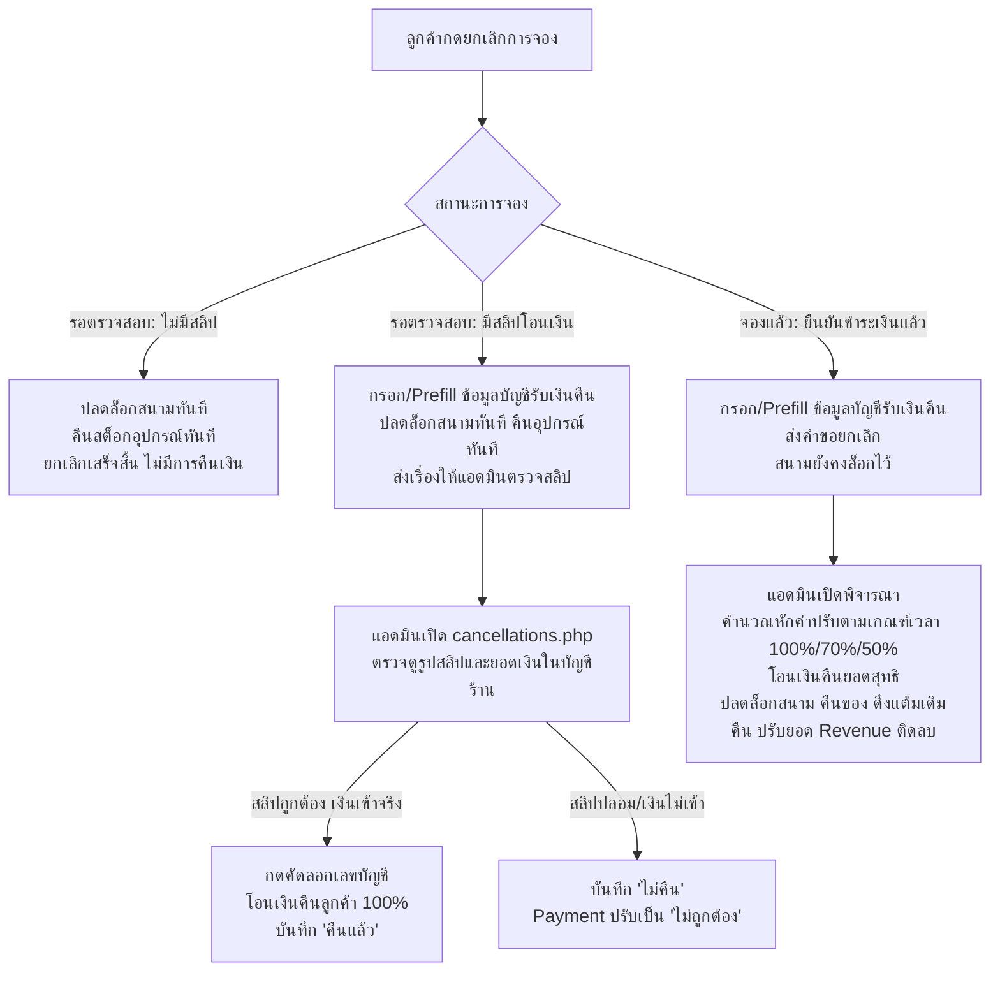

# บันทึกการพัฒนาระบบ: ระบบรับข้อมูลบัญชีโอนคืนและการตรวจสอบสลิปก่อนพิจารณาคืนเงิน (Refund Account & Slip Verification Flow)
**วันที่:** 6 ตุลาคม 2026  
**ระบบ:** ระบบบริหารจัดการสนามแบดมินตัน T.S. Pattani  
**ผู้รับผิดชอบ:** คู่พัฒนา AI (Antigravity) & ผู้พัฒนาระบบ  

---

## 1. วัตถุประสงค์และการตอบโจทย์การนำเสนอโครงงาน (Project Defense Context)
ในการนำเสนอโครงงานและสอบจบ (Senior Project Defense) มีประเด็นคำถามสำคัญที่คณะกรรมการมักสอบถามเกี่ยวกับกระบวนการยกเลิกและคืนเงิน (Cancellation & Refund Lifecycle):
1. **กรณีที่ลูกค้ายกเลิกเองขณะสถานะ "รอตรวจสอบ" แต่ได้โอนเงินและแนบสลิปมาแล้ว:**
   - *คำถาม:* ลูกค้าโอนเงินจริงแล้ว ทำไมระบบถึงจะไม่คืนเงิน? หรือถ้าจะคืนเงิน ทำไมแอดมินถึงกดยืนยันคืนเงินได้ทั้งๆ ที่ยังไม่ได้ตรวจสอบสลิปว่าเงินเข้าร้านจริงหรือไม่?
   - *คำตอบ & สิ่งที่ปรับปรุง:* หากลูกค้าโอนเงินและแนบสลิปมาแล้ว ระบบจะปล่อย Slot สนามทันทีเพื่อไม่ให้เสียโอกาสทางธุรกิจ และส่งเรื่องเข้าสู่คิวพิจารณาของแอดมิน เพื่อให้แอดมินตรวจสอบสลิปและเช็กสเตทเมนต์บัญชีร้านค้าก่อน หากเงินเข้าจริง จึงทำการโอนเงินคืน 100% (ค่าปรับ 0%)
2. **แอดมินทราบเลขบัญชีหรือพร้อมเพย์ของลูกค้าได้อย่างไร?**
   - *คำถาม:* สลิปโอนเงินมีการ Mask เลขบัญชี และการจองออนไลน์ลูกค้าไม่ได้อยู่ที่สนามเพื่อรับเงินสด แอดมินจะโอนคืนให้ใคร?
   - *คำตอบ & สิ่งที่ปรับปรุง:* ในขั้นตอนที่ลูกค้ากดยกเลิกรายการที่มีการชำระเงิน ระบบจะแสดงฟอร์มให้ลูกค้าระบุ **ธนาคาร/ช่องทาง, เลขที่บัญชีหรือเบอร์พร้อมเพย์, และชื่อ-นามสกุลเจ้าของบัญชี** พร้อมนำข้อมูลเดิมจากโปรไฟล์สมาชิกมากรอกให้อัตโนมัติ (Prefill ตามหลัก HCI: Avoid Redundant User Input) และฝั่งแอดมินจะมีปุ่ม "คัดลอกเลขบัญชี" แบบ 1-Click Clipboard เพื่อนำไปวางในแอปธนาคารได้อย่างรวดเร็ว

---

## 2. การปรับปรุงฐานข้อมูล (Database Schema & Migrations)
ได้ดำเนินการอัปเดตและทดสอบผ่านทั้ง `config/setup.php` และ `config/update_database.php` เรียบร้อยแล้ว:
* ตาราง `Cancellation`:
  * เพิ่มคอลัมน์ `refund_bank VARCHAR(50) DEFAULT NULL` (เก็บธนาคารหรือช่องทาง เช่น พร้อมเพย์, KBANK, SCB ฯลฯ)
  * เพิ่มคอลัมน์ `refund_account_no VARCHAR(30) DEFAULT NULL` (เก็บเลขบัญชี หรือเบอร์พร้อมเพย์)
  * เพิ่มคอลัมน์ `refund_account_name VARCHAR(100) DEFAULT NULL` (เก็บชื่อเจ้าของบัญชีสำหรับเทียบยอด)

---

## 3. รายละเอียดไฟล์ที่สร้างและแก้ไข (Modified Files Summary)

| ไฟล์ | รายละเอียดการเปลี่ยนแปลง |
|---|---|
| `config/setup.php` | เพิ่มนิยามคอลัมน์ `refund_bank`, `refund_account_no`, `refund_account_name` ในคำสั่ง `CREATE TABLE IF NOT EXISTS Cancellation` |
| `config/update_database.php` | เพิ่มคำสั่ง Migration ตรวจสอบคอลัมน์ใหม่ 3 คอลัมน์ และบันทึก Log แสดงสถานะผ่าน UI อย่างชัดเจน |
| `booking_history.php` | 1. ดึงข้อมูลสมาชิก `$current_member` มา Prefill เบอร์โทรและชื่อ 2. เพิ่ม Dropdown ธนาคารชั้นนำ 8 แห่ง, เลขบัญชี, ชื่อบัญชี ใน Modal ยกเลิก 3. ปรับ JavaScript `openCancelModal` แยกการแสดงผล 3 กรณีชัดเจน (ไม่จ่ายเงิน / แนบสลิปรอตรวจ / จองแล้วยืนยันแล้ว) |
| `actions/cancel_booking_db.php` | 1. เคส 1A (รอตรวจ + ไม่มีสลิป): ยกเลิก ปลดสนาม คืนของทันที `refund_status = 'ไม่คืน'` 2. เคส 1B (รอตรวจ + มีสลิป): ปลดสนาม คืนของทันที บันทึกข้อมูลบัญชีรับเงิน `refund_status = 'รอดำเนินการ'` เพื่อรอแอดมินตรวจสลิปและโอนคืน 100% 3. เคส 2 (จองแล้ว): บันทึกข้อมูลบัญชีรับเงิน `refund_status = 'รอดำเนินการ'` สนามยังไม่ปลดจนกว่าแอดมินพิจารณา |
| `admin/cancellations.php` | 1. ปรับการคำนวณค่าปรับ: หากลูกค้ายกเลิกระหว่างรอตรวจสอบสลิป แนะนำคืนเงิน 100% (ค่าปรับ 0%) 2. เปิดให้แอดมินกดปุ่ม "พิจารณา" สำหรับเคสแนบสลิปรอตรวจสอบได้ 3. แสดงการ์ดข้อมูลบัญชีรับเงินคืนของลูกค้าในตาราง และใน `#refundModal` 4. เพิ่มปุ่มคลิกเดียวคัดลอกเลขบัญชี และแสดง Thumbnail รูปสลิปพร้อมคลิกซูมขยาย |
| `assets/js/admin.js` | 1. ปรับฟังก์ชัน `openRefundModal` รองรับข้อมูลธนาคาร, เลขบัญชี, ชื่อบัญชี, และรูปสลิป 2. เพิ่มฟังก์ชัน `copyRefundAccount()` พร้อม Fallback รองรับทุกเบราว์เซอร์และแสดง Toast แจ้งเตือน |
| `admin/actions/cancellation_action_db.php` | 1. ปรับสิทธิ์การคืนเงินให้ครอบคลุมทั้งรายการที่จองแล้ว และรายการที่แนบสลิปรอตรวจสอบ 2. ปรับสถานะ `Payment.payment_status` เป็น `'ยืนยันแล้ว'` (กรณีคืนเงิน) หรือ `'ไม่ถูกต้อง'` (กรณีปฏิเสธ) เพื่อบันทึก Audit Trail ของแอดมิน 3. ป้องกันปัญหาบัญชีติดลบ (Accounting Invariant): บันทึกรายรับติดลบใน `Revenue` เฉพาะรายการที่เคยบันทึกรายรับเดิม (`booking_status = 'จองแล้ว'`) เท่านั้น |
| `admin/actions/payment_verify_db.php` | เพิ่ม Guardrail ตรวจสอบห้ามอนุมัติการชำระเงินของรายการจองที่ถูกยกเลิกไปแล้ว เพื่อป้องกันความสับสนในการทำงาน |

---

## 4. แผนภาพโฟลว์การทำงาน (Logic Flow Diagram)

---

## 5. การตรวจสอบความถูกต้อง (Verification & Testing)
1. **PHP Syntax & Linter:** ตรวจสอบไฟล์ PHP ทุกไฟล์ใน Workspace ด้วย `php -l` ผ่าน 100% ไม่มีข้อผิดพลาด
2. **Database Migration Integrity:** รัน `php config/update_database.php` ตรวจสอบตาราง MariaDB พบว่ามีโครงสร้างคอลัมน์ครบถ้วน
3. **Accounting Invariant Verified:** บัญชีรายรับร้านค้า (`Revenue`) จะไม่ติดลบผิดพลาดสำหรับรายการที่ยกเลิกขณะรอตรวจสอบสลิป
4. **HCI Compliance:**
   - Nielsen Heuristic #6 (Recognition over Recall): ดึงเบอร์โทรและชื่อสมาชิกมา Prefill ข้อมูลบัญชีรับเงินคืน
   - Efficiency of Use: ปุ่มคัดลอกเลขบัญชี 1 คลิกใน Modal ฝั่งแอดมิน
