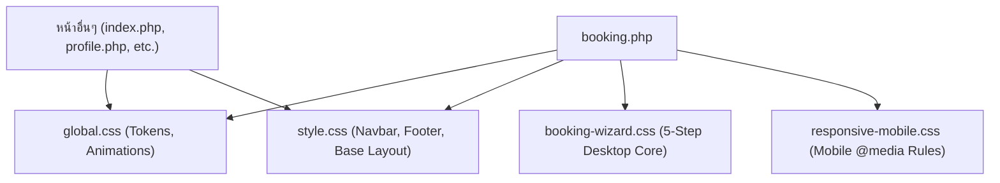

# รายงานการตัดแยกโมดูล CSS ระบบจองสนาม (booking-wizard.css & responsive-mobile.css)
**วันที่:** 10 ตุลาคม 2026  
**โครงการ:** ระบบบริหารจัดการสนามแบดมินตัน T.S. Pattani  
**ไฟล์ที่เกี่ยวข้อง:**
- `assets/css/booking-wizard.css` (สร้างใหม่)
- `assets/css/responsive-mobile.css` (สร้างใหม่)
- `assets/css/style.css` (ปรับปรุง)
- `assets/css/global.css` (ปรับปรุง)
- `booking.php` (ปรับปรุง)

---

## 1. ทำอะไรบ้าง (What Was Done)
1. **สร้างไฟล์ [assets/css/booking-wizard.css](file:///c:/xampp/htdocs/ts-pattani/assets/css/booking-wizard.css):**
   - รวบรวมและตัดแยกสไตล์ของระบบ 5-Step Booking Wizard บน Desktop (เดิมบรรทัด 881-1910 ใน `style.css`) รวม 1,030 บรรทัด
   - ครอบคลุม: Layout Wizard, Stepper, Calendar Date Picker, Time Slot Grid, Nickname Card, Court Cards 1-10 (พร้อม 5 สถานะสี), Addons, และ Sticky Summary Bar
2. **สร้างไฟล์ [assets/css/responsive-mobile.css](file:///c:/xampp/htdocs/ts-pattani/assets/css/responsive-mobile.css):**
   - รวบรวมเฉพาะกฎ `@media (max-width: 768px)` ของระบบจองสนาม เพื่อจัดระเบียบเลย์เอาต์หน้าจอมือถือโดยเฉพาะ
   - ครอบคลุม: การย่อขนาด Stepper, ซ่อน Sublabel, จัดกริดคอร์ทเป็น 2 คอลัมน์, และจัดวาง Sticky Summary Bar แบบแนวตั้งเต็มความกว้าง
3. **ปรับปรุง [assets/css/style.css](file:///c:/xampp/htdocs/ts-pattani/assets/css/style.css):**
   - ลบโค้ดระบบจองที่ถูกแยกออกไป (~1,040 บรรทัด)
   - ขนาดไฟล์ลดลงจาก 80.8 KB (3,566 บรรทัด) เหลือ 53.8 KB (2,526 บรรทัด) ลดลงกว่า 33.4%
4. **ปรับปรุง [assets/css/global.css](file:///c:/xampp/htdocs/ts-pattani/assets/css/global.css):**
   - บันทึก `@keyframes wizardFadeIn` ไว้ในระดับ Global เพื่อให้หน้า `rewards.php` สามารถเรียกใช้ Animation นี้ร่วมกันได้โดยไม่มีปัญหา
5. **ปรับปรุง [booking.php](file:///c:/xampp/htdocs/ts-pattani/booking.php):**
   - เพิ่มการเชื่อมโยงไปยัง `assets/css/booking-wizard.css?v=1.0` และ `assets/css/responsive-mobile.css?v=1.0` ใน `<head>`

---

## 2. ระบบเป็นอย่างไร (How the System Works)

* **Separation of Concerns:** 
  - สไตล์ของระบบจองถูกผูกไว้เฉพาะหน้า `booking.php` เท่านั้น หน้าอื่นๆ ในระบบไม่ต้องโหลด CSS กว่า 1,000 บรรทัดนี้
  - หากมีการปรับแต่ง UI หรือแก้ไข Responsive บนมือถือของระบบจองในอนาคต จะสามารถแก้ไขที่ `booking-wizard.css` และ `responsive-mobile.css` ได้โดยตรงอย่างปลอดภัย 100% โดยไม่กระทบหน้าอื่นในโปรเจกต์
* **Zero Disruption Guarantee:**
  - รหัสคลาส, ID, JavaScript selector, และ Form submission ทุกอย่างคงเดิมเหมือนเดิม 100% หน้าตาและพฤติกรรมของระบบจองเหมือนเดิมทุกประการ

---

## 3. การใช้งานอย่างไร (How to Use / Test)
1. เปิดหน้าจองสนามผ่านเบราว์เซอร์: `http://localhost/ts-pattani/booking.php`
2. **ทดสอบบน Desktop:**
   - ตรวจสอบความสมบูรณ์ของ Stepper ทั้ง 5 ขั้นตอน
   - ขั้นตอนที่ 1: ปฏิทินแสดงผลและคลิกเลือกวันที่ได้ถูกต้อง
   - ขั้นตอนที่ 2: การ์ดเวลา 08:00 - 22:00 น. แสดงครบถ้วน
   - ขั้นตอนที่ 3: การ์ดคอร์ท 1-10 พร้อมสถานะสีเขียว (ว่าง) และแถบ Sticky Summary Bar ด้านล่างแสดงยอดรวมถูกต้อง
   - ขั้นตอนที่ 4: รายการสินค้าและบริการเสริมแสดงครบ
   - ขั้นตอนที่ 5: หน้าสรุปรายละเอียดการจองแสดงผลครบถ้วน
3. **ทดสอบบน Mobile Responsive Mode (F12 DevTools หรือสมาร์ทโฟน):**
   - ปรับความกว้างจอ <= 768px
   - ตรวจสอบว่า Stepper ย่อขนาดพอดีหน้าจอ
   - การ์ดคอร์ทจัดเรียงเป็น 2 คอลัมน์อย่างสวยงาม
   - แถบ Sticky Summary Bar ปรับเป็นแนวตั้งเต็มความกว้างพร้อมปุ่มถัดไปที่กดง่าย

---

## 4. ปัญหาที่เจอหรือแก้อะไรบ้าง (Issues Encountered & Resolved)
* **ปัญหาเดิม:** `style.css` มีขนาดใหญ่เกินไป (3,566 บรรทัด) และมีสไตล์ระบบจอง 5 ขั้นตอนปะปนอยู่กับสไตล์ส่วนกลาง ทำให้ดูแลรักษายาก เสี่ยงต่อการทับซ้อนของ Selector และหน้าอื่นๆ ต้องโหลดโค้ดส่วนนี้โดยไม่จำเป็น
* **การแก้ไข:** ตัดแยกออกเป็น `booking-wizard.css` และ `responsive-mobile.css` อย่างเป็นระเบียบตามหลัก Separation of Concerns พร้อมย้าย `@keyframes wizardFadeIn` สู่ `global.css` เพื่อป้องกันการเรียกใช้แอนิเมชันข้ามโมดูล
