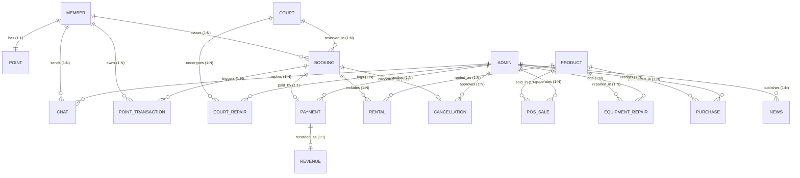

# เอกสารรายงานการวิเคราะห์ระบบ (PROJECT_ANALYSIS_RESULT.md)
**โครงการ:** เว็บแอปพลิเคชันระบบจัดการสนามแบดมินตัน T.S. Pattani  
**ประเภทงาน:** รายงานการวิเคราะห์ระบบจาก Source Code จริง (Read-Only Code Analysis)  
**วันที่และเวลาที่วิเคราะห์:** 9 กันยายน 2569  
**สถานะการแก้ไขโค้ด:** ไม่มีการแก้ไข Source Code หรือฐานข้อมูลใด ๆ ทั้งสิ้น (Read-Only 100%)

---

## สารบัญ
1. [บทนำและวัตถุประสงค์](#1-บทนำและวัตถุประสงค์)
2. [กฎและข้อกำหนดการวิเคราะห์](#2-กฎและข้อกำหนดการวิเคราะห์)
3. [Technology Stack จาก Source Code จริง](#3-technology-stack-จาก-source-code-จริง)
4. [โครงสร้างโปรเจกต์และหน้าที่ของแต่ละไฟล์](#4-โครงสร้างโปรเจกต์และหน้าที่ของแต่ละไฟล์)
5. [Entry Point และการเริ่มต้นระบบ](#5-entry-point-และการเริ่มต้นระบบ)
6. [การวิเคราะห์โมดูลการทำงาน (Module Analysis)](#6-การวิเคราะห์โมดูลการทำงาน-module-analysis)
7. [การวิเคราะห์ฟังก์ชันและกระบวนการสำคัญ (Function & Logic Analysis)](#7-การวิเคราะห์ฟังก์ชันและกระบวนการสำคัญ-function--logic-analysis)
8. [การวิเคราะห์ฐานข้อมูลและการใช้งานจริง (Database Analysis)](#8-การวิเคราะห์ฐานข้อมูลและการใช้งานจริง-database-analysis)
9. [แผนภาพความสัมพันธ์ของฐานข้อมูล (Database Relationship - ER Diagram)](#9-แผนภาพความสัมพันธ์ของฐานข้อมูล-database-relationship---er-diagram)
10. [การวิเคราะห์ CRUD รายโมดูล (CRUD Matrix)](#10-การวิเคราะห์-crud-รายโมดูล-crud-matrix)
11. [การจัดการข้อผิดพลาดและข้อยกเว้น (Error & Exception Handling)](#11-การจัดการข้อผิดพลาดและข้อยกเว้น-error--exception-handling)
12. [ระบบการยืนยันตัวตนและการควบคุมสิทธิ์ (Authentication & Authorization)](#12-ระบบการยืนยันตัวตนและการควบคุมสิทธิ์-authentication--authorization)
13. [การวิเคราะห์ระบบจองสนามและการล็อกเวลา (Booking Engine & Overlap Protection)](#13-การวิเคราะห์ระบบจองสนามและการล็อกเวลา-booking-engine--overlap-protection)
14. [การวิเคราะห์ระบบชำระเงินและตรวจสอบสลิป (Payment & Slip Verification)](#14-การวิเคราะห์ระบบชำระเงินและตรวจสอบสลิป-payment--slip-verification)
15. [การวิเคราะห์ระบบสินค้า คลังอุปกรณ์ และการตัดสต็อก (Inventory & Stock Lifecycle)](#15-การวิเคราะห์ระบบสินค้า-คลังอุปกรณ์-และการตัดสต็อก-inventory--stock-lifecycle)
16. [การวิเคราะห์ระบบคะแนนสะสมและระดับสมาชิก (Loyalty & Point System)](#16-การวิเคราะห์ระบบคะแนนสะสมและระดับสมาชิก-loyalty--point-system)
17. [การวิเคราะห์ระบบขายหน้าร้าน (Point of Sale - POS)](#17-การวิเคราะห์ระบบขายหน้าร้าน-point-of-sale---pos)
18. [การวิเคราะห์ระบบแชทและข่าวสารประชาสัมพันธ์ (Chat & News)](#18-การวิเคราะห์ระบบแชทและข่าวสารประชาสัมพันธ์-chat--news)
19. [การวิเคราะห์แดชบอร์ดและรายงาน (Dashboard & Analytics)](#19-การวิเคราะห์แดชบอร์ดและรายงาน-dashboard--analytics)
20. [การวิเคราะห์ระบบการยกเลิกการจองและการคืนแต้ม (Cancellation & Refund)](#20-การวิเคราะห์ระบบการยกเลิกการจองและการคืนแต้ม-cancellation--refund)
21. [กระแสข้อมูลของระบบ (Data Flow Diagrams)](#21-กระแสข้อมูลของระบบ-data-flow-diagrams)
22. [แผนผังความสัมพันธ์ระหว่างไฟล์ (File Dependencies Map)](#22-แผนผังความสัมพันธ์ระหว่างไฟล์-file-dependencies-map)
23. [แผนที่หน้าเว็บทั้งหมด (Page Map)](#23-แผนที่หน้าเว็บทั้งหมด-page-map)
24. [สรุปกฎเกณฑ์ทางธุรกิจสำคัญ (Core Business Logic Summary)](#24-สรุปกฎเกณฑ์ทางธุรกิจสำคัญ-core-business-logic-summary)
25. [การวิเคราะห์ความมั่นคงปลอดภัย (Security Analysis & Vulnerabilities)](#25-การวิเคราะห์ความมั่นคงปลอดภัย-security-analysis--vulnerabilities)
26. [Dependencies และไลบรารีภายนอก (External Libraries)](#26-dependencies-และไลบรารีภายนอก-external-libraries)
27. [การตั้งค่าคอนฟิเกอเรชัน (Configuration Analysis)](#27-การตั้งค่าคอนฟิเกอเรชัน-configuration-analysis)
28. [เปรียบเทียบสิ่งที่พบในโค้ดจริงกับเอกสารโครงงาน (Gap Analysis)](#28-เปรียบเทียบสิ่งที่พบในโค้ดจริงกับเอกสารโครงงาน-gap-analysis)
29. [สรุปการทำงานของระบบตั้งแต่ต้นจนจบ (End-to-End System Walkthrough)](#29-สรุปการทำงานของระบบตั้งแต่ต้นจนจบ-end-to-end-system-walkthrough)
30. [คู่มือสรุปสำหรับนักพัฒนาคนต่อไป (Developer Onboarding Guide)](#30-คู่มือสรุปสำหรับนักพัฒนาคนต่อไป-developer-onboarding-guide)

---

## 1. บทนำและวัตถุประสงค์

เอกสารฉบับนี้จัดทำขึ้นโดยการตรวจสอบ Source Code ทั้งหมดในโปรเจกต์ `ts-pattani` ที่ตั้งอยู่ ณ `c:\xampp\htdocs\ts-pattani` มีวัตถุประสงค์เพื่ออธิบายสถาปัตยกรรม โครงสร้างโค้ด การเชื่อมต่อฐานข้อมูล ความสัมพันธ์ของตาราง ลอจิกทางธุรกิจ และสถานะการพัฒนาจริงของระบบ โดยอ้างอิงจากหลักฐานเชิงประจักษ์ในไฟล์โปรเจกต์ 100%

---

## 2. กฎและข้อกำหนดการวิเคราะห์

การวิเคราะห์นี้ดำเนินงานภายใต้หลักเกณฑ์ **Read-Only Code Analysis** อย่างเคร่งครัด:
* ไม่มีการแก้ไข ลบ หรือเปลี่ยนแปลงไฟล์ Source Code ใด ๆ ในระบบ
* ไม่มีการแก้ไขโครงสร้าง Database, Table, หรือ Configuration
* ข้อบกพร่อง (Bug), ช่องโหว่ความปลอดภัย (Vulnerability), หรือจุดที่ยังพัฒนาไม่เสร็จสมบูรณ์ จะถูกบันทึกเป็น **"ข้อสังเกต"** ในเอกสารฉบับนี้เท่านั้น

---

## 3. Technology Stack จาก Source Code จริง

จากการตรวจสอบไฟล์ทั้งหมดในโปรเจกต์ พบการใช้งานเทคโนโลยีดังต่อไปนี้:

| เทคโนโลยี | สิ่งที่ตรวจพบจริง | ตำแหน่ง / ไฟล์ที่พบ | หน้าที่และความรับผิดชอบ |
| :--- | :--- | :--- | :--- |
| **PHP** | PHP Native 7.x / 8.x (Procedural + PDO OOP) | ทุกไฟล์ `.php` ใน Root, `actions/`, `admin/` | ประมวลผล Server-side, เชื่อมต่อฐานข้อมูล, ควบคุม Session, Business Logic |
| **MySQL / MariaDB** | MySQL 5.7+ / MariaDB ผ่าน PDO Driver | [config/config.php](file:///c:/xampp/htdocs/ts-pattani/config/config.php), [config/setup.php](file:///c:/xampp/htdocs/ts-pattani/config/setup.php) | ฐานข้อมูลเชิงสัมพันธ์ (Relational Database) Engine InnoDB, `utf8mb4_unicode_ci` |
| **HTML5** | โครงสร้าง Semantic HTML5 | หน้า View ทั้งหมดใน Root และ `admin/` | โครงสร้างหน้าเว็บและฟอร์มรับส่งข้อมูล |
| **CSS3** | **Custom Vanilla CSS** (Flexbox & CSS Grid) | [assets/css/style.css](file:///c:/xampp/htdocs/ts-pattani/assets/css/style.css), [assets/css/admin.css](file:///c:/xampp/htdocs/ts-pattani/assets/css/admin.css) | ตกแต่งหน้าตา จัดการ Layout แบบ Responsive ไม่พบการเรียกใช้ Framework ภายนอก |
| **JavaScript** | Vanilla JavaScript (ES6+), DOM Manipulation, Event Listeners | [assets/js/member.js](file:///c:/xampp/htdocs/ts-pattani/assets/js/member.js), [assets/js/admin.js](file:///c:/xampp/htdocs/ts-pattani/assets/js/admin.js) | Client-side Validation, คำนวณยอดเงิน Real-time, Countdown Timer, ควบคุม Modal |
| **Chart.js** | Chart.js via CDN (v3.x / v4.x) | [admin/index.php](file:///c:/xampp/htdocs/ts-pattani/admin/index.php), [assets/js/admin.js](file:///c:/xampp/htdocs/ts-pattani/assets/js/admin.js) | วาดกราฟแท่งรายรับ 7 วัน และกราฟโดนัทสัดส่วนรายได้แยกหมวดบน Dashboard |
| **Font Awesome** | Font Awesome 6.4.0 (CDN) | ทุกหน้า View ทั้งฝั่ง Member และ Admin | แสดงไอคอนประกอบ UI/UX |
| **Google Fonts** | Prompt (Weights: 300, 400, 500, 600, 700) | ทุกหน้า View ทั้งฝั่ง Member และ Admin | ฟอนต์หลักของระบบเพื่อความสวยงามและการอ่านภาษาไทย |
| **Bootstrap** | **ไม่พบในโปรเจกต์** | - | *ระบุไว้ในเอกสารโครงงาน แต่ไม่พบหลักฐานการทำงานจาก Source Code ที่ตรวจสอบ* |

---

## 4. โครงสร้างโปรเจกต์และหน้าที่ของแต่ละไฟล์

```text
ts-pattani/
├── actions/                         # Controllers ประมวลผลสำหรับฝั่งสมาชิก
│   ├── booking_db.php               # ประมวลผลการจองสนาม ล็อกเวลา และตัดสต็อกชั่วคราว
│   ├── login_db.php                 # ตรวจสอบรหัสผ่านสมาชิกและสร้าง Session
│   ├── logout.php                   # ทำลาย Session สมาชิก
│   ├── payment_db.php               # รับอัปโหลดไฟล์สลิปโอนเงิน
│   └── register_db.php              # ตรวจสอบข้อมูล บันทึกสมาชิกใหม่ และเปิดบัญชีแต้ม
├── admin/                           # พื้นที่การจัดการสำหรับผู้ดูแลระบบ (Admin Portal)
│   ├── actions/                     # Controllers ประมวลผลสำหรับฝั่งแอดมิน (22 ไฟล์)
│   │   ├── court_add_db.php         # บันทึกเพิ่มสนามใหม่
│   │   ├── reward_add_db.php        # บันทึกของรางวัลใหม่
│   │   ├── cancellation_action_db.php# บันทึกผลพิจารณาคืนเงิน/คืนแต้ม
│   │   ├── court_delete_db.php      # ลบสนามที่ยังไม่เคยถูกจอง
│   │   ├── product_delete_db.php    # ลบสินค้า/อุปกรณ์
│   │   ├── court_repair_edit_db.php # แก้ไขข้อมูลการซ่อมสนาม
│   │   ├── member_edit_db.php       # อัปเดตข้อมูลสมาชิก ปรับแต้ม และเปลี่ยนสถานะ
│   │   ├── equipment_court_repair_add_db.php# ส่งอุปกรณ์เช่าเข้าซ่อมบำรุง
│   │   ├── equipment_court_repair_finish_db.php# ปิดงานซ่อมอุปกรณ์ นำกลับเข้าสต็อกหรือตัดทิ้ง
│   │   ├── login_db.php             # ตรวจสอบรหัสผ่านแอดมิน
│   │   ├── logout_db.php            # ทำลาย Session แอดมิน
│   │   ├── news_add_db.php          # เพิ่มข่าวสารประชาสัมพันธ์พร้อมรูปภาพ
│   │   ├── news_delete_db.php       # ลบข่าวสารและรูปภาพ
│   │   ├── news_edit_db.php         # แก้ไขเนื้อหาข่าวสารและรูปภาพ
│   │   ├── payment_verify_db.php    # ยืนยัน/ปฏิเสธสลิป แยกรายได้ และแจกแต้ม
│   │   ├── pos_checkout_db.php      # คิดเงินหน้าร้าน ตัดสต็อก บันทึกรายได้
│   │   ├── product_add_db.php       # เพิ่มสินค้าบริโภค/อุปกรณ์เช่า
│   │   ├── product_edit_db.php      # แก้ไขรายละเอียดสินค้าและสต็อก
│   │   ├── purchase_add_db.php      # บันทึกรับสินค้าจัดซื้อเข้าสต็อก
│   │   ├── court_repair_add_db.php        # บันทึกแจ้งซ่อมสนามและเปลี่ยนสถานะเป็นปิดปรับปรุง
│   │   ├── court_repair_finish_db.php     # ปิดงานซ่อมสนามและเปิดใช้งานสนาม
│   │   └── chat_send_db.php         # บันทึกข้อความแชทตอบกลับลูกค้า
│   ├── includes/
│   │   └── sidebar.php              # เมนูนำทางด้านข้างของระบบแอดมิน
│   ├── add_admin.php                # สคริปต์สร้างแอดมินคนแรก (Utility)
│   ├── cancellations.php            # หน้าจอพิจารณาคำขอยกเลิกการจอง
│   ├── chats.php                    # หน้าจอแชทสนทนากับสมาชิก
│   ├── court_repairs.php            # หน้าจอประวัติการแจ้งซ่อมสนาม
│   ├── courts.php                   # หน้าจอจัดการสนามแบดมินตัน
│   ├── equipment_repairs.php        # หน้าจอประวัติการซ่อมอุปกรณ์
│   ├── index.php                    # แดชบอร์ดสรุปสถิติ กราฟ และแจ้งเตือนสต็อก
│   ├── login.php                    # หน้าเข้าสู่ระบบสำหรับแอดมิน
│   ├── member_edit.php              # หน้าจอแก้ไขข้อมูลสมาชิกและปรับแต้ม
│   ├── members.php                  # หน้าจอรายชื่อสมาชิกทั้งหมด
│   ├── news.php                     # หน้าจอจัดการข่าวสารและประกาศ
│   ├── news_edit.php                # หน้าจอแก้ไขข่าวสาร
│   ├── payments.php                 # หน้าจอตรวจสอบสลิปโอนเงิน
│   ├── pos.php                      # หน้าจอระบบขายหน้าร้าน (Point of Sale)
│   ├── pos_history.php              # หน้าจอประวัติบิลการขายหน้าร้าน
│   ├── product_add.php              # หน้าจอแบบฟอร์มเพิ่มสินค้า
│   ├── product_edit.php             # หน้าจอแบบฟอร์มแก้ไขสินค้า
│   ├── products.php                 # หน้าจอแคตตาล็อกสินค้าและอุปกรณ์
│   ├── purchase_add.php             # หน้าจอรับสินค้าจัดซื้อเข้าคลัง
│   ├── purchases.php                # หน้าจอประวัติการจัดซื้อ
│   ├── receipt.php                  # หน้าจอพิมพ์ใบเสร็จ 80mm
│   └── rewards.php                  # หน้าจอจัดการของรางวัลและระดับสมาชิก
├── assets/                          # Static Web Resources
│   ├── css/
│   │   ├── admin.css                # สไตล์ชีทสำหรับระบบจัดการแอดมิน
│   │   └── style.css                # สไตล์ชีทสำหรับระบบฝั่งสมาชิก
│   └── js/
│       ├── admin.js                 # สคริปต์ทำงานระบบแอดมิน (Modals, POS, Chart)
│       └── member.js                # สคริปต์ทำงานฝั่งสมาชิก (Validation, Calculation, Timer)
├── config/                          # ระบบตั้งค่าและจัดการฐานข้อมูล
│   ├── config.php                   # ตั้งค่าการเชื่อมต่อ PDO, UTF-8, Timezone
│   └── setup.php                    # สคริปต์ Migration สร้างฐานข้อมูลและ 18 ตารางอัตโนมัติ
├── includes/                        # ชิ้นส่วน UI ฝั่งสมาชิก
│   └── navbar.php                   # แถบเมนูด้านบน แสดงแต้ม และระดับสมาชิก
├── uploads/                         # โฟลเดอร์จัดเก็บไฟล์อัปโหลด
│   ├── news/                        # รูปภาพข่าวสาร
│   ├── products/                    # รูปภาพสินค้าและอุปกรณ์
│   ├── rewards/                     # รูปภาพของรางวัล
│   └── slips/                       # รูปภาพสลิปการโอนเงิน
├── booking.php                      # หน้าจอจองสนามและเลือกสินค้า/อุปกรณ์เสริม
├── booking_history.php              # หน้าจอประวัติการจองและสถานะของสมาชิก
├── index.php                        # หน้าแรกของเว็บไซต์ (Landing Page) แสดงข่าวสาร
├── login.php                        # หน้าจอเข้าสู่ระบบของสมาชิก
├── payment.php                      # หน้าจอแสดงยอดเงิน QR Code และแนบสลิป
└── register.php                     # หน้าจอสมัครสมาชิกใหม่
```

---

## 5. Entry Point และการเริ่มต้นระบบ

### 5.1 จุดเริ่มต้นของระบบ (Entry Points)
1. **ฝั่งสมาชิกทั่วไป (Customer Entry Point):** เริ่มต้นที่ [index.php](file:///c:/xampp/htdocs/ts-pattani/index.php) โดยจะเรียกใช้ `config/config.php` และโหลดข่าวสารล่าสุด 3 รายการ หากผู้ใช้กดจองสนามจะนำทางไปยัง `booking.php`
2. **ฝั่งผู้ดูแลระบบ (Admin Entry Point):** เริ่มต้นที่ [admin/login.php](file:///c:/xampp/htdocs/ts-pattani/admin/login.php) หากเข้า `admin/index.php` โดยไม่มี Session จะถูก Redirect กลับมายัง `admin/login.php`

### 5.2 แผนภาพวงจรการทำงานและการเริ่มต้นระบบ (System Initialization Lifecycle)

```text
ผู้ใช้งาน (Browser)
       ↓
เรียก URL (เช่น index.php หรือ admin/index.php)
       ↓
session_start() (เริ่มต้น Session ประจำตัวผู้ใช้)
       ↓
require_once 'config/config.php'
       ↓
PDO Connection (MySQL: host=localhost, dbname=ts_pattani_db, charset=utf8mb4)
ตั้งค่า Timezone: date_default_timezone_set('Asia/Bangkok')
       ↓
ตรวจสอบสิทธิ์การเข้าถึง (Authentication Check)
  ├── ฝั่ง Member (เช่น booking.php): เช็ค isset($_SESSION['member_id'])
  │     └── ถ้าไม่มี → Redirect ไป login.php พร้อมข้อความแจ้งเตือน
  └── ฝั่ง Admin (เช่น admin/*.php): เช็ค isset($_SESSION['admin_id'])
        └── ถ้าไม่มี → Redirect ไป admin/login.php
       ↓
ประมวลผลคำขอ (View Rendering หรือ Action Submission)
       ↓
ส่ง HTML/CSS/JS กลับไปแสดงผลที่ Browser
```

---

## 6. การวิเคราะห์โมดูลการทำงาน (Module Analysis)

### 6.1 โมดูลการลงทะเบียนและเข้าสู่ระบบสมาชิก (Member Authentication)
* **หน้าที่:** รับสมัครสมาชิกใหม่ เข้ารหัสผ่าน ตรวจสอบความซ้ำซ้อนของเบอร์โทร ตรวจสอบการเข้าสู่ระบบ
* **ไฟล์ที่เกี่ยวข้อง:** `register.php`, `login.php`, `actions/register_db.php`, `actions/login_db.php`, `actions/logout.php`
* **ตารางฐานข้อมูล:** `Member`, `Point`
* **ผู้ใช้งาน:** Guest, Member
* **Workflow:**
  ```text
  [กรอกฟอร์มสมัคร] → [register_db.php: Validate + Hash Password] 
                  → [INSERT Member + INSERT Point (เริ่มต้น 0)] → [Redirect login.php]
  ```

### 6.2 โมดูลจัดการสมาชิกหลังบ้าน (Admin Member Management)
* **หน้าที่:** แสดงรายชื่อสมาชิกทั้งหมด ค้นหา แก้ไขข้อมูลส่วนตัว ปรับแต้มสะสม เปลี่ยนระดับ Tier ระงับสิทธิ์การใช้งาน
* **ไฟล์ที่เกี่ยวข้อง:** `admin/members.php`, `admin/member_edit.php`, `admin/actions/member_edit_db.php`
* **ตารางฐานข้อมูล:** `Member`, `Point`, `Point_Transaction`
* **ผู้ใช้งาน:** Admin
* **Workflow:**
  ```text
  [admin/members.php] → [เลือกสมาชิก] → [admin/member_edit.php: แก้ไขข้อมูล/แต้ม/Tier]
                      → [member_edit_db.php: UPDATE Member, UPDATE Point, INSERT Point_Transaction]
  ```

### 6.3 โมดูลจัดการสนามและแจ้งซ่อมสนาม (Court & Court Repair Management)
* **หน้าที่:** เพิ่มสนามแบดมินตัน กำหนดราคาปกติ/Peak/Off-peak ปิดปรับปรุงสนาม บันทึกประวัติและงบประมาณการซ่อม
* **ไฟล์ที่เกี่ยวข้อง:** `admin/courts.php`, `admin/court_repairs.php`, `admin/actions/court_add_db.php`, `admin/actions/court_repair_add_db.php`, `admin/actions/court_repair_finish_db.php`, `admin/actions/court_delete_db.php`
* **ตารางฐานข้อมูล:** `Court`, `Court_repair`, `Booking`
* **ผู้ใช้งาน:** Admin

### 6.4 โมดูลการจองสนามแบบเบ็ดเสร็จ (One-Stop Booking System)
* **หน้าที่:** ให้สมาชิกเลือกวัน เวลา (ขั้นต่ำ 1 ชม.) สนาม สินค้าบริโภค และอุปกรณ์เช่า คำนวณยอดเงินรวม ป้องกันการจองซ้อน และล็อกสนามชั่วคราว 15 นาที
* **ไฟล์ที่เกี่ยวข้อง:** `booking.php`, `actions/booking_db.php`, `assets/js/member.js`
* **ตารางฐานข้อมูล:** `Court`, `Product`, `Booking`, `Rental`
* **ผู้ใช้งาน:** Member
* **Workflow:**
  ```text
  [เลือกวัน/เวลา/สนาม/สินค้า/อุปกรณ์] → [คำนวณยอดรวมผ่าน JS] → [Submit actions/booking_db.php]
  → [ตรวจสอบ Overlap เช็คเวลาชน] → [Begin Transaction] 
  → [INSERT Booking (สถานะ: รอตรวจสอบ, ล็อก 15 นาที)] 
  → [INSERT Rental + ตัดสต็อก Product ชั่วคราว] 
  → [Commit] → [Redirect payment.php?booking_id=...]
  ```

### 6.5 โมดูลชำระเงินและตรวจสอบสลิป (Payment & Slip Verification)
* **หน้าที่:** แสดงยอดชำระและเวลานับถอยหลัง รับไฟล์สลิปโอนเงิน ให้แอดมินตรวจสอบ อนุมัติการจอง แยกรายได้ลงบัญชี และแจกแต้มสะสม
* **ไฟล์ที่เกี่ยวข้อง:** `payment.php`, `booking_history.php`, `actions/payment_db.php`, `admin/payments.php`, `admin/actions/payment_verify_db.php`
* **ตารางฐานข้อมูล:** `Booking`, `Payment`, `Revenue`, `Point`, `Point_Transaction`
* **ผู้ใช้งาน:** Member, Admin

### 6.6 โมดูลคลังสินค้าและอุปกรณ์เช่า (Inventory & Equipment Management)
* **หน้าที่:** จัดการสินค้าแยกหมวดหมู่ บันทึกสเปกไม้แบดและรองเท้า ควบคุมจุดแจ้งเตือนสินค้าใกล้หมด บันทึกรับของเข้า และส่งซ่อมอุปกรณ์
* **ไฟล์ที่เกี่ยวข้อง:** `admin/products.php`, `admin/product_add.php`, `admin/product_edit.php`, `admin/purchases.php`, `admin/purchase_add.php`, `admin/equipment_repairs.php`
* **ตารางฐานข้อมูล:** `Product`, `Purchase`, `Equipment_repair`
* **ผู้ใช้งาน:** Admin

### 6.7 โมดูลระบบขายหน้าร้าน (Point of Sale - POS)
* **หน้าที่:** ให้แอดมินขายสินค้าหน้าร้าน คิดเงิน คำนวณเงินทอน ตัดสต็อกสินค้าทันที บันทึกรายได้หน้าร้าน และพิมพ์ใบเสร็จ 80mm
* **ไฟล์ที่เกี่ยวข้อง:** `admin/pos.php`, `admin/actions/pos_checkout_db.php`, `admin/pos_history.php`, `admin/receipt.php`, `assets/js/admin.js`
* **ตารางฐานข้อมูล:** `Product`, `Pos_sale`, `Revenue`
* **ผู้ใช้งาน:** Admin

### 6.8 โมดูลระบบตอบแชทลูกค้า (Customer Communication System)
* **หน้าที่:** สนทนาโต้ตอบระหว่างแอดมินและสมาชิก แยกห้องแชทตามรายชื่อลูกค้า
* **ไฟล์ที่เกี่ยวข้อง:** `admin/chats.php`, `admin/actions/chat_send_db.php`
* **ตารางฐานข้อมูล:** `Chat`, `Member`, `Admin`
* **ผู้ใช้งาน:** Admin (ฝั่งสมาชิกระบุในเอกสารโครงงาน แต่ไม่พบไฟล์ `chat.php` ใน Source Code ที่ตรวจสอบ)

### 6.9 โมดูลข่าวสารและประชาสัมพันธ์ (News & Announcements)
* **หน้าที่:** เผยแพร่ข่าวสาร กิจกรรม โปรโมชั่น พร้อมภาพประกอบ และแสดงผล 3 ข่าวล่าสุดบนหน้าแรก
* **ไฟล์ที่เกี่ยวข้อง:** `index.php`, `admin/news.php`, `admin/news_edit.php`, `admin/actions/news_add_db.php`, `admin/actions/news_edit_db.php`, `admin/actions/news_delete_db.php`
* **ตารางฐานข้อมูล:** `News`, `Admin`
* **ผู้ใช้งาน:** Guest, Member, Admin

### 6.10 โมดูลแดชบอร์ดและการวิเคราะห์ (Dashboard & Analytics)
* **หน้าที่:** รวบรวมสถิติภาพรวม ยอดรายได้ รายการจองค้างตรวจ สินค้าใกล้หมด และแสดงกราฟแท่ง/โดนัทผ่าน Chart.js
* **ไฟล์ที่เกี่ยวข้อง:** `admin/index.php`, `assets/js/admin.js`
* **ตารางฐานข้อมูล:** `Booking`, `Revenue`, `Product`, `Member`, `Court`
* **ผู้ใช้งาน:** Admin

### 6.11 โมดูลจัดการการยกเลิกการจอง (Cancellation Management)
* **หน้าที่:** แอดมินตรวจสอบคำขอยกเลิก พิจารณาคืนเงิน และคืนแต้มสะสมให้สมาชิก
* **ไฟล์ที่เกี่ยวข้อง:** `admin/cancellations.php`, `admin/actions/cancellation_action_db.php`
* **ตารางฐานข้อมูล:** `Cancellation`, `Booking`, `Point`, `Point_Transaction`
* **ผู้ใช้งาน:** Admin

### 6.12 โมดูลระบบของรางวัลและระดับสมาชิก (Rewards & Tier Management)
* **หน้าที่:** แอดมินสร้างรายการของรางวัล กำหนดแต้มที่ต้องใช้ และกำหนดระดับ Tier ขั้นต่ำที่สามารถแลกได้
* **ไฟล์ที่เกี่ยวข้อง:** `admin/rewards.php`, `admin/actions/reward_add_db.php`
* **ตารางฐานข้อมูล:** `Reward`
* **ผู้ใช้งาน:** Admin (ระบบกดแลกของฝั่งสมาชิก ระบุในเอกสารโครงงาน แต่ไม่พบใน Code)

---

## 7. การวิเคราะห์ฟังก์ชันและกระบวนการสำคัญ (Function & Logic Analysis)

### 7.1 JavaScript Functions

#### `calculateSummary()`
* **ไฟล์:** [assets/js/member.js](file:///c:/xampp/htdocs/ts-pattani/assets/js/member.js)
* **หน้าที่:** คำนวณระยะเวลาการจอง ค่าสนาม ค่าเช่าอุปกรณ์ และค่าสินค้าแบบ Real-time บนหน้าจองสนาม
* **Parameter:** ไม่มี (ดึงค่าจาก DOM Elements)
* **Logic:** 
  1. ดึงเวลาเริ่มและเวลาสิ้นสุด คำนวณ `hours = endHr - startHr`
  2. ตรวจสอบเงื่อนไข `hours < 1` หากไม่ถึง 1 ชม. จะแสดงแจ้งเตือน Error และปิดปุ่มกดยืนยัน
  3. ดึงราคาต่อชั่วโมงของสนามที่เลือก (`data-price`) มาคูณกับจำนวนชั่วโมง
  4. วนลูปอ่านค่า Input Class `.qty-input` แยกตามประเภท `อุปกรณ์เช่า` และ `สินค้าบริโภค`
  5. รวมยอดเงินสุทธิ และอัปเดตลง Input Hidden เพื่อเตรียมส่งให้ Form Action
* **ผลกระทบต่อระบบ:** ควบคุมการคำนวณราคาหน้าบ้านทั้งหมด

#### `initPaymentCountdown(lockExpireStr)`
* **ไฟล์:** [assets/js/member.js](file:///c:/xampp/htdocs/ts-pattani/assets/js/member.js)
* **หน้าที่:** นับเวลาถอยหลัง 15 นาทีตามเวลา `booking_lock_expire` จากฐานข้อมูล
* **Parameter:** `lockExpireStr` (String วันที่และเวลา เช่น `"2026-09-09 15:30:00"`)
* **Logic:** ใช้ `setInterval` ทุก 1 วินาที เทียบเวลาปัจจุบันกับเวลาหมดอายุ หากเวลาหมดจะสั่ง Alert และนำทางผู้ใช้กลับไปหน้า `booking.php`

#### `addToCart(id, name, price, stock)`
* **ไฟล์:** [assets/js/admin.js](file:///c:/xampp/htdocs/ts-pattani/assets/js/admin.js)
* **หน้าที่:** จัดการตะกร้าสินค้าในระบบ POS หน้าร้าน
* **Logic:** ตรวจสอบว่าสินค้ามีในตะกร้าหรือยัง หากมีจะเพิ่มจำนวน หากไม่มีจะสร้าง Object ใหม่ ตรวจสอบไม่ให้ขายเกินสต็อก (`stock`) และสั่งเรนเดอร์ตารางตะกร้าใหม่

---

## 8. การวิเคราะห์ฐานข้อมูลและการใช้งานจริง (Database Analysis)

สรุปตารางทั้งหมด **18 ตาราง** ที่ระบบใช้งานจริง:

| ชื่อตาราง (Table) | ไฟล์ที่เรียกใช้งาน | การอ่าน (SELECT) | การเพิ่ม (INSERT) | การแก้ไข (UPDATE) | การลบ (DELETE) | หน้าที่และความรับผิดชอบ |
| :--- | :--- | :---: | :---: | :---: | :---: | :--- |
| **`Member`** | `register_db`, `login_db`, `members.php`, `member_edit.php`, `member_edit_db.php`, `chats.php`, `index.php(admin)` | ✅ | ✅ | ✅ | ❌ | จัดเก็บข้อมูลสมาชิก บัญชีผู้ใช้ เบอร์โทร และสถานะการระงับสิทธิ์ |
| **`Admin`** | `admin/login_db.php`, `add_admin.php`, และหน้า Admin View ทั้งหมด | ✅ | ✅ | ❌ | ❌ | จัดเก็บข้อมูลผู้ดูแลระบบ เบอร์โทร รหัสผ่าน และสิทธิ์ (Role) |
| **`Court`** | `booking.php`, `booking_db.php`, `courts.php`, `court_add_db.php`, `court_delete_db.php`, `court_repair_add_db.php`, `court_repair_finish_db.php` | ✅ | ✅ | ✅ | ✅ | ข้อมูลสนามแบดมินตัน ราคาปกติ ราคา Peak/Off-peak และสถานะสนาม |
| **`Booking`** | `booking.php`, `booking_db.php`, `payment.php`, `payment_db.php`, `booking_history.php`, `payments.php`, `payment_verify_db.php`, `cancellations.php` | ✅ | ✅ | ✅ | ❌ | ข้อมูลการจองสนาม วันเวลา ยอดเงินรวม สถานะการจอง และเวลาล็อก 15 นาที |
| **`Payment`** | `admin/payments.php`, `payment_verify_db.php` | ✅ | ❌*(มีข้อสังเกต)* | ✅ | ❌ | ข้อมูลการชำระเงิน รูปภาพสลิป ยอดเงินที่โอน และสถานะการตรวจสอบสลิป |
| **`Revenue`** | `admin/index.php`, `payment_verify_db.php`, `pos_checkout_db.php` | ✅ | ✅ | ❌ | ❌ | บัญชีรายรับส่วนกลาง แยกตามค่าสนาม ค่าเช่า ค่าสินค้า และประเภทออนไลน์/หน้าร้าน |
| **`Product`** | `booking.php`, `booking_db.php`, `products.php`, `product_add_db.php`, `product_edit_db.php`, `product_delete_db.php`, `pos.php`, `pos_checkout_db.php`, `purchases.php`, `purchase_add_db.php` | ✅ | ✅ | ✅ | ✅ | แคตตาล็อกสินค้าบริโภคและอุปกรณ์เช่า สเปก จำนวนสต็อก และจุดเตือนสต็อก |
| **`Rental`** | `payment.php`, `booking_db.php` | ✅ | ✅ | ❌ | ❌ | ประวัติการเช่าอุปกรณ์ที่พ่วงกับรายการจองสนาม |
| **`Point`** | `navbar.php`, `register_db.php`, `members.php`, `member_edit.php`, `member_edit_db.php`, `payment_verify_db.php`, `cancellation_action_db.php` | ✅ | ✅ | ✅ | ❌ | แต้มสะสมคงเหลือ แต้มสะสมทั้งหมด และระดับสมาชิก (Bronze/Silver/Gold) |
| **`Point_Transaction`** | `member_edit_db.php`, `payment_verify_db.php`, `cancellation_action_db.php` | ❌ | ✅ | ❌ | ❌ | ประวัติการได้รับ การใช้ และการปรับปรุงแต้มสะสมโดยแอดมิน |
| **`Reward`** | `admin/rewards.php`, `reward_add_db.php` | ✅ | ✅ | ❌ | ❌ | แคตตาล็อกของรางวัล แต้มที่ใช้แลก ระดับ Tier ขั้นต่ำ และสต็อกของรางวัล |
| **`Court_repair`** | `admin/court_repairs.php`, `court_repair_add_db.php`, `court_repair_finish_db.php`, `court_delete_db.php` | ✅ | ✅ | ✅ | ✅ | ประวัติการแจ้งซ่อมสนาม สาเหตุ งบประมาณ และสถานะการซ่อม |
| **`Equipment_repair`** | `admin/equipment_repairs.php`, `equipment_court_repair_add_db.php`, `equipment_court_repair_finish_db.php`, `products.php` | ✅ | ✅ | ✅ | ❌ | ประวัติการส่งซ่อมอุปกรณ์เช่า สาเหตุ ค่าใช้จ่าย และสถานะการซ่อม |
| **`Purchase`** | `admin/purchases.php`, `purchase_add_db.php` | ✅ | ✅ | ❌ | ❌ | ประวัติการจัดซื้อสินค้าและอุปกรณ์เข้าสต็อก พร้อมบันทึกต้นทุน |
| **`Pos_sale`** | `admin/pos_checkout_db.php`, `pos_history.php`, `receipt.php` | ✅ | ✅ | ❌ | ❌ | รายการขายสินค้าหน้าร้าน จำนวนเงิน และผู้ขาย |
| **`Cancellation`** | `admin/cancellations.php`, `cancellation_action_db.php` | ✅ | ❌*(มีข้อสังเกต)* | ✅ | ❌ | ประวัติการขอยกเลิกการจอง เหตุผล สถานะคืนเงิน และการคืนแต้ม |
| **`Chat`** | `admin/chats.php`, `chat_send_db.php` | ✅ | ✅ | ❌ | ❌ | ข้อความสนทนาระหว่างสมาชิกและแอดมิน |
| **`News`** | `index.php`, `admin/news.php`, `news_add_db.php`, `news_edit_db.php`, `news_delete_db.php` | ✅ | ✅ | ✅ | ✅ | ข้อมูลข่าวสาร กิจกรรม ประชาสัมพันธ์ และรูปภาพ |

---

## 9. แผนภาพความสัมพันธ์ของฐานข้อมูล (Database Relationship - ER Diagram)

ความสัมพันธ์ของตารางที่ยืนยันได้จาก Foreign Keys และคำสั่ง SQL ใน Source Code:



---

## 10. การวิเคราะห์ CRUD รายโมดูล (CRUD Matrix)

| โมดูล (Module) | Create (สร้าง) | Read (อ่าน) | Update (แก้ไข) | Delete (ลบ) | ไฟล์หลักที่ควบคุม |
| :--- | :---: | :---: | :---: | :---: | :--- |
| **สมาชิก (Member)** | ✅ | ✅ | ✅ | ❌ | `register_db.php`, `members.php`, `member_edit_db.php` |
| **สนามแบดมินตัน (Court)** | ✅ | ✅ | ✅ | ✅ | `courts.php`, `court_add_db.php`, `court_delete_db.php` |
| **การจองสนาม (Booking)** | ✅ | ✅ | ✅ | ❌ | `booking_db.php`, `booking_history.php`, `payment_verify_db.php` |
| **การชำระเงิน (Payment)** | ⚠️*(ขาดคำสั่ง)* | ✅ | ✅ | ❌ | `payments.php`, `payment_verify_db.php` |
| **สินค้าและอุปกรณ์ (Product)**| ✅ | ✅ | ✅ | ✅ | `products.php`, `product_add_db.php`, `product_edit_db.php`, `product_delete_db.php` |
| **การซ่อมสนาม (Court Repair)**| ✅ | ✅ | ✅ | ✅ | `court_repairs.php`, `court_repair_add_db.php`, `court_repair_finish_db.php` |
| **การซ่อมอุปกรณ์ (Equip Repair)**| ✅ | ✅ | ✅ | ❌ | `equipment_repairs.php`, `equipment_court_repair_add_db.php`, `finish_db.php` |
| **การจัดซื้อสินค้า (Purchase)** | ✅ | ✅ | ❌ | ❌ | `purchases.php`, `purchase_add_db.php` |
| **การขายหน้าร้าน (POS)** | ✅ | ✅ | ❌ | ❌ | `pos.php`, `pos_checkout_db.php`, `pos_history.php` |
| **ข่าวสาร (News)** | ✅ | ✅ | ✅ | ✅ | `news.php`, `news_add_db.php`, `news_edit_db.php`, `news_delete_db.php` |
| **ของรางวัล (Reward)** | ✅ | ✅ | ❌ | ❌ | `rewards.php`, `reward_add_db.php` |
| **ข้อความแชท (Chat)** | ✅ | ✅ | ❌ | ❌ | `chats.php`, `chat_send_db.php` |

---

## 11. การจัดการข้อผิดพลาดและข้อยกเว้น (Error & Exception Handling)

### 11.1 PHP & Database Error Handling
* ระบบใช้งาน **PDO Exception Handling** เกือบ 100% ในทุกไฟล์ Action โดยมีการครอบบล็อก `try { ... } catch (PDOException $e) { ... }`
* มีการใช้งาน **Database Transactions** (`$conn->beginTransaction()`, `$conn->commit()`, `$conn->rollBack()`) ในโมดูลสำคัญ เช่น การจองสนาม (`booking_db.php`), การคิดเงิน POS (`pos_checkout_db.php`), การแก้ไขสมาชิก (`member_edit_db.php`), และการอนุมัติสลิป (`payment_verify_db.php`) ซึ่งช่วยรักษาความถูกต้องของข้อมูลเมื่อเกิด Error กลางคัน

### 11.2 Authentication & Access Control Handling
* เมื่อสมาชิกที่ไม่ได้เข้าสู่ระบบพยายามเข้าหน้า `booking.php` ระบบจะดักจับด้วย:
  ```php
  if (!isset($_SESSION['member_id'])) {
      $_SESSION['error'] = "กรุณาเข้าสู่ระบบก่อนทำการจองสนาม";
      header("Location: login.php");
      exit();
  }
  ```
* สำหรับหน้าจัดการของผู้ดูแลระบบ (`admin/*.php`) มีการดักจับสิทธิ์ทุกไฟล์:
  ```php
  if (!isset($_SESSION['admin_id'])) {
      header("Location: login.php");
      exit();
  }
  ```

### 11.3 ตารางสรุปสถานการณ์ข้อผิดพลาด (Error Handling Summary)

| สถานการณ์ข้อผิดพลาด (Scenario) | ไฟล์ที่เกี่ยวข้อง | สาเหตุ (Cause) | การจัดการในปัจจุบัน (Handling) | ผลลัพธ์ต่อผู้ใช้ (User Message) | ระดับความรุนแรง (Severity) |
| :--- | :--- | :--- | :--- | :--- | :---: |
| **สลิปไม่บันทึกลงตาราง Payment** | `actions/payment_db.php` | โค้ดสั่ง UPDATE Booking แต่ไม่มีคำสั่ง INSERT Payment | ไม่มีข้อมูลลงตาราง Payment | แสดงว่าอัปโหลดสำเร็จ แต่แอดมินมองไม่เห็นสลิป | **Critical** |
| **อนุมัติสลิปแล้ว Transaction แตก** | `admin/actions/payment_verify_db.php` | สั่ง UPDATE ฟิลด์ `member_points` ซึ่งไม่มีในตาราง `Member` | เกิด PDOException และ Rollback ทันที | เกิดข้อผิดพลาด ไม่สามารถยืนยันการชำระเงินได้ | **Critical** |
| **จองสนามเวลาชนกัน** | `actions/booking_db.php` | มีผู้ใช้อื่นจองสนามนั้นไปก่อนแล้ว | Query ตรวจสอบ Overlap และโยน Exception | "ขออภัย! สนามนี้มีผู้จองในช่วงเวลาดังกล่าวแล้ว..." | **High** |
| **สต็อกสินค้าไม่พอตอนกดจอง** | `actions/booking_db.php` | สต็อกใน DB น้อยกว่าจำนวนที่สั่ง | Query เช็คสต็อกซ้ำ และ Rollback | "ขออภัย สินค้า/อุปกรณ์ ... มีจำนวนไม่พอ" | **High** |
| **สมัครสมาชิกด้วยเบอร์ซ้ำ** | `actions/register_db.php` | เบอร์โทรศัพท์มีอยู่ในตาราง Member แล้ว | ตรวจสอบ COUNT(*) และโยน Exception | "เบอร์โทรศัพท์นี้ถูกใช้งานในระบบแล้ว..." | **Medium** |
| **อัปโหลดไฟล์สลิปผิดประเภท** | `actions/payment_db.php` | นามสกุลไฟล์ไม่ใช่ jpg, jpeg, png, webp | ตรวจสอบ In_array Extension | "รองรับเฉพาะไฟล์รูปภาพ ... เท่านั้น" | **Medium** |
| **เข้าสู่ระบบด้วยรหัสผ่านผิด** | `actions/login_db.php` | `password_verify` คืนค่า false | โยน Exception และเซ็ต Flash Session | "เบอร์โทรศัพท์หรือรหัสผ่านไม่ถูกต้อง" | **Low** |
| **บัญชีถูกระงับสิทธิ์** | `actions/login_db.php` | สมาชิกมีสถานะเป็น 'ระงับสิทธิ์' | ตรวจสอบค่า `member_status` | "บัญชีของคุณถูกระงับการใช้งาน กรุณาติดต่อผู้ดูแลระบบ" | **Low** |

---

## 12. ระบบการยืนยันตัวตนและการควบคุมสิทธิ์ (Authentication & Authorization)

```text
[ผู้ใช้งานกรอกเบอร์โทร + รหัสผ่าน]
               ↓
[POST ไปยัง actions/login_db.php หรือ admin/actions/login_db.php]
               ↓
[SELECT ค้นหาจาก Member หรือ Admin ด้วยเบอร์โทรศัพท์]
               ↓
[ตรวจสอบ password_verify(รหัสผ่านที่กรอก, hash_ในฐานข้อมูล)]
        ├── ไม่ถูกต้อง → เซ็ต $_SESSION['error'] → ดีดกลับหน้า Login
        └── ถูกต้อง
               ↓
[ตรวจสอบสถานะ member_status === 'ระงับสิทธิ์' หรือไม่ (เฉพาะ Member)]
        ├── ถูกระงับ → เซ็ต $_SESSION['error'] → ดีดกลับหน้า Login
        └── ปกติ
               ↓
[สร้าง Session: $_SESSION['member_id'] หรือ $_SESSION['admin_id']]
               ↓
[Redirect ไปยัง index.php (หน้าแรก) หรือ admin/index.php (Dashboard)]
```

---

## 13. การวิเคราะห์ระบบจองสนามและการล็อกเวลา (Booking Engine & Overlap Protection)

### 13.1 กระบวนการตรวจสอบการจองซ้อน (Overlap Protection Algorithm)
ใน [actions/booking_db.php](file:///c:/xampp/htdocs/ts-pattani/actions/booking_db.php) ระบบใช้สูตรทางคณิตศาสตร์ตรวจสอบการทับซ้อนของช่วงเวลา:
```sql
SELECT COUNT(*) FROM BOOKING 
WHERE court_id = :court_id 
  AND booking_date = :booking_date 
  AND booking_status != 'ยกเลิก'
  AND (booking_start_time < :end_time AND booking_end_time > :start_time)
```
* **คำอธิบาย:** หากเวลาเริ่มต้นของการจองเดิม น้อยกว่าเวลาสิ้นสุดที่ขอจองใหม่ **และ** เวลาสิ้นสุดของการจองเดิม มากกว่าเวลาเริ่มต้นที่ขอจองใหม่ แสดงว่ามีช่วงเวลาทับซ้อนกัน ระบบจะปฏิเสธการจองทันที

### 13.2 การล็อกสนามชั่วคราว (Atomic Locking & Expire)
* ทันทีที่จองสำเร็จ ระบบจะตั้งสถานะเป็น `'รอตรวจสอบ'` และบันทึกเวลาหมดอายุ:
  ```php
  $lock_expire = date('Y-m-d H:i:s', strtotime('+15 minutes'));
  ```
* **ข้อสังเกต:** บนหน้าเว็บมี JavaScript นับถอยหลัง 15 นาที แต่ในระดับ Server-side ยังไม่มี Cron Job หรือ Background Task คอยรันคำสั่ง `UPDATE Booking SET booking_status = 'ยกเลิก'` เมื่อเวลา `booking_lock_expire` ผ่านไปแล้ว ทำให้การจองที่หมดเวลายังคงล็อกสนามขวางผู้ใช้อื่นอยู่ในฐานข้อมูล

---

## 14. การวิเคราะห์ระบบชำระเงินและตรวจสอบสลิป (Payment & Slip Verification)

### 14.1 ขั้นตอนการชำระเงินฝั่งลูกค้า
1. ระบบแสดงยอดเงินสุทธิ และ QR Code บัญชีธนาคาร (บนหน้า [payment.php](file:///c:/xampp/htdocs/ts-pattani/payment.php))
2. ลูกค้าอัปโหลดรูปภาพสลิปผ่านฟอร์ม Multipart
3. ไฟล์ [actions/payment_db.php](file:///c:/xampp/htdocs/ts-pattani/actions/payment_db.php) ทำการย้ายไฟล์รูปภาพไปเก็บไว้ที่ `uploads/slips/` โดยเปลี่ยนชื่อไฟล์เป็น `slip_[booking_id]_[timestamp].[ext]`

### 14.2 ขั้นตอนการตรวจสอบของแอดมิน
1. แอดมินเปิดหน้า [admin/payments.php](file:///c:/xampp/htdocs/ts-pattani/admin/payments.php) ดูรายการสลิปที่รอตรวจสอบ
2. เมื่อกดตรวจสอบ รูปสลิปจะขยายใหญ่ขึ้นใน Modal ให้แอดมินตรวจเทียบยอดเงินและวันเวลาโอน
3. เมื่อแอดมินกด **"ยืนยันสลิปถูกต้อง"** ระบบจะ:
   * อัปเดต `Payment` เป็น `'ยืนยันแล้ว'`
   * อัปเดต `Booking` เป็น `'จองแล้ว'`
   * เพิ่มข้อมูลลงตาราง `Revenue` แยกรายรับค่าสนาม ค่าเช่า และค่าสินค้า
   * คำนวณแต้มสะสม (ทุก 100 บาทได้ 1 พอยท์) บันทึกลง `Point` และ `Point_Transaction`

---

## 15. การวิเคราะห์ระบบสินค้า คลังอุปกรณ์ และการตัดสต็อก (Inventory & Stock Lifecycle)

```text
[จัดซื้อสินค้าเข้า (Purchase)] 
       ↓ (เพิ่มสต็อก +)
[คลังสินค้า (Product)]
       ├── ตัดสต็อกขายหน้าร้าน (POS) ───→ (ลดสต็อก -) ──→ [Pos_sale] + [Revenue]
       ├── ตัดสต็อกจองออนไลน์ (Booking) ─→ (ลดสต็อก -) ──→ [Rental]
       └── ส่งอุปกรณ์เช่าชำรุดไปซ่อม ────→ (ลดสต็อก -) ──→ [Equipment_repair]
                                                                ↓
                                                     [ซ่อมเสร็จ / นำกลับเข้าคลัง] ─→ (เพิ่มสต็อก +)
```

---

## 16. การวิเคราะห์ระบบคะแนนสะสมและระดับสมาชิก (Loyalty & Point System)

### 16.1 โครงสร้างระดับสมาชิก (Tiers)
ระบบรองรับ 3 ระดับ:
1. **Bronze (ระดับเริ่มต้น):** ได้รับทันทีเมื่อสมัครสมาชิก
2. **Silver (ระดับกลาง):** สำหรับสมาชิกประจำ
3. **Gold (ระดับสูงสุด):** สำหรับสมาชิกระดับ VIP

### 16.2 การคำนวณแต้มสะสม
* **สูตรการคำนวณ:** ใน [admin/actions/payment_verify_db.php](file:///c:/xampp/htdocs/ts-pattani/admin/actions/payment_verify_db.php) กำหนดไว้ว่า:
  ```php
  $earned_points = floor($data['booking_total_price'] / 100); // ทุก 100 บาท รับ 1 พอยท์
  ```
* **การปรับแต้มโดยแอดมิน:** แอดมินสามารถเพิ่มหรือหักแต้มสมาชิกได้โดยตรงที่หน้า [admin/member_edit.php](file:///c:/xampp/htdocs/ts-pattani/admin/member_edit.php) โดยระบบจะคำนวณผลต่าง (`$diff = $new_points - $old_points`) และบันทึกประวัติลง `Point_Transaction` กำหนดประเภทเป็น `'ปรับโดย Admin'`

---

## 17. การวิเคราะห์ระบบขายหน้าร้าน (Point of Sale - POS)

* **ความสามารถที่พบจริง:**
  * มีแท็บกรองสินค้า: `ทั้งหมด`, `น้ำดื่ม/ลูกแบด`, `อุปกรณ์เช่า`
  * มีระบบตะกร้าสินค้า ปรับเพิ่ม-ลดจำนวน ตรวจสอบไม่ให้ขายเกินสต็อกคงเหลือ
  * เลือกระบบชำระเงินได้ 2 แบบ: **เงินสด (Cash)** พร้อมระบบคำนวณเงินทอนอัตโนมัติ และ **โอนเงินผ่าน QR Code**
  * เมื่อกดชำระเงินสำเร็จ ระบบจะตัดสต็อกสินค้าในตาราง `Product` บันทึกรายการขายลง `Pos_sale` บันทึกรายได้ลง `Revenue` (ประเภท `'หน้าร้าน'`) และส่ง ID ไปเปิดหน้าพิมพ์ใบเสร็จ [admin/receipt.php](file:///c:/xampp/htdocs/ts-pattani/admin/receipt.php) ขนาด 80mm ทันที

---

## 18. การวิเคราะห์ระบบแชทและข่าวสารประชาสัมพันธ์ (Chat & News)

* **ระบบแชท (Chat):**
  * ใน [admin/chats.php](file:///c:/xampp/htdocs/ts-pattani/admin/chats.php) แอดมินสามารถเลือกห้องสนทนาของสมาชิกแต่ละคน ดูประวัติการคุยเรียงตามวันเวลา และพิมพ์ตอบกลับผ่าน [admin/actions/chat_send_db.php](file:///c:/xampp/htdocs/ts-pattani/admin/actions/chat_send_db.php) บันทึกผู้ส่งเป็น `'Admin'`
  * *ข้อสังเกต:* ไม่พบหน้าจอแชทสำหรับสมาชิกทั่วไป (`chat.php`) ในโค้ดปัจจุบัน
* **ระบบข่าวสาร (News):**
  * แอดมินจัดการข่าวสารได้ครบวงจร (เพิ่ม/แก้ไข/ลบ) อัปโหลดภาพปกเก็บไว้ที่ `uploads/news/`
  * หน้าแรกของเว็บไซต์ [index.php](file:///c:/xampp/htdocs/ts-pattani/index.php) ทำการ SELECT ข่าวล่าสุด 3 รายการมาแสดงผลเป็น Card สวยงาม

---

## 19. การวิเคราะห์แดชบอร์ดและรายงาน (Dashboard & Analytics)

* **ข้อมูลบน Dashboard ([admin/index.php](file:///c:/xampp/htdocs/ts-pattani/admin/index.php)):**
  1. **สถิติ 4 กล่อง:** จำนวนสลิปรอตรวจสอบ, ยอดรายได้รวมระบบ (`SUM(revenue_total_amount)`), จำนวนสินค้าใกล้หมดสต็อก (`stock <= min_stock`), จำนวนสมาชิกทั้งหมด
  2. **ตารางแจ้งเตือน:** แสดงรายการจองล่าสุด 5 รายการ และสินค้าที่ต้องสั่งซื้อด่วน 5 รายการ
  3. **กราฟ Chart.js:**
     * **Bar Chart:** รายรับรวมรายวันย้อนหลัง 7 วัน
     * **Doughnut Chart:** สัดส่วนรายได้แยกตามหมวดหมู่ (ค่าสนาม / ค่าเช่าอุปกรณ์ / ค่าสินค้าบริโภค)
* *ข้อสังเกต:* ยังไม่พบกราฟแสดงสถิติอายุ/อาชีพของลูกค้า และยังไม่พบปุ่มสำหรับ Export รายงานเป็น CSV/Excel ตามที่ระบุในเอกสารโครงงาน

---

## 20. การวิเคราะห์ระบบการยกเลิกการจองและการคืนแต้ม (Cancellation & Refund)

* **ความสามารถที่พบจริงในโค้ด:**
  * ในหน้า [admin/cancellations.php](file:///c:/xampp/htdocs/ts-pattani/admin/cancellations.php) มีตารางแสดงประวัติรายการขอยกเลิก
  * แอดมินสามารถเปิด Modal พิจารณาการยกเลิก เลือกสถานะ (`คืนแล้ว`, `ไม่คืน`, `รอดำเนินการ`) และระบุจำนวนพอยท์ที่ต้องการคืน
  * เมื่อกดบันทึกใน [admin/actions/cancellation_action_db.php](file:///c:/xampp/htdocs/ts-pattani/admin/actions/cancellation_action_db.php) ระบบจะเพิ่มแต้มคืนในตาราง `Point` และบันทึกประวัติลง `Point_Transaction`
* *ข้อสังเกต:* ในหน้า [booking_history.php](file:///c:/xampp/htdocs/ts-pattani/booking_history.php) ยังไม่มีปุ่มให้สมาชิกกดยกเลิกการจองด้วยตนเอง และยังไม่พบคำสั่ง `INSERT INTO Cancellation` ในไฟล์ใดๆ

---

## 21. กระแสข้อมูลของระบบ (Data Flow Diagrams)

### แผนภาพกระแสข้อมูลภาพรวม (System Data Flow)
```text
[ผู้ใช้ / Member]
       ↓ (กรอกข้อมูลจองสนาม + สินค้า)
[Frontend: booking.php]
       ↓ (POST Data)
[Backend Controller: actions/booking_db.php]
       ↓ (เช็ค Overlap + Lock เวลา 15 นาที)
[MySQL: Booking & Rental Tables] ──(ตัดสต็อกชั่วคราว)──→ [Product Table]
       ↓ (ส่ง Booking ID)
[Frontend: payment.php]
       ↓ (Upload Slip)
[Backend Controller: actions/payment_db.php]
       ↓ (จัดเก็บไฟล์ uploads/slips/)
[ผู้ดูแลระบบ / Admin: admin/payments.php]
       ↓ (กดยืนยันสลิป)
[Backend Controller: admin/actions/payment_verify_db.php]
       ├── อัปเดตสถานะการจองเป็น 'จองแล้ว' ──→ [Booking Table]
       ├── บันทึกรายได้แยกหมวดหมู่ ──────────→ [Revenue Table]
       └── คำนวณแต้มสะสมและปรับ Tier ───────→ [Point & Point_Transaction]
```

---

## 22. แผนผังความสัมพันธ์ระหว่างไฟล์ (File Dependencies Map)

```text
index.php
 ├── config/config.php
 ├── includes/navbar.php
 ├── assets/css/style.css
 └── assets/js/member.js

booking.php
 ├── config/config.php
 ├── includes/navbar.php
 ├── assets/css/style.css
 ├── assets/js/member.js
 └── ส่ง Form ไปที่ → actions/booking_db.php
                        ├── config/config.php
                        └── สำเร็จ Redirect ไปที่ → payment.php

payment.php
 ├── config/config.php
 ├── includes/navbar.php
 ├── assets/css/style.css
 ├── assets/js/member.js
 └── ส่ง Form ไปที่ → actions/payment_db.php
                        ├── config/config.php
                        └── สำเร็จ Redirect ไปที่ → booking_history.php

admin/index.php (Dashboard)
 ├── config/config.php
 ├── admin/includes/sidebar.php
 ├── assets/css/admin.css
 └── assets/js/admin.js (ดึง Chart.js จาก CDN)

admin/pos.php
 ├── config/config.php
 ├── admin/includes/sidebar.php
 ├── assets/css/admin.css
 ├── assets/js/admin.js
 └── ส่ง Form ไปที่ → admin/actions/pos_checkout_db.php
                        ├── config/config.php
                        └── สำเร็จ Redirect ไปที่ → admin/pos.php (เปิด receipt.php)
```

---

## 23. แผนที่หน้าเว็บทั้งหมด (Page Map)

| หน้าเว็บ | URL / File Path | ระดับสิทธิ์ (Role) | หน้าที่การทำงานหลัก |
| :--- | :--- | :---: | :--- |
| หน้าแรก | `/index.php` | ทุกคน | แสดงแบนเนอร์ประชาสัมพันธ์ และข่าวสารล่าสุด 3 รายการ |
| สมัครสมาชิก | `/register.php` | Guest | ฟอร์มลงทะเบียนสมาชิกใหม่ |
| เข้าสู่ระบบสมาชิก | `/login.php` | Guest | ฟอร์มล็อกอินเข้าสู่ระบบสำหรับลูกค้า |
| จองสนาม | `/booking.php` | Member | เลือกวัน เวลา สนาม สินค้า และอุปกรณ์เช่า |
| ชำระเงิน | `/payment.php` | Member | สแกน QR Code ตรวจสอบเวลานับถอยหลัง แนบสลิป |
| ประวัติการจอง | `/booking_history.php` | Member | ดูประวัติ สถานะการจอง และดูสลิปที่แนบ |
| ล็อกอินแอดมิน | `/admin/login.php` | Guest / Admin | เข้าสู่ระบบสำหรับผู้ดูแลระบบ |
| แดชบอร์ด | `/admin/index.php` | Admin | สรุปภาพรวมสถิติ กราฟรายได้ และแจ้งเตือนสต็อก |
| จัดการสมาชิก | `/admin/members.php` | Admin | รายชื่อสมาชิกทั้งหมด สถานะแต้ม และระดับ Tier |
| แก้ไขสมาชิก | `/admin/member_edit.php`| Admin | แก้ไขข้อมูลสมาชิก ปรับแต้ม และระงับสิทธิ์ |
| จัดการสนาม | `/admin/courts.php` | Admin | เพิ่ม/ลบสนาม กำหนดราคาปกติ/Peak/Off-peak |
| บันทึกซ่อมสนาม | `/admin/court_repairs.php`| Admin | บันทึกประวัติและงบประมาณการซ่อมสนาม |
| สินค้าและอุปกรณ์ | `/admin/products.php` | Admin | แคตตาล็อกสินค้าบริโภคและอุปกรณ์เช่า |
| ประวัติซ่อมอุปกรณ์| `/admin/equipment_repairs.php`| Admin | บันทึกประวัติการส่งซ่อมอุปกรณ์เช่า |
| บันทึกจัดซื้อ | `/admin/purchases.php` | Admin | บันทึกรายการรับสินค้าเข้าสต็อก |
| ตรวจสอบสลิป | `/admin/payments.php` | Admin | ตรวจสอบรูปสลิปและอนุมัติการจอง |
| ขายหน้าร้าน | `/admin/pos.php` | Admin | ระบบแคชเชียร์ขายของหน้าร้าน ตัดสต็อก |
| ประวัติการขาย | `/admin/pos_history.php`| Admin | รายการบิลขายหน้าร้านย้อนหลัง |
| ใบเสร็จ | `/admin/receipt.php` | Admin | หน้าจอพิมพ์ใบเสร็จความร้อน 80mm |
| ตอบแชท | `/admin/chats.php` | Admin | ระบบสนทนากับสมาชิก |
| จัดการข่าวสาร | `/admin/news.php` | Admin | โพสต์ แก้ไข ลบข่าวสารและโปรโมชั่น |
| ของรางวัล | `/admin/rewards.php` | Admin | กำหนดของรางวัลและแต้มที่ใช้แลก |
| พิจารณายกเลิก | `/admin/cancellations.php`| Admin | พิจารณาคืนเงินและคืนแต้มจากการยกเลิก |

---

## 24. สรุปกฎเกณฑ์ทางธุรกิจสำคัญ (Core Business Logic Summary)

1. **ระยะเวลาจองขั้นต่ำ:** กำหนดไว้ที่ **1 ชั่วโมงขึ้นไป** (`hours >= 1`)
2. **การคำนวณแต้มสะสม:** ยอดชำระเงินสุทธิทุก 100 บาท ได้รับ 1 พอยท์ (`floor(total / 100)`)
3. **การป้องกันการจองซ้อน:** ตรวจสอบช่วงเวลา `(start_time < existing_end AND end_time > existing_start)` ในวันและสนามเดียวกัน
4. **ระยะเวลาล็อกสนาม (Atomic Lock):** 15 นาที นับจากเวลาที่กดยืนยันการจอง
5. **การตัดสต็อกสินค้า:**
   * การจองออนไลน์: ตัดสต็อกอุปกรณ์เช่า/สินค้าทันทีเมื่อสร้างรายการจอง
   * การขายหน้าร้าน (POS): ตัดสต็อกทันทีเมื่อทำรายการสำเร็จ
6. **การแยกรายรับทางบัญชี:** รายรับจากการจองออนไลน์จะถูกบันทึกลง `Revenue` ก็ต่อเมื่อ **แอดมินตรวจสอบสลิปและกดยืนยันแล้วเท่านั้น** โดยแยกเป็น 3 คอลัมน์ชัดเจน (ค่าสนาม, ค่าเช่า, ค่าสินค้า)

---

## 25. การวิเคราะห์ความมั่นคงปลอดภัย (Security Analysis & Vulnerabilities)

> รายการด้านล่างนี้คือข้อสังเกตเชิงโครงสร้างและความปลอดภัยจากโค้ดจริง ไม่มีการดัดแปลงโค้ดใด ๆ ทั้งสิ้น:

1. **Password Hashing:** ✅ ทำได้ดีมาก มีการใช้ฟังก์ชันมาตรฐาน `password_hash($password, PASSWORD_DEFAULT)` และ `password_verify()` ทั้งฝั่ง Member และ Admin
2. **SQL Injection Prevention:** ✅ ทำได้ดี มีการใช้ PDO Prepared Statements พร้อม Parameter Binding (`:param`) ในคำสั่งที่มีการรับ Input จากภายนอกเกือบทั้งหมด
3. **ข้อสังเกต - Price Tampering Vulnerability:** ใน [actions/booking_db.php](file:///c:/xampp/htdocs/ts-pattani/actions/booking_db.php) ระบบรับค่ายอดเงินสุทธิจาก `$_POST['total_price']` ที่คำนวณจาก JavaScript หน้าบ้านไปบันทึกลงฐานข้อมูลโดยตรง โดยไม่มีการดึงราคาจากฐานข้อมูลมาคำนวณซ้ำในฝั่ง Server ผู้ไม่หวังดีสามารถดัดแปลงค่าผ่าน DevTools ได้
4. **ข้อสังเกต - File Upload Validation:** ใน [actions/payment_db.php](file:///c:/xampp/htdocs/ts-pattani/actions/payment_db.php) มีการตรวจสอบนามสกุลไฟล์ (`$allowed_extensions`) แต่ยังไม่ได้ตรวจสอบ MIME-Type หรือขนาดไฟล์ (File Size) ซึ่งอาจเสี่ยงต่อการอัปโหลดไฟล์ขนาดใหญ่เกินความจำเป็น
5. **ข้อสังเกต - Script ตกค้าง:** ไฟล์ [admin/add_admin.php](file:///c:/xampp/htdocs/ts-pattani/admin/add_admin.php) มีการระบุรหัสผ่านเริ่มต้นแบบ Hardcoded ไว้ในโค้ด หากนำขึ้นระบบจริงควรลบหรือจำกัดสิทธิ์การเข้าถึงไฟล์นี้

---

## 26. Dependencies และไลบรารีภายนอก (External Libraries)

* **Font Awesome 6.4.0 CDN:** `https://cdnjs.cloudflare.com/ajax/libs/font-awesome/6.4.0/css/all.min.css` (ใช้ทุกหน้า)
* **Google Fonts (Prompt):** `https://fonts.googleapis.com/css2?family=Prompt:wght@300;400;500;600;700&display=swap` (ใช้ทุกหน้า)
* **Chart.js CDN:** `https://cdn.jsdelivr.net/npm/chart.js` (ใช้ใน [admin/index.php](file:///c:/xampp/htdocs/ts-pattani/admin/index.php))

---

## 27. การตั้งค่าคอนฟิเกอเรชัน (Configuration Analysis)

* ไฟล์ตั้งค่าหลัก: [config/config.php](file:///c:/xampp/htdocs/ts-pattani/config/config.php)
* ระบบมีการกำหนดตัวแปร Host, Username, Password, และ Database Name สำหรับการเชื่อมต่อฐานข้อมูล
* > **ข้อกำหนดความปลอดภัย:** พบข้อมูล Configuration ที่มีความละเอียดอ่อน จึงไม่แสดงค่าจริงในเอกสารฉบับนี้

---

## 28. เปรียบเทียบสิ่งที่พบในโค้ดจริงกับเอกสารโครงงาน (Gap Analysis)

### 28.1 มีในเอกสารและพบใน Code จริง
* ระบบสมัครสมาชิก ตรวจเบอร์โทรซ้ำ เข้ารหัสผ่าน และเข้าสู่ระบบ
* ระบบจัดการสมาชิก แอดมินแก้ไขข้อมูล ปรับแต้ม ระงับสิทธิ์
* ระบบจัดการสนาม กำหนดราคาปกติ, Peak, Off-peak และบันทึกแจ้งซ่อม
* ระบบจองสนาม One-stop จองคอร์ตพร้อมเช่าอุปกรณ์และซื้อสินค้า
* ระบบป้องกันการจองซ้อน (Overlap Protection) และระบบล็อกสนาม 15 นาที
* ระบบตรวจสอบสลิปโอนเงิน การยืนยัน/ปฏิเสธสลิป และการแยกรายรับลงตาราง Revenue
* ระบบจุดขายหน้าร้าน (POS) ตัดสต็อก คิดเงิน ทอนเงิน และพิมพ์ใบเสร็จ 80mm
* ระบบคลังสินค้า บันทึกการจัดซื้อของเข้า และส่งอุปกรณ์ซ่อมบำรุง
* ระบบข่าวสารและประชาสัมพันธ์ แสดงหน้าแรก และระบบจัดการหลังบ้าน
* ระบบตอบแชทลูกค้าฝั่งแอดมิน
* แดชบอร์ดสรุปสถิติ 4 ตัวเลข และกราฟรายได้ย้อนหลัง 7 วัน (Chart.js)

### 28.2 มีในเอกสารแต่ไม่พบใน Code จริง
* ระบบกู้คืนรหัสผ่านด้วยตนเองสำหรับสมาชิก (`forgot_password.php`)
* หน้าแก้ไขข้อมูลส่วนตัวของสมาชิก (`profile.php`)
* หน้าดูแคตตาล็อกและกดแลกของรางวัลฝั่งสมาชิก (`rewards.php` ฝั่งหน้าบ้าน)
* ตารางแสดงสถานะสนามแบบเรียลไทม์ 4 สถานะ (ว่าง, รอตรวจสอบ, จองแล้ว, ปิดปรับปรุง) ตามช่วงเวลาที่เลือกบนหน้าจอง
* หน้าระบบแอดมินตรวจสอบอุปกรณ์เช่าที่ยังไม่คืน และปุ่มบันทึกรับคืนอุปกรณ์เข้าสต็อก
* ระบบแชทติดต่อแอดมินฝั่งสมาชิก (`chat.php`)
* กราฟสถิติข้อมูลลูกค้า (ช่วงอายุ และ อาชีพของสมาชิก) บนแดชบอร์ด
* ปุ่มและฟังก์ชันส่งออกรายงานรายรับเป็นไฟล์ CSV หรือ Excel
* ปุ่มกดยกเลิกการจองสนามด้วยตนเองของสมาชิกบนหน้าประวัติการจอง
* การจองสนามสำหรับลูกค้า Walk-in บนระบบ POS

### 28.3 พบใน Code แต่ไม่ได้ระบุในเอกสาร
* มีการปรับเงื่อนไขระยะเวลาจองสนามขั้นต่ำจาก 2 ชั่วโมงในเอกสาร เป็น **1 ชั่วโมงขึ้นไป** ในโค้ดจริง
* การใช้งาน Custom Vanilla CSS แทน Bootstrap 5 ตามที่เอกสารระบุไว้

### 28.4 ไม่สามารถยืนยันได้จาก Source Code
* การตั้งเวลารันสคริปต์อัตโนมัติ (Cron Job) สำหรับการปลดล็อกสนามที่เกิน 15 นาทีฝั่ง Server เนื่องจากไม่พบไฟล์ Task Scheduler ในโปรเจกต์

---

## 29. สรุปการทำงานของระบบตั้งแต่ต้นจนจบ (End-to-End System Walkthrough)

```text
1. สมาชิกสมัครและล็อกอินเข้าสู่ระบบ (register.php → login.php)
       ↓
2. เข้าหน้าจองสนาม (booking.php) เลือกวันที่ เวลา (ขั้นต่ำ 1 ชม.) สนาม อุปกรณ์เช่า และน้ำดื่ม
       ↓
3. ระบบคำนวณยอดเงินรวม ตรวจสอบเวลาชนในฐานข้อมูล ล็อกสนามสถานะ 'รอตรวจสอบ' 15 นาที
       ↓
4. ลูกค้าเข้าหน้าชำระเงิน (payment.php) ดูเวลานับถอยหลัง โอนเงิน และแนบรูปสลิป
       ↓
5. แอดมินเปิดระบบหลังบ้าน (admin/payments.php) เปิดดูรูปสลิปใน Modal และกดยืนยัน
       ↓
6. ระบบปรับสถานะการจองเป็น 'จองแล้ว' บันทึกรายได้ลงตาราง Revenue และแจกแต้มสะสมให้สมาชิก
       ↓
7. สมาชิกตรวจสอบประวัติการจองได้ที่หน้า booking_history.php
```

---

## 30. คู่มือสรุปสำหรับนักพัฒนาคนต่อไป (Developer Onboarding Guide)

* **โปรเจกต์นี้คืออะไร:** เว็บแอปพลิเคชันจองสนามแบดมินตัน จัดการคลังอุปกรณ์ และขายสินค้าหน้าร้าน (POS) ของ T.S. Pattani
* **ระบบเริ่มต้นจากไฟล์ใด:** หน้าบ้านเริ่มจาก [index.php](file:///c:/xampp/htdocs/ts-pattani/index.php) หลังบ้านเริ่มจาก [admin/login.php](file:///c:/xampp/htdocs/ts-pattani/admin/login.php)
* **การเชื่อมต่อ Database อยู่ที่ไหน:** [config/config.php](file:///c:/xampp/htdocs/ts-pattani/config/config.php)
* **สคริปต์สร้างตารางอัตโนมัติอยู่ที่ไหน:** [config/setup.php](file:///c:/xampp/htdocs/ts-pattani/config/setup.php)
* **การควบคุมการจองสนามอยู่ที่ไหน:** หน้าจอคือ [booking.php](file:///c:/xampp/htdocs/ts-pattani/booking.php) ลอจิกหลังบ้านคือ [actions/booking_db.php](file:///c:/xampp/htdocs/ts-pattani/actions/booking_db.php)
* **ระบบ POS อยู่ที่ไหน:** หน้าจอคือ [admin/pos.php](file:///c:/xampp/htdocs/ts-pattani/admin/pos.php) ลอจิกหลังบ้านคือ [admin/actions/pos_checkout_db.php](file:///c:/xampp/htdocs/ts-pattani/admin/actions/pos_checkout_db.php)
* **ข้อควรระวังสำคัญที่สุดในการพัฒนาต่อ:**
  1. ใน [actions/payment_db.php](file:///c:/xampp/htdocs/ts-pattani/actions/payment_db.php) ต้องเพิ่มคำสั่ง `INSERT INTO Payment` เพื่อให้สลิปไปแสดงบนหน้าแอดมิน
  2. ใน [admin/actions/payment_verify_db.php](file:///c:/xampp/htdocs/ts-pattani/admin/actions/payment_verify_db.php) ต้องตัดคำสั่ง `UPDATE Member SET member_points = ...` ออก เพราะแต้มถูกจัดเก็บอยู่ในตาราง `Point`

---
*เอกสารฉบับนี้ถูกสร้างขึ้นอย่างสมบูรณ์ตามข้อกำหนด Read-Only Analysis โดยไม่มีการแก้ไข Source Code ใด ๆ ในระบบทั้งสิ้น*
