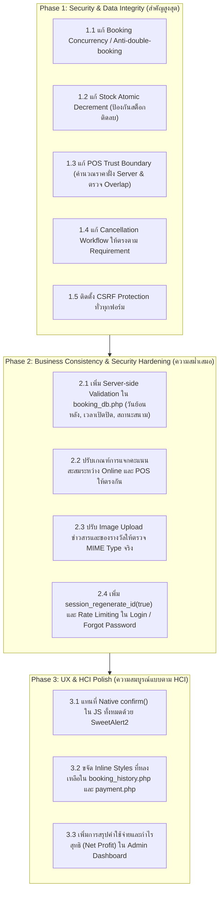

# T.S. Pattani Badminton Court Management — Comprehensive Project Status Audit
**วันที่ตรวจสอบ:** 2026-10-06  
**เอกสารอ้างอิง:** `PROJECT_FULL_AUDIT_2026-10-06.md`, `docs/PROJECT_HCI_RULES.md`, Database Schema (`config/setup.php`), และ Source Code ปัจจุบัน (Git HEAD: `2a9f643`)  
**วิธีและขอบเขตการตรวจสอบ:** Static Code Analysis, Business Logic Tracing, Concurrency & Security Vulnerability Assessment, และ Database Constraint Inspection ครอบคลุม 91+ ไฟล์ PHP ทั้งฝั่งสมาชิก (Member) และผู้ดูแลระบบ (Admin)

---

## สรุปสถานะภาพรวมของโปรเจกต์ (Executive Summary)

ระบบจัดการสนามแบดมินตัน **T.S. Pattani** อยู่ในสถานะ **"ฟังก์ชันงานครอบคลุมเกือบครบถ้วน (Feature-rich / Near-complete)"** ไวยากรณ์ PHP ทั้งหมด 91+ ไฟล์ผ่านการตรวจสอบ (Lint Pass 100%) โครงสร้างหลักได้รับการวางรากฐานไว้อย่างเป็นระบบ อย่างไรก็ตาม **ยังมีประเด็นด้าน Data Integrity, Concurrency Control, Security (CSRF) และ Business Logic Inconsistency ที่ต้องได้รับการแก้ไขให้เรียบร้อยก่อนเปิดใช้งานจริง**

---

## หมวดหมู่ผลการตรวจสอบ 5 ส่วน (Audit Categorization)

---

### A. PASS (สิ่งที่ทำถูกต้อง สมบูรณ์ และไม่จำเป็นต้องแก้ไข)

1. **Authentication & Role Separation:**
   - มีการแยก Session ระหว่างสมาชิก (`$_SESSION['member_id']`) และผู้ดูแลระบบ (`$_SESSION['admin_id']`) อย่างเด็ดขาดใน `includes/auth_check.php` และ `admin/includes/auth_check.php` ป้องกันการปีนสิทธิ์เข้าถึงหน้า Admin
   - จัดเก็บและตรวจสอบรหัสผ่านด้วยฟังก์ชันมาตรฐานที่ปลอดภัย (`password_hash()`, `password_verify()`)
   - ตรวจจับและระงับการเข้าสู่ระบบของสมาชิกที่อยู่ในสถานะ `'ระงับสิทธิ์'` ได้อย่างถูกต้องใน `actions/login_db.php`

2. **Booking Wizard UI/UX Flow (HCI Re-architecture):**
   - หน้า `booking.php` ได้รับการ Refactor เป็น **5-Step Wizard Pattern** อย่างสมบูรณ์ พร้อม Progress Stepper นำทางผู้ใช้
   - ถอดตาราง Availability Matrix ขนาดใหญ่ออกจากหน้าแรก เพื่อลดภาระทางความคิด (Cognitive Overload) ตามกฎ Heuristic 6 & 8
   - Calendar Picker ปิดการเลือกวันในอดีต (Past dates disabled) พร้อมปุ่มทางลัด `[วันนี้]` และ `[พรุ่งนี้]`
   - มีการแยกเก็บและแสดงผลชื่อเล่น/ชื่อก๊วน (`booking_nickname`) ดึงค่าเริ่มต้นจากชื่อสมาชิกใน Session แต่เปิดให้แก้ไขได้ และไม่เปิดเผยข้อมูลส่วนบุคคลสู่สาธารณะตามมาตรฐาน PDPA
   - ปราศจาก Inline Styles ในหน้า `booking.php` (Zero Inline Styles 100%)

3. **Server-side Booking Price Recalculation:**
   - `actions/booking_db.php` มีระบบคำนวณราคาค่าสนามใหม่ที่ฝั่ง Server เสมอ อ้างอิงตามประเภทวันในสัปดาห์ (Day-of-Week Pricing: เสาร์-อาทิตย์ = 200฿, อังคาร/พฤหัสบดี = 150฿, จันทร์/พุธ/ศุกร์ = 180฿)
   - ป้องกันการที่ Client แก้ไขราคาค่าสนาม ค่าเช่าอุปกรณ์ หรือค่าสินค้าผ่านทาง Request ได้อย่างมีประสิทธิภาพ

4. **Payment Slip Validation & Upload Security:**
   - `actions/payment_db.php` ตรวจสอบทั้งนามสกุลไฟล์ (Extension allowlist), ขนาดไฟล์ (ไม่เกิน 5MB) และตรวจสอบ MIME Type จริงด้วย `finfo_file(FILEINFO_MIME_TYPE)` ป้องกันการปลอมแปลงนามสกุลไฟล์
   - สร้างชื่อไฟล์ใหม่แบบสุ่ม (`slip_{booking_id}_{timestamp}.ext`) ป้องกันปัญหาชื่อไฟล์ซ้ำและ Path Traversal
   - ดึงยอดเงินที่ต้องชำระจากตาราง `Booking.booking_total_price` ฝั่ง Server ป้องกันการปลอมแปลงยอดเงิน

5. **Equipment Return Management & Workflow:**
   - `admin/actions/equipment_return_db.php` มี Workflow การตรวจรับคืนอุปกรณ์ 3 กรณีอย่างสมบูรณ์:
     - **สภาพปกติ:** คืนจำนวนสต็อกเข้าสู่ระบบพร้อมให้เช่าต่อ
     - **สภาพชำรุด:** ไม่คืนสต็อก แต่ส่งเข้าคิวซ่อมบำรุง `Equipment_repair` อัตโนมัติ
     - **สภาพสูญหาย:** ตัดจำหน่ายออกจากระบบถาวร
   - บันทึกรายรับค่าปรับ (Fine Amount) ลงตาราง `Revenue` แยกตามประเภทหน้าร้านอัตโนมัติ
   - ทำงานภายใต้ Database Transaction

6. **Customer Analytics & Dashboard Demographics:**
   - `admin/index.php` มีการประมวลผลข้อมูลทางสถิติและ Demographic Analytics ครบถ้วน:
     - สัดส่วนเพศ (Gender ratio)
     - สัดส่วนอาชีพ (Occupation distribution)
     - สัดส่วนกลุ่มอายุ 5 ช่วง (<18, 18-25, 26-35, 36-50, >50 ปี)
     - สรุปรายรับย้อนหลัง 12 เดือน (Monthly Revenue แยกค่าสนาม, ค่าเช่า, ค่าสินค้า)
     - ช่วงเวลาการใช้งานหนาแน่นที่สุด (Top 5 Peak Hours)
     - ลูกค้าที่มาใช้บริการบ่อยที่สุด (Top 5 Customers)
   - นำเสนอด้วยกราฟ Chart.js (ทั้ง Pie Chart และ Bar Chart)

7. **Loyalty Rewards & Member Gamification:**
   - `rewards.php` มี Progress Bar แสดงแต้มปัจจุบัน คำนวณแต้มที่ขาด (Shortfall), แบ่งของรางวัลตามระดับ Tier (Bronze, Silver, Gold), และมีแท็บประวัติการแลกรับของรางวัล (`my_redemptions`)
   - `actions/reward_redeem_db.php` มีการใช้ `SELECT ... FOR UPDATE` เพื่อล็อกแถวสต็อกของรางวัล ป้องกันการแย่งแลกของรางวัลชิ้นสุดท้าย

8. **Admin SweetAlert2 Confirmation Modals:**
   - ส่วนงานสำคัญของผู้ดูแลระบบได้รับการติดตั้ง SweetAlert2 สำหรับหน้าต่างยืนยันการทำรายการที่มีความเสี่ยงสูง (ลบสนาม, ลบสินค้า, ปฏิเสธสลิป, ลบแอดมิน ฯลฯ)

9. **PHP Syntax & Code Linting Pass:**
   - ตรวจสอบไวยากรณ์ไฟล์ PHP ทั้งหมด 91+ ไฟล์ในระบบ ไม่พบข้อผิดพลาดด้าน Syntax Error 100%

---

### B. WARNING (สิ่งที่ยังทำงานได้ แต่ควรปรับปรุงให้มีคุณภาพและความปลอดภัยสูงขึ้น)

#### W-01: ขาด `session_regenerate_id(true)` เมื่อเข้าสู่ระบบสำเร็จ
- **File:** `actions/login_db.php` (บรรทัดที่ 34–38) & `admin/actions/login_db.php` (บรรทัดที่ 22–27)
- **Function / Section:** Login Authentication Block
- **ปัญหาคืออะไร:** เมื่อรหัสผ่านถูกต้อง ระบบกำหนดค่าลงใน `$_SESSION` ทันทีโดยไม่ได้เรียกฟังก์ชัน `session_regenerate_id(true)` เพื่อสร้าง Session ID ใหม่
- **หลักฐานจาก Source Code:**
  ```php
  // actions/login_db.php บรรทัดที่ 35-37
  $_SESSION['member_id'] = $member['member_id'];
  $_SESSION['member_name'] = $member['member_name'];
  $_SESSION['member_phone'] = $member['member_phone'];
  ```
- **ผลกระทบ:** เสี่ยงต่อการถูกโจมตีแบบ Session Fixation ซึ่งผู้ไม่หวังดีอาจขโมยสิทธิ์การใช้งานของสมาชิกหรือผู้ดูแลระบบได้
- **ระดับความรุนแรง:** Medium
- **แนวทางแก้ไข:** เพิ่มคำสั่ง `session_regenerate_id(true);` ทันทีหลังยืนยันความถูกต้องของรหัสผ่านสำเร็จ ก่อนกำหนดค่าลง Session
- **ต้องแก้ Database หรือไม่:** ไม่ต้อง
- **ต้องแก้ Frontend / Backend หรือไม่:** Backend เท่านั้น

---

#### W-02: ฟังก์ชันลืมรหัสผ่านไม่มี Rate Limiting และขาดขั้นตอนยืนยันตัวตนขั้นที่สอง
- **File:** `actions/forgot_password_db.php` (บรรทัดที่ 24–38)
- **Function / Section:** Password Reset Handling
- **ปัญหาคืออะไร:** สมาชิกสามารถรีเซ็ตรหัสผ่านใหม่ได้ทันทีเพียงแค่ระบุเบอร์โทรศัพท์และชื่อ-นามสกุลให้ตรงกับในฐานข้อมูล โดยไม่มีการส่ง OTP, Security Token ทางอีเมล หรือการหน่วงเวลาป้องกัน Brute-force
- **หลักฐานจาก Source Code:**
  ```php
  $stmt = $conn->prepare("SELECT member_id FROM Member WHERE member_phone = :phone AND member_name = :name");
  $stmt->execute([':phone' => $phone, ':name' => $name]);
  $member = $stmt->fetch(PDO::FETCH_ASSOC);
  if ($member) {
      $hashed_password = password_hash($new_password, PASSWORD_DEFAULT);
      $stmt_update = $conn->prepare("UPDATE Member SET member_password = :password WHERE member_id = :id");
      ...
  ```
- **ผลกระทบ:** บุคคลภายนอกที่ทราบชื่อและเบอร์โทรศัพท์ของสมาชิก สามารถตั้งรหัสผ่านใหม่และยึดบัญชีของผู้อื่นได้ทันที
- **ระดับความรุนแรง:** High / Medium
- **แนวทางแก้ไข:** เพิ่มการบันทึก Failed Attempts และหน่วงเวลา (Rate Limiting) หรือใช้วิธีติดต่อ Admin เพื่อยืนยันตัวตนก่อนรีเซ็ตรหัสผ่าน
- **ต้องแก้ Database หรือไม่:** อาจเพิ่มตาราง Reset Log หากทำ Rate Limiting
- **ต้องแก้ Frontend / Backend หรือไม่:** Backend เป็นหลัก

---

#### W-03: การตรวจสอบไฟล์รูปภาพข่าวสารและของรางวัลไม่รัดกุมเท่ากับสลิป
- **File:** `admin/actions/news_add_db.php`, `news_edit_db.php`, `reward_add_db.php`, `reward_edit_db.php`
- **Function / Section:** Image Upload Handling
- **ปัญหาคืออะไร:** การอัปโหลดรูปภาพข่าวสารและของรางวัลตรวจสอบเฉพาะนามสกุลไฟล์จาก `pathinfo()` แต่ไม่ได้ตรวจสอบ MIME Type จริงด้วย `finfo_file()` และใน `reward_add_db.php` ไม่ได้กำหนดการจำกัดขนาดไฟล์สูงสุด (File size limit)
- **หลักฐานจาก Source Code:**
  ```php
  // admin/actions/reward_add_db.php บรรทัดที่ 20-26
  if (isset($_FILES['reward_image']) && $_FILES['reward_image']['error'] == UPLOAD_ERR_OK) {
      $allowed_ext = ['jpg', 'jpeg', 'png'];
      $file_info = pathinfo($_FILES['reward_image']['name']);
      $ext = strtolower($file_info['extension']);
      if (in_array($ext, $allowed_ext)) {
          move_uploaded_file(...);
  ```
- **ผลกระทบ:** ผู้ไม่หวังดีอาจอัปโหลดไฟล์สคริปต์อันตรายที่แฝงนามสกุลรูปภาพ หรือไฟล์ขนาดใหญ่มากจนพื้นที่เซิร์ฟเวอร์เต็ม
- **ระดับความรุนแรง:** Medium
- **แนวทางแก้ไข:** ดึงมาตรฐานเดียวกับ `actions/payment_db.php` มาใช้ โดยตรวจสอบ MIME Type ด้วย `finfo_file` และจำกัดขนาดไฟล์ไม่เกิน 2MB–5MB
- **ต้องแก้ Database หรือไม่:** ไม่ต้อง
- **ต้องแก้ Frontend / Backend หรือไม่:** Backend เท่านั้น

---

#### W-04: มีคำสั่ง Native Browser `confirm()` หลงเหลือในสคริปต์ JavaScript
- **File:** `assets/js/admin.js` (บรรทัดที่ 240, 247, 870, 922) และ `assets/js/member.js` (บรรทัดที่ 535)
- **Function / Section:** Client-side Confirmation Handling
- **ปัญหาคืออะไร:** ยังมีคำสั่ง `confirm(...)` แบบดั้งเดิมของเบราว์เซอร์หลงเหลืออยู่ในการคิดเงิน POS และการแจ้งเตือน
- **หลักฐานจาก Source Code:**
  ```javascript
  // assets/js/admin.js บรรทัดที่ 240
  return confirm("ยืนยันการชำระเงินและบันทึกการขาย? ยอดรวมทั้งสิ้น " + totalPrice.toFixed(2) + " บาท (พิมพ์ใบเสร็จรับเงิน)");
  // assets/js/admin.js บรรทัดที่ 247
  return confirm("ยืนยันรับเงินสด " + cashReceived.toFixed(2) + " บาท?");
  ```
- **ผลกระทบ:** ขัดต่อมาตรฐาน HCI Rule 2.4.3 & 2.5.3 ใน `docs/PROJECT_HCI_RULES.md` ที่ระบุว่าการยืนยันการทำรายการทั้งหมดต้องรวมศูนย์ด้วย SweetAlert2 เพื่อความเป็นเอกภาพและความชัดเจนของ Consequence Statement
- **ระดับความรุนแรง:** Medium / Low
- **แนวทางแก้ไข:** Refactor จุดที่เรียกใช้ `confirm()` ทั้งหมดในไฟล์ JS ให้ส่งผ่านโมดูล `AdminModal.confirmAction()` ด้วย SweetAlert2
- **ต้องแก้ Database หรือไม่:** ไม่ต้อง
- **ต้องแก้ Frontend / Backend หรือไม่:** Frontend JS เท่านั้น

---

#### W-05: Admin Dashboard ยังไม่มีการสรุปค่าใช้จ่ายรวมและกำไรสุทธิ (Net Profit)
- **File:** `admin/index.php` (บรรทัดที่ 13–15, 120–135)
- **Function / Section:** Financial Metric Calculations
- **ปัญหาคืออะไร:** Dashboard สรุปเฉพาะยอดรายรับ (`Revenue`) แต่ไม่ได้รวมข้อมูลรายจ่ายจากตาราง `Court_repair` (`repair_cost`), `Equipment_repair` (`eq_repair_cost`) และ `Purchase` (`purchase_total_price`) เพื่อแสดงเป็น "ค่าใช้จ่ายรวม" และ "กำไรสุทธิ"
- **หลักฐานจาก Source Code:**
  ```php
  // admin/index.php บรรทัดที่ 14
  $stmt = $conn->query("SELECT SUM(revenue_total_amount) FROM Revenue");
  $total_revenue = $stmt->fetchColumn() ?: 0;
  // ไม่มีการ query ข้อมูลต้นทุน/ค่าใช้จ่ายจาก Court_repair, Equipment_repair, Purchase
  ```
- **ผลกระทบ:** ผู้บริหารหรือผู้ดูแลระบบไม่สามารถมองเห็นภาพรวมทางการเงินที่แท้จริง (Net Profit / Loss) ทั้งที่ระบบมีการบันทึกข้อมูลต้นทุนไว้ครบถ้วน
- **ระดับความรุนแรง:** Medium
- **แนวทางแก้ไข:** เพิ่ม Query สรุปค่าใช้จ่ายรวมทั้ง 3 ด้าน และคำนวณ `กำไรสุทธิ = รายรับรวม - ค่าใช้จ่ายรวม` แสดงเป็นการ์ดสรุปบน Dashboard
- **ต้องแก้ Database หรือไม่:** ไม่ต้อง (ตารางและคอลัมน์มีอยู่แล้ว)
- **ต้องแก้ Frontend / Backend หรือไม่:** ทั้ง Frontend (เพิ่มการ์ด/กราฟ) และ Backend (เพิ่ม Query)

---

#### W-06: ยังมี Inline Styles หลงเหลืออยู่ในบางหน้าจอของฝั่ง Member
- **File:** `booking_history.php` (บรรทัดที่ 104, 110, 127) และ `payment.php` (บรรทัดที่ 61, 65, 80)
- **Function / Section:** Presentation Markup
- **ปัญหาคืออะไร:** ยังมีแท็ก HTML ที่ใส่แอตทริบิวต์ `style="..."` โดยตรง เช่น `style="background-color: #f4f6f9;"`, `style="max-width: 800px; margin: 40px auto;"`
- **หลักฐานจาก Source Code:**
  ```html
  <!-- payment.php บรรทัดที่ 65 -->
  <div class="payment-wrapper" style="max-width: 800px; margin: 40px auto; padding: 0 20px;">
  ```
- **ผลกระทบ:** ขัดต่อกฎ HCI Rule 2.8.3 (Zero Inline Styles)
- **ระดับความรุนแรง:** Low
- **แนวทางแก้ไข:** ย้าย CSS properties ทั้งหมดไปไว้ในคลาสของ `assets/css/style.css`
- **ต้องแก้ Database หรือไม่:** ไม่ต้อง
- **ต้องแก้ Frontend / Backend หรือไม่:** Frontend เท่านั้น

---

### C. CRITICAL (ความเสี่ยงต่อข้อมูล ระบบ หรือความปลอดภัยที่ต้องแก้ก่อนเปิดใช้งานจริง)

#### C-01: ช่องโหว่ Race Condition / Concurrent Double-Booking ในระบบจองสนาม
- **File:** `actions/booking_db.php`
- **Function / Section:** Overlap Checking & Transaction Handling (บรรทัดที่ 117–141)
- **ปัญหาคืออะไร:** การตรวจเวลาซ้ำซ้อน (`SELECT COUNT(*) FROM BOOKING`) เกิดขึ้น **ก่อนการเปิด Transaction (`$conn->beginTransaction()`)** และตาราง `Booking` ไม่มีระดับ Unique Constraint บนช่วงเวลาจอง
- **หลักฐานจาก Source Code:**
  ```php
  // actions/booking_db.php บรรทัดที่ 117-140
  $sql_check = "SELECT COUNT(*) FROM BOOKING 
                WHERE court_id = :court_id 
                AND booking_date = :booking_date 
                AND booking_status != 'ยกเลิก'
                AND ((booking_start_time < :end_time AND booking_end_time > :start_time))";
  $stmt_check = $conn->prepare($sql_check);
  $stmt_check->execute([...]);
  if ($stmt_check->fetchColumn() > 0) {
      throw new Exception("ขออภัย! สนามนี้มีผู้จองในช่วงเวลาดังกล่าวแล้ว...");
  }

  // Transaction เพิ่งถูกเปิดตรงนี้!
  $conn->beginTransaction();
  ```
- **ผลกระทบ:** หากมีผู้ใช้งาน 2 คนกดจองสนามเดียวกันและเวลาเดียวกันพร้อมกันในเสี้ยววินาที:
  1. Request A ตรวจสอบผ่าน (ไม่พบข้อมูลทับซ้อน)
  2. Request B ตรวจสอบผ่าน (ไม่พบข้อมูลทับซ้อน)
  3. Request A เปิด Transaction และ INSERT สำเร็จ
  4. Request B เปิด Transaction และ INSERT สำเร็จ  
  **ผลลัพธ์: เกิดการจองสนามซ้ำซ้อน 2 รายการในช่วงเวลาเดียวกัน (Double Booking Disaster)**
- **ระดับความรุนแรง:** **CRITICAL**
- **แนวทางแก้ไข:**
  1. ย้ายการเปิด Transaction เข้ามาก่อนการตรวจสอบ
  2. ใช้กลไก Slot Reservation Lock หรือใช้ Pessimistic Lock ผ่านตารางล็อกสนามเฉพาะกิจที่มี Unique Index บน `(court_id, booking_date, time_slot)` หรือใช้ Named Locks (`GET_LOCK()`) ของ MySQL
- **ต้องแก้ Database หรือไม่:** แนะนำเพิ่ม Unique Constraint หรือตาราง Time-slot Reservation Index
- **ต้องแก้ Frontend / Backend หรือไม่:** Backend เป็นหลัก

---

#### C-02: สต็อกสินค้า/อุปกรณ์เกิด Race Condition จนติดลบได้ (Stock Race Condition)
- **File:** `actions/booking_db.php` (บรรทัดที่ 189–220) & `admin/actions/pos_checkout_db.php` (บรรทัดที่ 137–139)
- **Function / Section:** Stock Deduction Handling
- **ปัญหาคืออะไร:** การตัดสต็อกสินค้าและอุปกรณ์เช่า สั่งคำสั่ง `UPDATE Product SET product_stock = product_stock - :qty WHERE product_id = :id` โดยไม่มีเงื่อนไขป้องกัน `AND product_stock >= :qty` และในขั้นตอนการ SELECT ตรวจสอบไม่ได้ใช้ `FOR UPDATE`
- **หลักฐานจาก Source Code:**
  ```php
  // actions/booking_db.php บรรทัดที่ 189 และ 216-219
  $sql_update_stock = "UPDATE PRODUCT SET product_stock = product_stock - :qty WHERE product_id = :id";
  ...
  $stmt_update_stock->execute([':qty' => $qty, ':id' => $prod_id]);
  ```
- **ผลกระทบ:** หากมีอุปกรณ์เหลือ 1 ชิ้น และมีผู้ใช้ 2 คนกดเช่าพร้อมกัน ทั้งคู่จะผ่านเงื่อนไขใน PHP (`1 >= 1`) และทั้งคู่จะรันคำสั่งลดสต็อก ทำให้สต็อกคงเหลือกลายเป็น `1 - 1 - 1 = -1` (สินค้าติดลบ)
- **ระดับความรุนแรง:** **HIGH / CRITICAL**
- **แนวทางแก้ไข:** เปลี่ยนเป็น Atomic Update:
  ```sql
  UPDATE Product 
  SET product_stock = product_stock - :qty 
  WHERE product_id = :id AND product_stock >= :qty;
  ```
  และตรวจสอบว่า `rowCount() > 0` หากคืนค่า 0 ให้โยน Exception เพื่อ Rollback ทันที
- **ต้องแก้ Database หรือไม่:** ไม่ต้องแก้โครงสร้างตาราง
- **ต้องแก้ Frontend / Backend หรือไม่:** Backend

---

#### C-03: ขาดระบบป้องกัน CSRF (Cross-Site Request Forgery) ทั่วทั้งระบบ
- **File:** ทุกแบบฟอร์มใน `actions/*.php` และ `admin/actions/*.php`
- **Function / Section:** Form Submissions & State-Changing Requests
- **ปัญหาคืออะไร:** ไม่มีการสร้างหรือตรวจสอบ CSRF Token ในคำร้องขอแบบ POST ใดๆ ในระบบ
- **หลักฐานจาก Source Code:**
  - ค้นหาคำสั่ง `csrf` หรือ `token` ทั่วทั้ง Source Code ผลลัพธ์เป็น 0 รายการ
- **ผลกระทบ:** ผู้ใช้หรือผู้ดูแลระบบที่กำลังล็อกอินอยู่ หากคลิกลิงก์อันตรายจากภายนอก สามารถถูกบังคับให้ส่ง Request มาลบข้อมูล, สั่งซื้อสินค้า, ปฏิเสธสลิป, หรือเปลี่ยนรหัสผ่านได้โดยไม่รู้ตัว
- **ระดับความรุนแรง:** **HIGH**
- **แนวทางแก้ไข:**
  1. สร้างฟังก์ชันสร้าง Token: `$_SESSION['csrf_token'] = bin2hex(random_bytes(32));`
  2. ฝัง `<input type="hidden" name="csrf_token" value="<?php echo $_SESSION['csrf_token']; ?>">` ในทุกแบบฟอร์ม
  3. ตรวจสอบ `hash_equals($_SESSION['csrf_token'], $_POST['csrf_token'] ?? '')` ในทุก Action Script
- **ต้องแก้ Database หรือไม่:** ไม่ต้อง
- **ต้องแก้ Frontend / Backend หรือไม่:** ทั้ง Frontend (เพิ่ม Hidden Input ใน Form) และ Backend (ตรวจสอบ Token)

---

#### C-04: ระบบขายหน้าร้าน (POS) ไว้วางใจราคาสนามและยอดรวมจาก Client
- **File:** `admin/actions/pos_checkout_db.php` (บรรทัดที่ 7, 35–52, 185)
- **Function / Section:** POS Checkout & Total Amount Verification
- **ปัญหาคืออะไร:** ในการเปิดสนาม Walk-in หน้าร้าน ระบบรับค่า `$court_price = floatval($item['price'])` จาก Client เข้ามาบันทึก หากส่งค่ามากกว่า 0 จะไม่ทำการคำนวณใหม่ และยอดรวมรายรับ `revenue_total_amount` ดึงจาก `$_POST['total_amount']` โดยตรง
- **หลักฐานจาก Source Code:**
  ```php
  // admin/actions/pos_checkout_db.php บรรทัดที่ 35-38
  $court_price = floatval($item['price']);
  // Fallback คำนวณราคาตามประเภทวันหากไม่ได้ส่งมา
  if ($court_price <= 0) { ...คำนวณใหม่... }

  // บรรทัดที่ 185
  $stmt_revenue->execute([
      ':court' => $revenue_court,
      ':rental' => $revenue_rental,
      ':product' => $revenue_product,
      ':total' => $total_amount // ใช้ค่าจาก $_POST โดยตรง!
  ]);
  ```
- **ผลกระทบ:** ขัดต่อหลัก Trust Boundary ของระบบ หากหน้าเว็บ POS ถูกแทรกแซงหรือปรับเปลี่ยน Payload ราคาสนามและยอดรวมรายรับในตาราง `Revenue` จะไม่ตรงกับความจริง
- **ระดับความรุนแรง:** **HIGH**
- **แนวทางแก้ไข:** ให้ Server คำนวณราคาสนาม Walk-in ตามเรทวันในสัปดาห์ใหม่เสมอ และคำนวณ `$total_amount = $revenue_court + $revenue_rental + $revenue_product` ในฝั่ง Server แทนการรับจาก POST
- **ต้องแก้ Database หรือไม่:** ไม่ต้อง
- **ต้องแก้ Frontend / Backend หรือไม่:** Backend

---

### D. REQUIREMENT GAP (สิ่งที่ระบุใน Requirement แต่ Source Code ยังไม่รองรับหรือขัดแย้ง)

#### GAP-01: Flow การยกเลิกการจองไม่ตรงตาม Requirement สำหรับสถานะ 'จองแล้ว'
- **File:** `actions/cancel_booking_db.php` (บรรทัดที่ 44–77) & `booking_history.php` (บรรทัดที่ 184–188)
- **Function / Section:** Booking Cancellation Workflow
- **ข้อกำหนดใน Requirement:**
  - สมาชิกสามารถกดยกเลิกการจองได้เองเฉพาะรายการที่อยู่ในสถานะ **"รอตรวจสอบ"** (หรือก่อนชำระเงิน)
  - รายการที่ได้รับการอนุมัติเป็นสถานะ **"จองแล้ว"** สมาชิกไม่สามารถกดยกเลิกโดยพลการได้ ต้องส่งเรื่องคำร้องขอไปยัง Admin และ Admin จะเป็นผู้พิจารณาอนุมัติ/ปฏิเสธการยกเลิกและการคืนเงิน
- **การทำงานจริงใน Source Code:**
  - `actions/cancel_booking_db.php` อนุญาตให้สมาชิก POST ขอยกเลิกรายการสถานะ "จองแล้ว" ได้โดยตรง และคำสั่งจะเปลี่ยน `Booking.booking_status = 'ยกเลิก'` และคืนสต็อกอุปกรณ์ทันที โดยไม่ต้องรอแอดมินอนุมัติ
- **หลักฐานจาก Source Code:**
  ```php
  // actions/cancel_booking_db.php บรรทัดที่ 76
  $sql_booking = "UPDATE Booking SET booking_status = 'ยกเลิก' WHERE booking_id = :b_id";
  $conn->prepare($sql_booking)->execute([':b_id' => $booking_id]);
  ```
- **ผลกระทบ:** ลูกค้าที่จองแล้วสามารถกดแคนเซิลสนามคืนสต็อกได้เองทันที ทำให้สนามหลุดจากระบบโดยที่แอดมินยังไม่ได้พิจารณาเงื่อนไขนโยบายค่าปรับหรือคืนเงิน
- **ระดับความรุนแรง:** **HIGH**
- **แนวทางแก้ไข:**
  - หากสถานะเป็น "รอตรวจสอบ": ให้เปลี่ยนเป็น "ยกเลิก" ได้ทันที
  - หากสถานะเป็น "จองแล้ว": ห้ามเปลี่ยนสถานะ Booking เป็น "ยกเลิก" ทันที ให้เปลี่ยนสถานะ Booking เป็น "ขอยกเลิก" หรือบันทึกลงตาราง `Cancellation` (สถานะ `refund_status = 'รอดำเนินการ'`) แล้วรอให้แอดมินกดอนุมัติในหน้า `admin/cancellations.php`
- **ต้องแก้ Database หรือไม่:** หากเพิ่ม ENUM 'ขอยกเลิก' ใน `Booking.booking_status` จะทำให้ Flow สมบูรณ์ขึ้น
- **ต้องแก้ Frontend / Backend หรือไม่:** ทั้ง Frontend (`booking_history.php` ปรับข้อความปุ่ม/เงื่อนไข) และ Backend (`actions/cancel_booking_db.php`)

---

#### GAP-02: Admin Cancellation Approval ไม่ได้เปลี่ยนสถานะ Booking และไม่จัดการ Revenue / Refund
- **File:** `admin/actions/cancellation_action_db.php` (บรรทัดที่ 15–59)
- **Function / Section:** Admin Cancellation Review Action
- **ข้อกำหนดใน Requirement:**
  - เมื่อผู้ดูแลระบบอนุมัติการยกเลิก (Approve Cancellation) ระบบต้องเปลี่ยนสถานะ Booking เป็น "ยกเลิก", ปรับปรุงยอดรายรับ (Revenue reversal/refund adjustment), คืนสต็อกอุปกรณ์ และคืนพอยท์
- **การทำงานจริงใน Source Code:**
  - `admin/actions/cancellation_action_db.php` อัปเดตเพียงฟิลด์ `refund_status` ในตาราง `Cancellation` และเพิ่มพอยท์ให้สมาชิกเท่านั้น **ไม่มีการอัปเดตตาราง `Booking`, ไม่มีการคืนสต็อกอุปกรณ์ และไม่มีการปรับปรุงตาราง `Revenue`**
- **หลักฐานจาก Source Code:**
  ```php
  // admin/actions/cancellation_action_db.php
  // มีเพียง UPDATE CANCELLATION และ UPDATE POINT
  // ขาดการจัดการ Booking, Rental, Revenue
  ```
- **ผลกระทบ:** หากแอดมินไม่อนุมัติ (`refund_status = 'ไม่คืน'`) แต่ตัว Booking ถูกเปลี่ยนเป็น "ยกเลิก" ไปตั้งแต่ตอนสมาชิกส่งคำร้องแล้ว ทำให้ข้อมูลขัดแย้งกันอย่างสิ้นเชิง
- **ระดับความรุนแรง:** **HIGH**
- **แนวทางแก้ไข:** ย้าย Logic การเปลี่ยนสถานะ `Booking = 'ยกเลิก'`, การคืนสต็อกอุปกรณ์, และการบันทึกรายการคืนเงินใน `Revenue` มาประมวลผลตอนแอดมินกด "อนุมัติการยกเลิก" ในไฟล์นี้
- **ต้องแก้ Database หรือไม่:** แนะนำเพิ่มคอลัมน์ `refund_amount DECIMAL(8,2)` ในตาราง `Cancellation`
- **ต้องแก้ Frontend / Backend หรือไม่:** Backend (`cancellation_action_db.php`) และ Frontend (`admin/cancellations.php`)

---

#### GAP-03: การเปิดสนาม Walk-in หน้าร้าน POS ขาดการตรวจสอบการจองซ้อน (Overlap Check)
- **File:** `admin/actions/pos_checkout_db.php` (บรรทัดที่ 66–83)
- **Function / Section:** Walk-in Court Reservation
- **ข้อกำหนดใน Requirement:**
  - การเปิดสนาม Walk-in หน้าร้าน ต้องไม่ซ้ำซ้อนกับสนามที่มีลูกค้าจองออนไลน์ไว้แล้วในช่วงเวลาเดียวกัน
- **การทำงานจริงใน Source Code:**
  - สั่ง `INSERT INTO Booking` เป็นสถานะ "จองแล้ว" ทันที โดยไม่มีการรันคำสั่ง `SELECT COUNT(*)` ตรวจสอบการจองซ้อน (Overlap Check) ก่อน
- **หลักฐานจาก Source Code:**
  ```php
  // admin/actions/pos_checkout_db.php บรรทัดที่ 66-83
  // ไม่มีโค้ดตรวจ SELECT FROM Booking ซ้อนทับเลย สั่ง INSERT ทันที
  $sql_booking = "INSERT INTO Booking (...) VALUES (...)";
  ```
- **ผลกระทบ:** แอดมินสามารถเปิดสนาม Walk-in ทับกับสนามที่ลูกค้าออนไลน์กำลังใช้งานอยู่ หรือกำลังรอตรวจสอบสลิปได้ทันที ทำให้เกิดการชนกันของลูกค้าจริงที่สนาม
- **ระดับความรุนแรง:** **HIGH**
- **แนวทางแก้ไข:** เพิ่ม Overlap Check ของสนามและช่วงเวลาดังกล่าวในตาราง `Booking` ก่อนทำการ INSERT
- **ต้องแก้ Database หรือไม่:** ไม่ต้อง
- **ต้องแก้ Frontend / Backend หรือไม่:** Backend

---

#### GAP-04: ความไม่สอดคล้องกันของเกณฑ์การแจกคะแนนสะสม (Loyalty Point Rule Mismatch)
- **File:** `admin/actions/payment_verify_db.php` (บรรทัดที่ 67) เทียบกับ `admin/actions/pos_checkout_db.php` (บรรทัดที่ 89)
- **Function / Section:** Loyalty Point Calculation Logic
- **ข้อกำหนดใน Requirement:**
  - กฎการคำนวณคะแนนสะสมควรมีความสม่ำเสมอตาม Business Policy เดียวกันทั่วทั้งระบบ
- **การทำงานจริงใน Source Code:**
  - **Online Payment Verification:** คำนวณแต้ม `1 คะแนน ต่อ 100 บาท` จาก **ยอดรวมทั้งสิ้น (สนาม + อุปกรณ์เช่า + สินค้า)**:
    ```php
    $earned_points = floor($data['booking_total_price'] / 100);
    ```
  - **POS Walk-in Checkout:** คำนวณแต้ม `1 คะแนน ต่อ 50 บาท` จาก **ค่าสนามอย่างเดียว** (สินค้าบริโภคและอุปกรณ์เช่าหน้าร้านไม่ได้คะแนนสะสม):
    ```php
    $earned_points = floor($court_price / 50);
    ```
- **ผลกระทบ:** สมาชิกได้รับผลประโยชน์ไม่เท่าเทียมกันระหว่างการจองออนไลน์กับการซื้อหน้าร้าน ก่อให้เกิดความสับสนต่อผู้ใช้งาน
- **ระดับความรุนแรง:** **MEDIUM**
- **แนวทางแก้ไข:** กำหนด Business Rule ให้ชัดเจน (เช่น 100 บาท = 1 คะแนน หรือ 50 บาท = 1 คะแนน) และบังคับใช้สูตรเดียวกันทั้งสองช่องทาง
- **ต้องแก้ Database หรือไม่:** ไม่ต้อง
- **ต้องแก้ Frontend / Backend หรือไม่:** Backend

---

#### GAP-05: Backend Validation ใน `booking_db.php` ยังไม่ครอบคลุมเงื่อนไขเวลาและสถานะสนาม
- **File:** `actions/booking_db.php` (บรรทัดที่ 38–72)
- **Function / Section:** Server-side Pre-booking Validations
- **ข้อกำหนดใน Requirement:**
  - ต้องป้องกันการจองวันย้อนหลัง (Past dates)
  - ต้องตรวจสอบเวลาเริ่มต้นและสิ้นสุดให้อยู่ในช่วงเปิดทำการ (08:00–22:00 น.)
  - ต้องตรวจสอบว่าสนามไม่อยู่ในสถานะ "ปิดปรับปรุง" (`court_status != 'ปิดปรับปรุง'`)
  - ต้องตรวจสอบว่าสมาชิกไม่อยู่ในสถานะ "ระงับสิทธิ์"
- **การทำงานจริงใน Source Code:**
  - แม้ว่า Frontend จะมีการปิดการเลือกวันในอดีต แต่ใน Backend `actions/booking_db.php` ตรวจสอบเพียงความยาวชั่วโมง (`$hours >= 1`) และเวลาเริ่มต้นน้อยกว่าสิ้นสุด แต่ไม่ได้ตรวจวันย้อนหลัง, ไม่ได้ตรวจเวลาเปิดปิดทำการ 08:00–22:00, ไม่ได้ตรวจสถานะสนาม และไม่ได้ตรวจสถานะสมาชิก
- **หลักฐานจาก Source Code:**
  ```php
  // actions/booking_db.php บรรทัดที่ 66-71
  $stmt_court = $conn->prepare("SELECT court_price_per_hour, court_peak_price, court_offpeak_price FROM Court WHERE court_id = :court_id");
  // ไม่ได้ SELECT court_status มาตรวจว่า 'ปิดปรับปรุง' หรือไม่
  ```
- **ผลกระทบ:** หากผู้ใช้ยิง Request เข้ามาโดยตรง สามารถจองสนามที่ปิดปรับปรุง หรือจองสนามในอดีตได้
- **ระดับความรุนแรง:** **MEDIUM**
- **แนวทางแก้ไข:** เพิ่มเงื่อนไขการตรวจสอบเหล่านี้ใน `actions/booking_db.php` ก่อนเข้าสู่ขั้นตอนคำนวณราคา
- **ต้องแก้ Database หรือไม่:** ไม่ต้อง
- **ต้องแก้ Frontend / Backend หรือไม่:** Backend

---

### E. RECOMMENDED FIX ORDER (จัดลำดับสิ่งที่ควรแก้ไขตามลำดับความสำคัญ)



#### รายละเอียดลำดับการดำเนินงาน:
1. **ลำดับที่ 1 (Critical):** แก้ไข Concurrency Control ของการจองสนามใน `actions/booking_db.php` ให้มี Atomic Locking ป้องกัน Double Booking
2. **ลำดับที่ 2 (High):** แก้ไข Stock Concurrency ใน `actions/booking_db.php` และ `admin/actions/pos_checkout_db.php` ให้เป็น Atomic Update `WHERE product_stock >= :qty`
3. **ลำดับที่ 3 (High):** ปรับแก้ POS ใน `admin/actions/pos_checkout_db.php` ให้คำนวณราคาสนามและยอดรวมจาก Server และเพิ่ม Overlap Check ของสนาม Walk-in
4. **ลำดับที่ 4 (High):** จัดระเบียบ Cancellation Flow ให้สมาชิกยื่นคำร้องในสถานะ 'จองแล้ว' และให้ Admin เป็นผู้อนุมัติเพื่อปรับปรุง Booking, Stock, Revenue และ Point อย่างสมบูรณ์
5. **ลำดับที่ 5 (High):** ติดตั้งระบบ CSRF Protection ในทุก POST Action ของทั้งฝั่ง Member และ Admin
6. **ลำดับที่ 6 (Medium):** เสริม Backend Validation ใน `actions/booking_db.php` ให้ตรวจวันย้อนหลัง, เวลาเปิดปิดสนาม, สถานะสนาม และสถานะสมาชิก
7. **ลำดับที่ 7 (Medium):** รวมเกณฑ์การแจกคะแนนสะสมให้เป็นมาตรฐานเดียวกันระหว่าง Online และ POS
8. **ลำดับที่ 8 (Medium):** ปรับระบบอัปโหลดรูปภาพ News/Reward ให้ตรวจ MIME Type และขนาดไฟล์
9. **ลำดับที่ 9 (Medium):** เพิ่ม `session_regenerate_id(true)` และ Rate Limiting ให้ระบบเข้าสู่ระบบและกู้รหัสผ่าน
10. **ลำดับที่ 10 (Low):** เปลี่ยน `confirm()` ที่เหลือใน Admin JS เป็น SweetAlert2 และย้าย Inline Styles ที่เหลือเข้าสู่ CSS

---

## สรุปภาพรวมและคำตอบ 5 ประเด็นหลัก (Overview Q&A)

### 1. ระบบส่วนไหนพร้อมใช้งานแล้วบ้าง?
- **Member Module:** ระบบสมัครสมาชิก, เข้าสู่ระบบ, โปรไฟล์, การสะสมแต้ม, และหน้าแลกของรางวัล (`rewards.php`) พร้อมใช้งาน
- **Booking Frontend:** หน้าจองสนามแบบ 5-Step Wizard Pattern สอดคล้องตามหลัก HCI มีการปกป้องข้อมูลส่วนบุคคลตาม PDPA ปราศจาก Inline Styles
- **Payment Verification:** การแนบสลิป, การตรวจ MIME/Size, และการอนุมัติสลิปออนไลน์ของ Admin พร้อมใช้งานและทำงานเป็น Transaction
- **Equipment Return:** ระบบตรวจรับคืนอุปกรณ์ (ปกติ/ชำรุด/สูญหาย) และส่งเข้าคิวซ่อมบำรุงพร้อมใช้งาน 100%
- **Customer Analytics:** การวิเคราะห์ข้อมูลเพศ, อาชีพ, ช่วงอายุ, รายได้รายเดือน และช่วงเวลาหนาแน่นบน Dashboard ทำงานได้จริง
- **Admin CRUD & Navigation:** การจัดการสนาม, สินค้า, ของรางวัล, ข่าวสาร, สมาชิก, ผู้ดูแลระบบ, บันทึกจัดซื้อ, บันทึกแจ้งซ่อมสนาม/อุปกรณ์ มีสคริปต์รองรับครบถ้วน

### 2. Critical Issues ที่ต้องแก้ก่อนเปิดใช้งานจริงมีอะไรบ้าง?
1. **Double Booking Race Condition:** การจองสนามพร้อมกันในเสี้ยววินาทียังไม่มี Concurrency Lock ที่แข็งแรงพอ
2. **Stock Race Condition:** การตัดสต็อกยังไม่มีเงื่อนไข Atomic ป้องกันสต็อกติดลบ
3. **ขาด CSRF Protection:** ทุกฟอร์มเสี่ยงต่อการถูกปลอมแปลงคำสั่งข้ามไซต์
4. **POS Trust Boundary:** POS รับราคาสนามและยอดเงินรวมจาก Client โดยตรง และขาด Overlap Check
5. **Cancellation Workflow Inconsistency:** สมาชิกสามารถกดยกเลิกรายการที่ได้รับการอนุมัติแล้วได้เองทันที และการอนุมัติของ Admin ยังไม่เชื่อมโยงกับ Booking, Stock, และ Revenue

### 3. สิ่งไหนควรแก้ก่อน?
- ควรแก้กลุ่ม **Data Integrity & Security** ใน **Phase 1** เป็นอันดับแรกสุด ได้แก่:
  - การล็อกสนามป้องกัน Double Booking
  - การตัดสต็อกแบบ Atomic
  - การตรวจสอบและคำนวณราคาหน้าร้าน POS ฝั่ง Server
  - การปรับ Flow การยกเลิกการจองให้ตรง Requirement
  - การเพิ่ม CSRF Token

### 4. สิ่งไหนไม่จำเป็นต้องแก้ในตอนนี้?
- **โครงสร้างฐานข้อมูลหลักและฟังก์ชันงานที่ทำงานถูกต้องแล้ว:** ตาราง `Member`, `Court`, `Product`, `Rental`, `Revenue`, `Point` โครงสร้างหลักสมบูรณ์ดี ไม่มีความจำเป็นต้องรื้อถอนใหม่
- **UI ของหน้า Booking Wizard และ Rewards:** ผ่านการยกระดับตามเกณฑ์ HCI ครบถ้วนแล้ว ไม่ต้องออกแบบใหม่
- **ระบบ Analytic กราฟบน Dashboard:** มีชุดข้อมูลครบถ้วน ไม่จำเป็นต้องเปลี่ยน Library หรือดีไซน์ใหม่ เพียงแค่เพิ่มตัวเลขค่าใช้จ่ายและกำไรสุทธิเท่านั้น

### 5. พร้อมเริ่มพัฒนา Feature ใหม่หรือยัง?
- **ยังไม่ควรเริ่ม Feature ใหม่ในขณะนี้:** ระบบมี Feature ครอบคลุมความต้องการของโครงงานเกือบ 100% แล้ว แต่จุดอ่อนที่ตรวจพบเกี่ยวข้องกับความถูกต้องของข้อมูล (Data Integrity), ความมั่นคงปลอดภัย (Security), และความถูกต้องของ Business Logic โดยตรง
- **คำแนะนำ:** ควรมุ่งเน้นการ Hardening และ Refactoring ใน 5 ข้อของ Phase 1 ให้เสร็จสิ้นเรียบร้อย เพื่อให้ระบบมีความเสถียร 100% และพร้อมสำหรับการทดสอบจริง (End-to-End Testing) ก่อนการส่งมอบงาน
