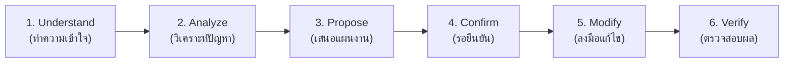

# T.S. Pattani — HCI Design Rules & Usability Standards

## 1. วัตถุประสงค์และขอบเขต (Purpose & Scope)

เอกสารนี้เป็นมาตรฐานกลางด้าน **Human-Computer Interaction (HCI)** และความง่ายในการใช้งาน (Usability Standards) สำหรับระบบเว็บแอปพลิเคชันจัดการสนามแบดมินตัน **T.S. Pattani**

นักพัฒนาและ AI Developer ต้องยึดถือมาตรฐานในเอกสารนี้เป็นแนวทางปฏิบัติอย่างเคร่งครัดในการพัฒนา แก้ไข หรือออกแบบ UI/UX ทั้งในส่วนของผู้ใช้งานทั่วไป/สมาชิก (Member) และส่วนของผู้ดูแลระบบ (Admin):

* **ยึดหลัก Usability Heuristics ของ Jakob Nielsen ทั้ง 10 ข้อ** เป็นโครงสร้างหลักของระบบ โดยไม่ดัดแปลงชื่อมาตรฐานและไม่เพิ่ม Heuristic ข้อที่ 11
* **นำกฎและข้อกำหนดเฉพาะของระบบ T.S. Pattani** มาจัดหมวดหมู่ภายใต้ Heuristics ที่เกี่ยวข้องอย่างเป็นระบบ
* **ความง่ายและถูกต้องในการใช้งานจริงต้องมาก่อนความสวยงาม (Usability & Functionality > Decoration):** ห้ามออกแบบหรือปรับแก้ UI โดยเน้นเฉพาะความสวยงาม ทันสมัย หรือแอนิเมชัน โดยละเลยความชัดเจน การลดภาระทางความคิด (Cognitive Load) และการป้องกันความผิดพลาดของผู้ใช้

---

## 2. Nielsen's 10 Usability Heuristics & Project-Specific Rules

### 2.1 Visibility of System Status (การมองเห็นสถานะของระบบ)

ระบบต้องแสดงสถานะปัจจุบันให้ผู้ใช้รับรู้และเข้าใจได้ทันทีอย่างชัดเจนตลอดเวลา และต้องสะท้อนสถานะจริงของฐานข้อมูล (Real System State) เสมอ

#### 2.1.1 การแสดงผลสถานะและการตอบสนองทันที (Immediate Feedback After Action)
ทุกการกระทำสำคัญของผู้ใช้ต้องได้รับการตอบสนองจากระบบทันที เพื่อไม่ให้ผู้ใช้เกิดความลังเลว่าระบบได้รับคำสั่งหรือยัง:
- **กดจองสนาม (Booking):** แสดง Loading State หรือสปินเนอร์บนปุ่มระหว่างประมวลผล
- **ทำรายการสำเร็จ (Booking Success):** แสดง Success Message / SweetAlert2 Toast แจ้งเตือนชัดเจน
- **อัปโหลดสลิป (Slip Upload):** แสดงรูปตัวอย่างทันที (Instant Image Preview) พร้อมสถานะการเลือกไฟล์
- **การขายหน้าร้าน (POS Cart):** ตัวเลขจำนวนชิ้นในตะกร้าและยอดรวมเงินต้องอัปเดตแบบ Real-time ทันทีที่คลิก
- **การอนุมัติ/ปฏิเสธสลิป:** เปลี่ยนป้ายสถานะ (Status Badge) บนตารางให้เห็นทันที
- **สัญลักษณ์และสี:** ห้ามใช้สีเพียงอย่างเดียวในการสื่อความหมาย ต้องมีข้อความ (Text Label) หรือไอคอน (Icon) กำกับร่วมด้วยเสมอ เช่น:
  * สนามว่าง: กรอบเขียว + ป้าย `● ว่าง`
  * กำลังเลือก: กรอบเหลืองไฮไลท์ + ป้าย `กำลังเลือก`
  * รอตรวจสอบ: กรอบส้ม + ป้าย `● รอตรวจสอบ (ชื่อเล่น)`
  * จองแล้ว: กรอบแดง + ป้าย `● จองแล้ว (ชื่อเล่น)`
  * ปิดปรับปรุง: กรอบเทา + ป้าย `● ปิดปรับปรุง`
  * สินค้าหมด: ป้าย `Out of Stock`

#### 2.1.2 องค์ประกอบของ 5 สภาวะสำคัญ (The 5 Essential UI States)
ทุกหน้าจอและทุก Component ที่มีการรับส่งข้อมูล ต้องได้รับการออกแบบให้ครอบคลุม 5 สภาวะนี้เสมอ:
1. **Loading State:** แสดงสถานะกำลังโหลดที่เหมาะสม ไม่ปล่อยให้หน้าจอดับหรือนิ่งจนผู้ใช้เข้าใจว่าระบบค้าง
2. **Empty State:** หากไม่มีข้อมูล ต้องไม่แสดงเป็นพื้นที่ว่างเปล่า ต้องมีข้อความอธิบายพร้อมคำแนะนำ Call to Action เช่น *"ยังไม่มีประวัติการจอง เริ่มต้นด้วยการจองสนามของคุณ [ปุ่มจองสนาม]"*
3. **Success State:** แสดงการยืนยันเมื่อทำรายการสำเร็จ พร้อมบอกสิ่งที่เกิดขึ้นถัดไป
4. **Error State:** อธิบายข้อผิดพลาดอย่างเข้าใจง่าย พร้อมระบุแนวทางแก้ไข
5. **Disabled State:** แสดงปุ่มหรือ Action ที่ไม่สามารถกดได้ให้เห็นความแตกต่างทางสายตาอย่างชัดเจน พร้อมคำอธิบายเหตุผลเมื่อจำเป็น

#### 2.1.3 สถานะจริงของระบบและความสมบูรณ์ของข้อมูล (Real System State & Data Integrity)
UI ต้องสะท้อนสถานะจริงของ Backend และ Database เสมอ ห้ามแสดงข้อมูลขัดแย้ง:
- **สนามถูกจองแล้ว:** ต้องไม่แสดงสถานะ "ว่าง" และต้องไม่เปิดให้ผู้ใช้คลิกเลือกได้
- **สต็อกสินค้าเป็น 0 (Stock = 0):** ต้องแสดงสถานะ "สินค้าหมด" ทันที และไม่อนุญาตให้กดเพิ่มลงตะกร้าหรือเช่า
- **Booking Lock หมดเวลา:** ต้องคลาย Lock และคืนสล็อตเวลาของสนามกลับสู่ระบบทันที
- **สลิปถูกปฏิเสธ (Rejected):** ต้องแสดงสถานะ "ปฏิเสธ" ให้ผู้ใช้เห็น พร้อมแจ้งขั้นตอนที่ต้องดำเนินการต่อ
- **ห้ามสร้าง UI หลอกว่ารายการสำเร็จ:** หาก Backend หรือ Database ยังไม่ได้ยืนยันผลการทำรายการ

#### 2.1.4 การแยกความหมายระหว่าง Booking Lock และ Payment / Verification Status
ระบบต้องแยกความหมายและการสื่อสารของสองคำนี้ออกจากกันอย่างเด็ดขาด ห้ามใช้สองคำนี้แทนกัน:
1. **Booking Lock (กลไกการล็อกสนามชั่วคราว):**
   - คือกลไก Concurrency Control ในระดับระบบ เพื่อป้องกันการจองสนามซ้ำซ้อน (Anti-double-booking) ในช่วงเวลา 15 นาทีที่ผู้ใช้กำลังดำเนินการชำระเงิน
   - เมื่อหมดเวลา 15 นาที หากไม่มีการส่งสลิป ระบบจะคลาย Lock และคืน Slot เวลาของสนามกลับสู่ระบบโดยอัตโนมัติ
2. **Payment / Verification Status (สถานะการชำระเงินและการตรวจสอบ):**
   - คือสถานะทางธุรกิจของรายการธุรกรรมและการตรวจสอบสลิปโดยผู้ดูแลระบบ (เช่น "รอชำระเงิน" → "รอตรวจสอบ" → "ยืนยันแล้ว" / "ปฏิเสธ")
   - ห้ามใช้คำว่า "ล็อกสถานะ" เพื่ออธิบายการตรวจสอบสลิป เพราะจะสร้างความสับสนกับ Booking Lock

---

### 2.2 Match Between the System and the Real World (ความสอดคล้องระหว่างระบบกับโลกจริง)

ระบบต้องใช้ภาษา คำศัพท์ และแนวคิดที่คุ้นเคยในธุรกิจสนามแบดมินตันและการใช้ชีวิตจริง หลีกเลี่ยงศัพท์เทคนิคคอมพิวเตอร์

#### 2.2.1 คำศัพท์และบริบทของสนามแบดมินตัน (Real-world Terminology)
- ใช้คำศัพท์ภาษาไทยที่เข้าใจง่ายและตรงกับสิ่งที่ผู้ใช้ต้องการทำ:
  * "จองสนาม", "เช่าอุปกรณ์", "ซื้อสินค้า", "ชำระเงิน", "แนบสลิป", "คะแนนสะสม", "แลกของรางวัล", "ประวัติการจอง", "ยกเลิกการจอง"
- หลีกเลี่ยงศัพท์เฉพาะทางด้านเทคนิค (Technical Jargon) เช่น `Foreign Key`, `HTTP 500`, `Query Failed`, `Null Pointer`, หรือรหัสตารางฐานข้อมูลที่ผู้ใช้ไม่จำเป็นต้องรู้

#### 2.2.2 การจำลองช่วงเวลาและประเภทวันตามความเป็นจริง
- จัดกลุ่มและแสดงประเภทวันตามพฤติกรรมการใช้งานจริงของลูกค้าสนามแบดมินตัน:
  * **วันปกติ (Normal):** จันทร์, พุธ, ศุกร์
  * **วันหยุด (Peak):** เสาร์, อาทิตย์
  * **วันโปรโมชั่น (Off-peak):** อังคาร, พฤหัสบดี
- แสดงเวลาเปิด-ปิดสนามเป็นรูปแบบนาฬิกา 24 ชั่วโมงที่คุ้นเคย (เช่น `08:00 - 09:00 น.`) ไม่ใช้รูปแบบที่ชวนสับสน

---

### 2.3 User Control and Freedom (การควบคุมและอิสระของผู้ใช้)

ผู้ใช้ต้องมีอิสระในการควบคุมการทำงาน มีทางเลือกในการย้อนกลับ แก้ไข หรือยกเลิกการทำรายการได้อย่างชัดเจน

#### 2.3.1 การย้อนกลับและแก้ไขใน Multi-step Flow
- ในระบบจองสนามแบบ Multi-step Form (Wizard Pattern) ผู้ใช้ต้องสามารถกดย้อนกลับไปยังขั้นตอนก่อนหน้า เพื่อเปลี่ยนวันที่ เวลา หรือสนามได้ โดยระบบต้องไม่ล้างข้อมูลที่เลือกไว้เดิมทิ้ง
- มีปุ่ม [ย้อนกลับ] บนหน้าจออย่างชัดเจน ไม่บังคับให้ผู้ใช้ต้องกดปุ่ม Back ของเบราว์เซอร์เพียงอย่างเดียว
- ผู้ใช้ต้องสามารถตรวจสอบและแก้ไขรายการสินค้าในตะกร้า หรืออุปกรณ์เช่าได้ตลอดเวลาก่อนกดยืนยันชำระเงิน

#### 2.3.2 ทางเลือกเสริมและปุ่มข้ามขั้นตอน (Optional Add-ons)
- ในขั้นตอนบริการเสริม (Phase 2: อุปกรณ์เช่าและสินค้าบริโภค) ต้องมีปุ่ม **[ข้ามขั้นตอนนี้]** อย่างเด่นชัด เพื่อให้ผู้ใช้ที่มีอุปกรณ์ครบแล้วสามารถข้ามไปยังหน้าสรุปยอดได้ทันทีโดยไม่รู้สึกว่าถูกบังคับ

#### 2.3.3 การปิดหน้าต่าง Modal และการยกเลิกรายการ
- หน้าต่าง Modal และ Dialog ทุกบานต้องมีปุ่มปิด/ยกเลิกที่เห็นได้ชัด รองรับการคลิกพื้นที่ภายนอก (Backdrop Click) และรองรับการกดปุ่ม `ESC` บนแป้นพิมพ์
- ผู้ใช้ต้องสามารถกดยกเลิกรายการจองของตนเองได้จากหน้าประวัติการจอง ภายใต้เงื่อนไขนโยบายที่โปร่งใส

---

### 2.4 Consistency and Standards (ความสอดคล้องและเป็นมาตรฐานเดียวกัน)

องค์ประกอบที่มีความหมายเดียวกันต้องมีรูปแบบ พฤติกรรม และตำแหน่งที่สอดคล้องกันทั่วทั้งระบบ

#### 2.4.1 การแบ่งแยกบทบาทผู้ใช้อย่างเคร่งครัด (Strict Role Separation)
- **Member UI:** เน้นความง่าย ไม่ซับซ้อน ลำดับขั้นตอนชัดเจน รองรับการใช้งานบนมือถือและจอสัมผัส (Mobile-friendly & Touch-friendly)
- **Admin UI:** เน้น Information Density ที่เหมาะสม สแกนข้อมูลได้เร็ว มีระบบค้นหาและตัวกรอง (Search & Filter) ป้ายสถานะชัดเจน และมีปุ่ม Action ดำเนินการที่สะดวกรวดเร็ว
- **Information Hiding & Least Privilege UI:** ไม่แสดงข้อมูล เมนู หรือฟังก์ชันการจัดการของ Admin ให้สมาชิกเห็นโดยไม่จำเป็น เพื่อลดความสับสนและรักษาความปลอดภัย

#### 2.4.2 ระบบสีมาตรฐานและ Design Tokens (Semantic Color Rules)
ใช้สีอย่างมีความหมายเดียวกันทั่วทั้งระบบ:
- **Primary (สีหลัก):** Deep Navy Blue (`#1e3c72` ถึง `#2a5298`) สำหรับหัวข้อ แถบเมนู และปุ่มหลัก
- **Success (สำเร็จ / ว่าง / ผ่าน):** Green (`#059669` / `#28a745`) สำหรับสถานะพร้อมใช้งาน ยอดชำระถูกต้อง และการอนุมัติ
- **Warning / Pending (รอ / เตือน / ซ่อม):** Amber / Orange (`#d97706` / `#f59e0b`) สำหรับรอตรวจสอบ สภาพชำรุด และกำลังซ่อม
- **Danger / Error (ยกเลิก / ลบ / ผิดพลาด):** Red (`#dc3545` / `#ef4444`) สำหรับรายการที่ถูกยกเลิก การลบข้อมูล และข้อผิดพลาด
- **Info (ข้อมูลเสริม):** Blue (`#3b82f6` / `#0284c7`) สำหรับข้อมูลแนะนำ รายละเอียดเพิ่มเติม
- **Neutral / Background:** White, Slate Gray (`#f8fafc`, `#e2e8f0`)
- **Accessibility:** ห้ามใช้สีเพียงอย่างเดียวในการบอกสถานะ ต้องมี Text Label หรือ Icon กำกับเสมอ

#### 2.4.3 มาตรฐาน UI Components ทั่วทั้งระบบ
- ปุ่ม Primary, Secondary, Danger, Success ต้องมีขนาด Padding, Border-radius และ Hover effect รูปแบบเดียวกัน
- ป้ายสถานะ (Badges) ต้องมีมาตรฐานฟอนต์และระยะขอบที่สม่ำเสมอ
- ตารางข้อมูล (Admin Table) ต้องมี Header, Padding และโครงสร้างเหมือนกัน
- หน้าต่างยืนยันการทำรายการในฝั่ง Admin ต้องรวมศูนย์ด้วย **SweetAlert2** ทั่วทั้งระบบ เพื่อให้ดีไซน์ แอนิเมชัน และพฤติกรรมการแจ้งเตือนเป็นมาตรฐานเดียวกัน 100%

#### 2.4.4 การออกแบบเพื่อการเข้าถึงและการตอบสนองทุกอุปกรณ์ (Responsive & Accessibility)
- ระบบต้องรองรับ Desktop, Tablet และ Mobile อย่างสมบูรณ์ โดยไม่ใช้วิธีย่อสเกลหน้าจอ แต่ต้องปรับ Layout, Grid, และ Navigation ให้เหมาะสม
- ขนาด Touch Target บนมือถือต้องไม่เล็กกว่า `44x44px` และเว้นระยะห่างพอเหมาะ
- ความคมชัดของสีและตัวอักษร (Contrast Ratio) ต้องได้ตามมาตรฐาน WCAG ให้อ่านง่ายในทุกสภาวะแสง

---

### 2.5 Error Prevention (การป้องกันความผิดพลาดล่วงหน้า)

การออกแบบระบบที่ดีต้องป้องกันไม่ให้เกิดความผิดพลาดตั้งแต่แรก มากกว่าการปล่อยให้ผู้ใช้ทำผิดแล้วค่อยแจ้งเตือน

#### 2.5.1 การออกแบบฟอร์มและการตรวจสอบความถูกต้องล่วงหน้า (Form Validation)
- ระบุช่องที่จำเป็นต้องกรอก (Required Field) ด้วยสัญลักษณ์ `*` ชัดเจน
- ตรวจสอบความถูกต้องของข้อมูล (Validation) ใกล้กับช่อง Input นั้นๆ ทันที
- ปิดใช้งาน (Disable) ปุ่ม Submit จนกว่าผู้ใช้จะกรอกข้อมูลครบถ้วนถูกต้อง
- ในหน้าแนบสลิปชำระเงิน ต้องตรวจสอบประเภทไฟล์ (JPEG, PNG, JPG) และขนาดไฟล์ (ไม่เกิน 5MB) ก่อนอนุญาตให้อัปโหลด
- ห้ามล้างข้อมูลที่ผู้ใช้กรอกทิ้งเมื่อเกิดข้อผิดพลาดในการตรวจสอบ

#### 2.5.2 กลไกป้องกันการทำรายการซ้ำซ้อนและการจองชน (Concurrency & Locking)
- Disable วันที่ในอดีตทั้งหมดบน Calendar Picker
- ซ่อนหรือไม่เปิดให้เลือกช่วงเวลาและสนามที่มีผู้จองแล้วหรือกำลังรอตรวจสอบ
- ใช้กลไก **Booking Lock** ป้องกันไม่ให้ผู้ใช้อื่นเลือกสนามและช่วงเวลาเดียวกันขณะกำลังชำระเงิน
- ตรวจสอบจำนวนสต็อกอุปกรณ์เช่าและสินค้าคงเหลือจริงก่อนอนุญาตให้เพิ่มลงในรายการ

#### 2.5.3 การยืนยันสำหรับรายการที่มีผลกระทบสูง (Confirmation for Impactful Actions)
รายการที่มีความเสี่ยงสูง (Impactful & Destructive Actions) โดยเฉพาะในฝั่ง Admin ต้องมีกล่องยืนยัน (Confirmation Modal ด้วย SweetAlert2) ก่อนดำเนินการเสมอ:
- รายการที่ต้องยืนยัน: การลบสนาม, การลบสินค้า, การลบสมาชิก, การลบของรางวัล, การลบข่าวสาร, การปฏิเสธสลิปการโอนเงิน, การอนุมัติคืนเงิน, การตัดจำหน่ายอุปกรณ์ชำรุด, การระงับสิทธิ์สมาชิก, และการออกจากระบบ (Logout)
- กล่องยืนยันต้องระบุ 4 องค์ประกอบสำคัญ:
  1. กำลังจะทำรายการอะไร
  2. ข้อมูลหรือสถานะใดที่จะได้รับผลกระทบ
  3. ผลลัพธ์หรือความเสียหายที่จะเกิดขึ้น (Consequence Statement ในกรอบสีแดงชัดเจน)
  4. ระบุชัดเจนว่าการดำเนินการนี้ไม่สามารถย้อนกลับได้
- ปุ่มยืนยันต้องระบุคำกริยาที่ชัดเจน เช่น `[ยืนยันการลบ]`, `[ยืนยันปฏิเสธสลิป]`, `[ยืนยันระงับสิทธิ์]` ห้ามใช้เพียงคำว่า `[OK]` หรือ `[Confirm]`
- กำหนดให้ปุ่ม **[ยกเลิก]** เป็น Default Focus เสมอ เพื่อป้องกันการเผลอกดปุ่ม Enter ซ้ำโดยไม่ได้ตั้งใจ

---

### 2.6 Recognition Rather Than Recall (จำได้โดยไม่ต้องนึกย้อน)

ผู้ใช้ไม่ควรต้องจดจำข้อมูลจากขั้นตอนก่อนหน้า ระบบต้องนำข้อมูลที่เกี่ยวข้องมาแสดงให้เห็นในจุดที่ต้องตัดสินใจ เพื่อลดภาระการจำ (Minimize Memory Load)

#### 2.6.1 การจัดการภาระทางความคิด (Cognitive Load Management & Progressive Disclosure)
- ลดการยัดข้อมูลทั้งหมดลงในหน้าเดียว (Stop Information Overload)
- ถอดตาราง Matrix ขนาดใหญ่ออกจากหน้าแรกของการจอง
- ใช้หลัก Progressive Disclosure แสดงเฉพาะข้อมูลและตัวเลือกที่จำเป็นในแต่ละขั้นตอนทีละระดับ

#### 2.6.2 Avoid Redundant User Input (ลดการกรอกข้อมูลซ้ำซ้อน)
> **กฎเฉพาะของโปรเจกต์ที่ประยุกต์จาก Recognition Rather Than Recall และหลักการลด Cognitive Load**

**หลักการ:**
ระบบต้องหลีกเลี่ยงการบังคับให้ผู้ใช้กรอกข้อมูลเดิมซ้ำในหลายหน้า หรือหลายขั้นตอน หากข้อมูลนั้นมีอยู่ในระบบแล้ว

**กฎข้อบังคับ:**
1. หากผู้ใช้เคยกรอกข้อมูลแล้ว ระบบควรนำข้อมูลนั้นมาใช้ต่อโดยอัตโนมัติเมื่อเหมาะสม
2. ข้อมูลจากขั้นตอนก่อนหน้าควรถูกส่งต่อไปยังขั้นตอนถัดไปอย่างราบรื่น
3. หากต้องให้ผู้ใช้ตรวจสอบข้อมูลเดิมอีกครั้ง ให้แสดงเป็นข้อมูลสำหรับ Review เพื่อตรวจสอบ แทนการบังคับให้กรอกใหม่
4. หากข้อมูลมีอยู่ใน Member Profile, Session หรือ Database ควรนำมาใช้แทนการให้ผู้ใช้กรอกใหม่
5. มุ่งเน้นการลดจำนวน Click และ Input ที่ไม่จำเป็น
6. ลดภาระทางความคิด (Cognitive Load) ของผู้ใช้ในทุกขั้นตอน
7. ลดโอกาสเกิดข้อผิดพลาดจากการกรอกข้อมูลซ้ำ (Typo & Human Errors)

**ตัวอย่างการประยุกต์ใช้ในระบบ T.S. Pattani:**
- เมื่อสมาชิกเข้าสู่ระบบ (Login) แล้ว ไม่ต้องให้กรอกข้อมูลสมาชิก (ชื่อ, เบอร์โทร, อีเมล) ซ้ำอีกในแบบฟอร์มการจอง
- ข้อมูลชื่อผู้จองที่มีอยู่ใน Profile ควรนำมาตั้งเป็นค่าเริ่มต้นอัตโนมัติในช่อง "ชื่อเล่น / ชื่อก๊วนผู้จอง" (`booking_nickname`) แต่เปิดให้แก้ไขได้
- วันที่ที่เลือกในขั้นตอนที่ 1 ต้องถูกส่งต่อไปยังขั้นตอนเลือกเวลาและสรุปยอดโดยอัตโนมัติ
- เวลาเริ่มต้นและจำนวนชั่วโมงที่เลือกแล้ว ต้องถูกนำไปใช้คำนวณและแสดงผลต่อเนื่อง ไม่ถามซ้ำ
- คอร์ทสนามที่คลิกเลือกแล้ว ต้องแสดงในแถบ Sticky Summary Bar และส่งต่อไปยังหน้าถัดไปโดยไม่ต้องให้เลือกซ้ำ
- รายการอุปกรณ์เช่าและสินค้าบริโภคที่เลือกแล้ว ต้องถูกส่งต่อไปยังหน้า Review และ Payment โดยอัตโนมัติ
- ยอดรวมที่ระบบคำนวณแล้ว (ค่าสนาม ค่าเช่า ค่าสินค้า) ต้องแสดงผลให้ผู้ใช้เห็นชัดเจน ห้ามให้ผู้ใช้ต้องคำนวณหรือกรอกเอง

**ข้อยกเว้น:**
ระบบสามารถขอให้ผู้ใช้ระบุหรือยืนยันข้อมูลซ้ำได้เฉพาะกรณีที่มีเหตุผลชัดเจนและจำเป็นเท่านั้น ได้แก่:
- ด้านความปลอดภัยและการยืนยันตัวตน (Security / Authentication) เช่น การใส่รหัสผ่านเดิมก่อนเปลี่ยนรหัสผ่านใหม่
- การยืนยันการทำรายการที่มีความเสี่ยงสูง (Impactful / Destructive Actions)
- ความประสงค์ในการแก้ไขข้อมูลให้เป็นปัจจุบัน (Data Modification)
- ข้อกำหนดทางธุรกิจ (Business Rules) เช่น การระบุเบอร์โทรศัพท์ลูกค้าทั่วไปกรณีเปิดสนาม Walk-in หน้าเคาน์เตอร์ POS
- ความจำเป็นด้านความถูกต้องสมบูรณ์ของข้อมูลธุรกรรมการเงิน

#### 2.6.3 กระบวนการจอง 4 ระยะ (4-Phase Booking Flow Standards)
ระบบ Booking ของ T.S. Pattani ต้องแบ่งขั้นตอนการทำงานออกเป็น 4 ระยะที่ชัดเจนตาม Wizard Pattern:

* **Phase 1: จองคอร์ท (Court Booking)**
  1. **เลือกวันที่:** แสดง Calendar Picker (ปฏิทินเดือนและวันที่ 1-31 ชัดเจน) พร้อมปุ่มด่วน `[วันนี้]` `[พรุ่งนี้]` ห้ามใช้ช่องพิมพ์ข้อความ `mm/dd/yyyy` และ Disable วันที่ในอดีตทั้งหมด พร้อมป้ายบอกราคาของวันที่เลือกเพียงบรรทัดเดียว
  2. **เลือกเวลาเริ่มต้นและระยะเวลา:** แสดงการ์ดหรือปุ่มกดเลือกเวลาเปิดทำการ (เช่น `[08:00]`, `[09:00]`, ...) เมื่อคลิกแล้วให้พาไปสู่การเลือกสนามทันที
  3. **เลือกสนามที่ว่าง:** แสดงเฉพาะสนามที่ว่างในแต่ละช่วงเวลา มีช่องระบุ "ชื่อเล่น / ชื่อก๊วนผู้จอง" (ดึงค่าเริ่มต้นจากชื่อสมาชิกใน Session แต่เปิดให้แก้ไขได้ และห้ามแสดงชื่อจริงของผู้อื่นตาม PDPA) พร้อมแถบ Sticky Summary Bar ตรึงไว้ด้านล่างจอ สรุปจำนวนชั่วโมง จำนวนสนาม และยอดเงิน Real-time
* **Phase 2: บริการเสริม One-Stop (Add-on Services)**
  4. **เลือกอุปกรณ์เช่า:** เช่น ไม้แบดมินตัน, รองเท้า พร้อมปุ่มบวก-ลบจำนวน
  5. **เลือกสินค้าบริโภค:** เช่น น้ำดื่ม, ลูกแบดมินตัน
  *(มีปุ่ม `[ข้ามขั้นตอนนี้]` สำหรับผู้ใช้ที่มีอุปกรณ์ครบแล้ว เพื่อพาไปหน้าสรุปยอดทันที)*
* **Phase 3: ตรวจสอบและยืนยัน (Review & Confirmation)**
  6. **ตรวจสอบรายการและยอดรวมสุทธิ:** แสดงแจกแจงแยกหมวดหมู่ชัดเจน:
     - ค่าสนาม (ระบุวัน เวลา คอร์ท และเรทราคา)
     - ค่าเช่าอุปกรณ์
     - ค่าสินค้าบริโภค
     - ส่วนลด / คะแนนสะสม (หากมี)
     - ยอดรวมสุทธิที่ต้องชำระ
* **Phase 4: การชำระเงินและการอนุมัติ (Payment & Verification)**
  7. **ชำระเงินผ่าน QR Code / PromptPay:** แสดงยอดเงินสุทธิ, QR Code พร้อมปุ่มคัดลอกเลขบัญชี และเวลานับถอยหลัง 15 นาที
  8. **แนบสลิป:** มีระบบตรวจสอบประเภทและขนาดไฟล์ พร้อมแสดงรูปสลิปตัวอย่างก่อนส่ง
  9. **ระบบเปลี่ยนสถานะเป็น "รอการตรวจสอบ":** ส่งรายการให้ผู้ดูแลระบบตรวจสอบหลักฐานความถูกต้อง

#### 2.6.4 ความโปร่งใสของราคาและการคำนวณยอดอัตโนมัติ (Automated Price Breakdown)
- ลบข้อความเงื่อนไขราคา 3 บรรทัดที่ซ้ำซ้อนออกจากการ์ดสนามทุกใบ
- ระบบต้องตรวจสอบวันที่และจำนวนชั่วโมงที่เลือก แล้วคำนวณยอดเงินจริงให้ผู้ใช้เห็นทันที
- แสดงป้ายประเภทวันอย่างชัดเจน: Normal / Peak / Off-peak
- ห้ามทำให้ผู้ใช้ต้องคำนวณยอดเงินด้วยตนเอง

#### 2.6.5 การตรวจสอบข้อมูลสรุปก่อนชำระเงิน (Pre-payment Review)
- หน้าชำระเงิน (`payment.php`) ต้องแสดงกล่องสรุปรายการจอง (สนาม, วันที่, เวลา, ยอดเงิน) ไว้ด้านบนเสมอ เพื่อให้ผู้ใช้ตรวจทานได้ทันทีก่อนสแกนจ่ายเงิน โดยไม่ต้องย้อนกลับไปดูหน้าก่อน

---

### 2.7 Flexibility and Efficiency of Use (ความยืดหยุ่นและประสิทธิภาพในการใช้งาน)

ระบบต้องรองรับทั้งผู้ใช้งานใหม่ (Novice Users) และผู้ใช้งานประจำที่ต้องการความรวดเร็ว (Expert Users)

#### 2.7.1 เครื่องมือเพิ่มประสิทธิภาพสำหรับผู้ดูแลระบบ (Admin Efficiency & POS Cashier)
- **Dashboard สรุปภาพรวม:** แสดงตัวเลขสถิติสำคัญประจำวัน รายการที่ต้องดำเนินการเร่งด่วน การจองล่าสุด และสถานะสนาม
- **การจัดการข้อมูล:** มีระบบ Search, Filter ตามสถานะหรือวันที่, Sorting, และ Pagination
- **ระบบขายหน้าร้าน (POS):** มีปุ่มเปิดสนาม Walk-in ด่วน พร้อมคำนวณราคาตามประเภทวันอัตโนมัติ และสลับแท็บหมวดหมู่สินค้าได้อย่างรวดเร็ว

#### 2.7.2 ทางลัดและปุ่มด่วนสำหรับสมาชิก (Member Accelerators)
- ปุ่มเลือกวันด่วน `[วันนี้]` และ `[พรุ่งนี้]` ในหน้าจองสนาม
- ปุ่มปรับเพิ่ม-ลดจำนวน `[ + ]` `[ - ]` สำหรับสินค้าและอุปกรณ์เช่า
- ปุ่มคลิกเดียวเพื่อคัดลอกเลขบัญชีธนาคารในหน้าชำระเงิน (`Copy to Clipboard`)

---

### 2.8 Aesthetic and Minimalist Design (ความสวยงามและการออกแบบที่เรียบง่าย)

หน้าจอต้องไม่ใส่องค์ประกอบ ข้อมูล หรือการตกแต่งที่ไม่จำเป็น ซึ่งจะแย่งความสนใจไปจากข้อมูลสำคัญ

#### 2.8.1 ลำดับชั้นทางสายตา (Visual Hierarchy)
จัดลำดับความสำคัญของข้อมูลในทุกหน้าจออย่างชัดเจน:
1. **Primary Information (สำคัญที่สุด):** เช่น วันที่ เวลา สนาม ยอดเงินรวม ป้ายสถานะ
2. **Secondary Information (ข้อมูลรอง):** เช่น ชื่อเล่นผู้จอง รายการอุปกรณ์เช่า ข้อมูลบัญชีธนาคาร
3. **Supporting Information (ข้อมูลสนับสนุน):** เช่น เงื่อนไขหมายเหตุ วันที่ทำรายการ ข้อมูลสถิติ

#### 2.8.2 การตัดทอนข้อมูลที่ไม่จำเป็นและลดความซ้ำซ้อน
- ไม่ใส่แอนิเมชันที่ไม่ช่วยส่งเสริมการใช้งาน
- ไม่ใช้ Card หรือกรอบล้อมรอบทุกอย่างโดยไม่มีความจำเป็น
- ข้อมูลบนการ์ดสนามต้องแสดงเฉพาะชื่อสนามและป้ายสถานะ ไม่ใส่ข้อความเงื่อนไขราคาหลายบรรทัด

#### 2.8.3 ความสะอาดของโค้ดและสไตล์ (Clean Code & Zero Inline Styles)
- **ห้ามใส่ Inline Style (`style="..."`) ในแท็ก HTML แม้แต่จุดเดียว**
- ย้าย CSS ทั้งหมดไปสร้างเป็นคลาสใน `assets/css/admin.css` หรือ `assets/css/style.css` โดยอ้างอิง Design Tokens จาก `assets/css/global.css`
- แยกโครงสร้าง HTML, การนำเสนอ CSS, และการทำงาน JavaScript ออกจากกันอย่างเด็ดขาด (Separation of Concerns)

---

### 2.9 Help Users Recognize, Diagnose, and Recover from Errors (ช่วยให้ผู้ใช้รับรู้ วินิจฉัย และแก้ไขข้อผิดพลาด)

ข้อความแจ้งเตือนข้อผิดพลาดต้องใช้ภาษาที่สุภาพ ชัดเจน ระบุสาเหตุที่แท้จริง และแนะนำวิธีแก้ไขปัญหาให้ผู้ใช้ทำต่อได้ทันที

#### 2.9.1 รูปแบบข้อความแจ้งเตือนความผิดพลาดที่สร้างสรรค์และชัดเจน
Error Message ทุกจุดต้องบอก 3 สิ่งเสมอ:
1. **เกิดอะไรขึ้น:** อธิบายปัญหาด้วยภาษาที่เข้าใจง่าย
2. **เกิดจากสาเหตุใด:** ระบุเหตุผลหากสามารถระบุได้
3. **ผู้ใช้ควรทำอย่างไรต่อ:** ชี้แนะแนวทางแก้ไขหรือขั้นตอนถัดไป

*ตัวอย่าง:*
> ❌ **ไม่ควรใช้:** `Error: Booking Failed`  
> ✅ **ควรใช้:** `ไม่สามารถจองสนามได้ เนื่องจากช่วงเวลานี้มีผู้ใช้งานอื่นจองแล้ว กรุณาเลือกช่วงเวลาหรือสนามอื่น`

#### 2.9.2 การนำทางผู้ใช้เพื่อแก้ไขปัญหาเฉพาะกรณี
- **กรณีแนบไฟล์สลิปไม่ถูกต้อง:** แจ้งเตือนว่า *"ไฟล์ที่เลือกไม่ใช่รูปภาพ หรือมีขนาดเกิน 5MB กรุณาเลือกไฟล์รูปภาพใหม่ (JPG, PNG)"*
- **กรณีการจองหมดเวลา 15 นาที (Lock Expired):** แจ้งเตือนว่า *"หมดเวลาการทำรายการชำระเงิน ระบบได้คืนสล็อตเวลาให้ผู้ใช้อื่นแล้ว [ปุ่มจองสนามใหม่อีกครั้ง]"*
- **กรณีสลิปถูกปฏิเสธโดยแอดมิน:** แสดงเหตุผลที่ปฏิเสธ พร้อมเปิดทางให้สมาชิกสามารถติดต่อแอดมินหรือส่งหลักฐานใหม่ได้

---

### 2.10 Help and Documentation (ความช่วยเหลือและเอกสารแนะนำ)

ระบบควรมีคำอธิบาย คำแนะนำ และเอกสารนโยบายที่จำเป็นในจุดที่ผู้ใช้ต้องตัดสินใจ โดยค้นหาและเข้าถึงได้ง่าย

#### 2.10.1 เอกสารเงื่อนไข นโยบาย และคำแนะนำในบริบทการใช้งาน
- **นโยบายการยกเลิกและการคืนเงิน (Cancellation & Refund Policy):** อธิบายอัตราค่าปรับและยอดเงินที่ได้รับคืนอย่างโปร่งใสตามระยะเวลาการแจ้งยกเลิกล่วงหน้าก่อนเวลาใช้งาน
- **ระบบคะแนนสะสมและระดับสมาชิก (Loyalty Points & Tiers):** อธิบายเกณฑ์การได้รับคะแนนจากการจองและซื้อสินค้า รวมถึงสิทธิประโยชน์ของระดับ Bronze, Silver, Gold
- **เงื่อนไขการใช้อุปกรณ์เช่า:** คำแนะนำการดูแลรักษา และแนวทางกรณีอุปกรณ์ชำรุด
- **Inline Helper Text & Tooltips:** แสดงข้อความแนะนำสั้นๆ ใต้ช่องกรอกที่ต้องการคำอธิบายเพิ่มเติม เช่น คำแนะนำชื่อเล่นผู้จองตามระเบียบ PDPA หรือคำอธิบายอัตราค่าบริการช่วง Peak

---

## 3. มาตรฐานการปฏิบัติงานของ AI Developer (Developer Implementation Standards)

### 3.1 กฎเหล็ก 6 ขั้นตอนก่อนปรับแต่ง UI/UX (The 6-Step Process)
ก่อนทำการแก้ไขโค้ดหรือออกแบบหน้าจอใดๆ AI Developer ต้องปฏิบัติตาม 6 ขั้นตอนนี้อย่างเคร่งครัด:

1. **Understand (ทำความเข้าใจ):** อ่านและศึกษาโครงสร้าง HTML, PHP, CSS, JS, Database, Workflow, Business Logic, และ Data Flow ที่เกี่ยวข้องทั้งหมด
2. **Analyze (วิเคราะห์):** ระบุปัญหา HCI วิเคราะห์ผู้ใช้งาน (User Role) และตรวจสอบผลกระทบต่อระบบเดิม
3. **Propose (เสนอแนวทาง):** จัดทำแผนการแก้ไขที่ชัดเจน อธิบายว่าจะแก้อะไร เพราะเหตุใด และมีไฟล์ใดได้รับผลกระทบ
4. **Confirm (รอยืนยัน):** หากการแก้ไขมีผลกระทบต่อ Workflow, Business Logic, Database, หรือสิทธิ์การใช้งาน ต้องเสนอแผนและรอการยืนยันจากผู้ใช้ก่อนลงมือแก้ไขเสมอ
5. **Modify (ลงมือแก้ไข):** แก้ไขโค้ดตามขอบเขตที่ได้รับความเห็นชอบอย่างประณีต โดยยึดหลัก Clean Code และ Zero Inline Styles
6. **Verify (ตรวจสอบ):** ตรวจสอบความถูกต้องของไวยากรณ์ การทำงานของฟอร์ม ความเข้ากันได้กับฐานข้อมูล และการแสดงผลบนอุปกรณ์ต่างๆ

---

### 3.2 ปรัชญาการออกแบบ (Design Philosophy)

* **HCI > Decoration:** ความง่ายในการใช้งาน ความชัดเจน และการป้องกันข้อผิดพลาด ต้องมาก่อนความสวยงามภายนอกเสมอ
* **Don't Redesign Blindly:** ห้ามรื้อหรือเขียนหน้าจอใหม่ทั้งหมดเพียงเพราะดีไซน์เดิมดูเก่า โดยที่ยังไม่ได้ศึกษา Workflow และ Business Logic
* **Don't Optimize for Appearance Alone:** ห้ามสรุปว่า UI ดีขึ้นเพียงเพราะมีสีสัน กราเดียนต์ หรือแอนิเมชันมากขึ้น การเปลี่ยนแปลงทุกจุดต้องตอบโจทย์ด้าน Usability และ HCI

---

### 3.3 รายการตรวจสอบขั้นสุดท้ายก่อนส่งมอบงาน (Final Verification Checklist)

ทุกครั้งหลังปรับปรุง UI/UX นักพัฒนาต้องตรวจสอบให้ครบทุกข้อ:

- [ ] **Heuristic 1:** แสดงสถานะของระบบชัดเจน สะท้อน Database จริง และมี Immediate Feedback
- [ ] **Heuristic 2:** ใช้คำศัพท์สนามแบดมินตันที่เข้าใจง่าย ไม่มี Technical Jargon
- [ ] **Heuristic 3:** มีปุ่มย้อนกลับใน Multi-step และปิด Modal ได้สะดวก
- [ ] **Heuristic 4:** แยก Role ระหว่าง Member และ Admin ชัดเจน ใช้สีและ Component สอดคล้องกัน
- [ ] **Heuristic 5:** มีการป้องกันความผิดพลาด ตรวจสอบฟอร์ม และมี SweetAlert2 ยืนยันรายการเสี่ยงสูง
- [ ] **Heuristic 6:** ลด Cognitive Load, ยึดกฎ Avoid Redundant User Input, และ Booking Flow ครบ 4 ระยะ
- [ ] **Heuristic 7:** มีปุ่มด่วนและทางลัดช่วยเพิ่มความเร็วในการใช้งานทั้ง Member และ Admin
- [ ] **Heuristic 8:** Visual Hierarchy ชัดเจน, ตัดข้อมูลซ้ำซ้อน, และ Zero Inline Styles 100%
- [ ] **Heuristic 9:** ข้อความ Error ระบุสาเหตุและวิธีแก้ไขชัดเจน
- [ ] **Heuristic 10:** มีคำอธิบายเงื่อนไข นโยบาย และ Helper Text ในจุดที่จำเป็น
- [ ] **Code Integrity:** ไม่กระทบต่อ Business Logic, Database Schema, และระบบความปลอดภัย
